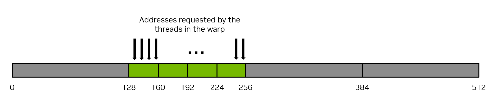
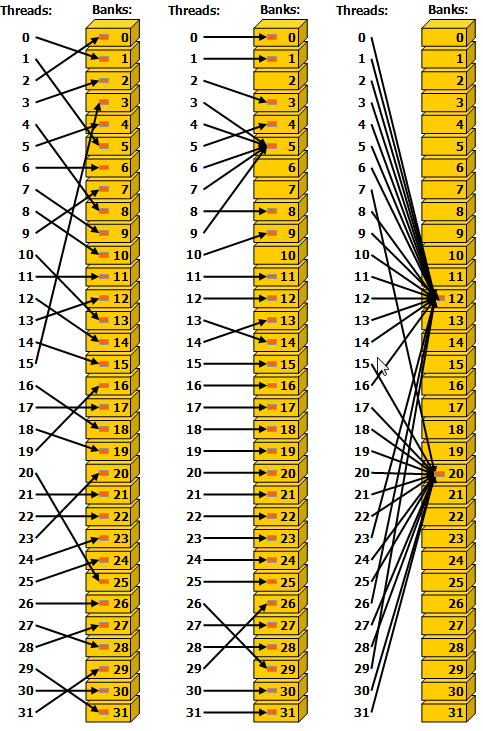

# 2.2. Writing CUDA SIMT Kernels — Memory Performance, Atomics, and Occupancy

## 2.2.4. Memory Performance

Ensuring proper memory usage is key to achieving high performance in CUDA kernels. This section discusses some general principles and examples for achieving high memory throughput in CUDA kernels.

### 2.2.4.1. Coalesced Global Memory Access

Global memory is accessed via 32-byte memory transactions. When a CUDA thread requests a word of data from global memory, the relevant warp coalesces the memory requests from all the threads in that warp into the number of memory transactions necessary to satisfy the request, depending on the size of the word accessed by each thread and the distribution of the memory addresses across the threads. For example, if a thread requests a 4-byte word, the actual memory transaction the warp will generate to global memory will be 32 bytes in total. To use the memory system most efficiently, the warp should use all the memory that is fetched in a single memory transaction. That is, if a thread is requesting a 4-byte word from global memory, and the transaction size is 32 bytes, if other threads in that warp can use other 4-byte words of data from that 32-byte request, this will result in the most efficient use of the memory system.

As a simple example, if consecutive threads in the warp request consecutive 4-byte words in memory, then the warp will request 128 bytes of memory total, and this 128 bytes required will be fetched in four 32-byte memory transactions. This results in 100% utilization of the memory system. That is, 100% of the memory traffic is utilized by the warp. [Figure 10](#writing-cuda-kernels-128-byte-coalesced-access) illustrates this example of perfectly coalesced memory access.



*Figure 10 Coalesced memory access*

Conversely, the pathologically worst case scenario is when consecutive threads access data elements that are 32 bytes or more apart from each other in memory. In this case, the warp will be forced to issue a 32-byte memory transaction for each thread, and the total number of bytes of memory traffic will be 32 bytes times 32 threads/warp = 1024 bytes. However, the amount of memory used will be 128 bytes only (4 bytes for each thread in the warp), so the memory utilization will only be 128 / 1024 = 12.5%. This is a very inefficient use of the memory system. [Figure 11](#writing-cuda-kernels-128-byte-no-coalesced-access) illustrates this example of uncoalesced memory access.


*Figure 11 Uncoalesced memory access*

The most straightforward way to achieve coalesced memory access is for consecutive threads to access consecutive elements in memory. For example, for a kernel launched with 1d thread blocks, the following `VecAdd` kernel will achieve coalesced memory access. Notice how thread `workIndex` accesses the three arrays, and consecutive threads (indicated by consecutive values of `workIndex`) access consecutive elements in the arrays.

```
__global__ void vecAdd(float* A, float* B, float* C, int vectorLength)
{
    int workIndex = threadIdx.x + blockIdx.x*blockDim.x;
    if(workIndex < vectorLength)
    {
        C[workIndex] = A[workIndex] + B[workIndex];
```

There is no requirement that consecutive threads access consecutive elements of memory to achieve coalesced memory access, it is merely the typical way coalescing is achieved. Coalesced memory access occurs provided all the threads in the warp access elements from the same 32-byte segments of memory in some linear or permuted way. Stated another way, the best way to achieve coalesced memory access is to maximize the ratio of bytes used to bytes transferred.

Note

Ensuring proper coalescing of global memory accesses is one of the most important performance considerations for writing performant CUDA kernels. It is imperative that applications use the memory system as efficiently as possible.

#### 2.2.4.1.1. Matrix Transpose Example Using Global Memory

As a simple example, consider an out-of-place matrix transpose kernel that transposes a 32 bit float square matrix of size N x N, from matrix `a` to matrix `c`. This example uses a 2d grid, and assumes a launch of 2d thread blocks of size 32 x 32 threads, that is, `blockDim.x = 32` and `blockDim.y = 32`, so each 2d thread block will operate on a 32 x 32 tile of the matrix. Each thread operates on a unique element of the matrix, so no explicit synchronization of threads is necessary. [Figure 12](#writing-cuda-kernels-figure-global-transpose) illustrates this matrix transpose operation. The kernel source code follows the figure.


*Figure 12 Matrix Transpose using Global memory. The labels on the top and left of each matrix are the 2d thread block indices and also can be considered the tile indices, where each small square indicates a tile of the matrix that will be operated on by a 2d thread block. In this example, the tile size is 32 x 32 elements, so each of the small squares represents a 32 x 32 tile of the matrix. The green shaded square shows the location of an example tile before and after the transpose operation.*

```
/* macro to index a 1D memory array with 2D indices in row-major order */
/* ld is the leading dimension, i.e. the number of columns in the matrix     */

#define INDX( row, col, ld ) ( ( (row) * (ld) ) + (col) )

/* CUDA kernel for naive matrix transpose */

__global__ void naive_cuda_transpose(int m, float *a, float *c )
{
    int myCol = blockDim.x * blockIdx.x + threadIdx.x;
    int myRow = blockDim.y * blockIdx.y + threadIdx.y;

    if( myRow < m && myCol < m )
    {
        c[INDX( myCol, myRow, m )] = a[INDX( myRow, myCol, m )];
    } /* end if */
    return;
} /* end naive_cuda_transpose */
```

To determine whether this kernel is achieving coalesced memory access one needs to determine whether consecutive threads are accessing consecutive elements of memory. In a 2d thread block, the `x` index moves the fastest, so consecutive values of `threadIdx.x` should be accessing consecutive elements of memory. `threadIdx.x` appears in `myCol`, and one can observe that when `myCol` is the second argument to the `INDX` macro, consecutive threads are reading consecutive values of `a`, so the read of `a` is perfectly coalesced.

However, the writing of `c` is not coalesced, because consecutive values of `threadIdx.x` (again examine `myCol`) are writing elements to `c` that are `ld` (leading dimension) elements apart from each other. This is observed because now `myCol` is the first argument to the `INDX` macro, and as the first argument to `INDX` increments by 1, the memory location changes by `ld`. When `ld` is larger than 32 (which occurs whenever the matrix sizes are larger than 32), this is equivalent to the pathological case shown in [Figure 11](#writing-cuda-kernels-128-byte-no-coalesced-access).

To alleviate these uncoalesced writes, the use of shared memory can be employed, which will be described in the next section.

### 2.2.4.2. Shared Memory Access Patterns

Shared memory has 32 banks that are organized such that successive 32-bit words map to successive banks. Each bank has a bandwidth of 32 bits per clock cycle.

When multiple threads in the same warp attempt to access different elements in the same bank, a bank conflict occurs. In this case, the access to the data in that bank will be serialized until the data in that bank has been obtained by all the threads that have requested it. This serialization of access results in a performance penalty.

The two exceptions to this scenario happen when multiple threads in the same warp are accessing (either reading or writing) the same shared memory location. For read accesses, the word is broadcast to the requesting threads. For write accesses, each shared memory address is written by only one of the threads (which thread performs the write is undefined).

[Figure 13](#writing-cuda-kernels-shared-memory-5-x-examples-of-strided-shared-memory-accesses) shows some examples of strided access. The red box inside the bank indicates a unique location in shared memory.


*Figure 13 Strided Shared Memory Accesses in 32 bit bank size mode. Left: Linear addressing with a stride of one 32-bit word (no bank conflict). Middle: Linear addressing with a stride of two 32-bit words (two-way bank conflict). Right: Linear addressing with a stride of three 32-bit words (no bank conflict).*

[Figure 14](#writing-cuda-kernels-shared-memory-5-x-examples-of-irregular-shared-memory-accesses) shows some examples of memory read accesses that involve the broadcast mechanism. The red box inside the bank indicates a unique location in shared memory. If multiple arrows point to the same location, the data is broadcast to all threads that requested it.



*Figure 14 Irregular Shared Memory Accesses. Left: Conflict-free access via random permutation. Middle: Conflict-free access since threads 3, 4, 6, 7, and 9 access the same word within bank 5. Right: Conflict-free broadcast access (threads access the same word within a bank).*

Note

Avoiding bank conflicts is an important performance consideration for writing performant CUDA kernels that use shared memory.

#### 2.2.4.2.1. Matrix Transpose Example Using Shared Memory

In the previous example [Matrix Transpose Example Using Global Memory](#writing-cuda-kernels-matrix-transpose-example-global-memory), a naive implementation of matrix transpose was illustrated that was functionally correct, but not optimized for efficient use of global memory because the write of the `c` matrix was not coalesced properly. In this example, shared memory will be treated as a user-managed cache to stage loads and stores from global memory, resulting in coalesced global memory access of both reads and writes.

Example

```
 1/* definitions of thread block size in X and Y directions */
 2
 3#define THREADS_PER_BLOCK_X 32
 4#define THREADS_PER_BLOCK_Y 32
 5
 6/* macro to index a 1D memory array with 2D indices in row-major order */
 7/* ld is the leading dimension, i.e. the number of columns in the matrix     */
 8
 9#define INDX( row, col, ld ) ( ( (row) * (ld) ) + (col) )
10
11/* CUDA kernel for shared memory matrix transpose */
12
13__global__ void smem_cuda_transpose(int m, float *a, float *c )
14{
15
16    /* declare a statically allocated shared memory array */
17
18    __shared__ float smemArray[THREADS_PER_BLOCK_X][THREADS_PER_BLOCK_Y];
19
20    /* determine my row tile and column tile index */
21
22    const int tileCol = blockDim.x * blockIdx.x;
23    const int tileRow = blockDim.y * blockIdx.y;
24
25    /* read from global memory into shared memory array */
26    smemArray[threadIdx.x][threadIdx.y] = a[INDX( tileRow + threadIdx.y, tileCol + threadIdx.x, m )];
27
28    /* synchronize the threads in the thread block */
29    __syncthreads();
30
31    /* write the result from shared memory to global memory */
32    c[INDX( tileCol + threadIdx.y, tileRow + threadIdx.x, m )] = smemArray[threadIdx.y][threadIdx.x];
33    return;
34
35} /* end smem_cuda_transpose */
```

Example with array checks

```
 1/* definitions of thread block size in X and Y directions */
 2
 3#define THREADS_PER_BLOCK_X 32
 4#define THREADS_PER_BLOCK_Y 32
 5
 6/* macro to index a 1D memory array with 2D indices in column-major order */
 7/* ld is the leading dimension, i.e. the number of rows in the matrix     */
 8
 9#define INDX( row, col, ld ) ( ( (col) * (ld) ) + (row) )
10
11/* CUDA kernel for shared memory matrix transpose */
12
13__global__ void smem_cuda_transpose(int m,
14                                    float *a,
15                                    float *c )
16{
17
18    /* declare a statically allocated shared memory array */
19
20    __shared__ float smemArray[THREADS_PER_BLOCK_X][THREADS_PER_BLOCK_Y];
21
22    /* determine my row and column indices for the error checking code */
23
24    const int myRow = blockDim.x * blockIdx.x + threadIdx.x;
25    const int myCol = blockDim.y * blockIdx.y + threadIdx.y;
26
27    /* determine my row tile and column tile index */
28
29    const int tileX = blockDim.x * blockIdx.x;
30    const int tileY = blockDim.y * blockIdx.y;
31
32    if( myRow < m && myCol < m )
33    {
34        /* read from global memory into shared memory array */
35        smemArray[threadIdx.x][threadIdx.y] = a[INDX( tileX + threadIdx.x, tileY + threadIdx.y, m )];
36    } /* end if */
37
38    /* synchronize the threads in the thread block */
39    __syncthreads();
40
41    if( myRow < m && myCol < m )
42    {
43        /* write the result from shared memory to global memory */
44        c[INDX( tileY + threadIdx.x, tileX + threadIdx.y, m )] = smemArray[threadIdx.y][threadIdx.x];
45    } /* end if */
46    return;
47
48} /* end smem_cuda_transpose */
```

The fundamental performance optimization illustrated in this example is to ensure that when accessing global memory, the memory accesses are coalesced properly. Prior to the execution of the copy, each thread computes its `tileRow` and `tileCol` indices. These are the indices for the specific tile that will be operated on, and these tile indices are based on which thread block is executing. Each thread in the same thread block has the same `tileRow` and `tileCol` values, so it can be thought of as the starting position of the tile that this specific thread block will operate on.

The kernel then proceeds with each thread block copying a 32 x 32 tile of the matrix from global memory to shared memory with the following statement. Since the size of a warp is 32 threads, this copy operation will be executed by 32 warps, with no guaranteed order between the warps.

```
smemArray[threadIdx.x][threadIdx.y] = a[INDX( tileRow + threadIdx.y, tileCol + threadIdx.x, m )];
```

Note that because `threadIdx.x` appears in the second argument to `INDX`, consecutive threads are accessing consecutive elements in memory, and the read of `a` is perfectly coalesced.

The next step in the kernel is the call to the `__syncthreads()` function. This ensures that all threads in the thread block have completed their execution of the previous code before proceeding and therefore that the write of `a` into shared memory is completed before the next step. This is critically important because the next step will involve threads reading from shared memory. Without the `__syncthreads()` call, the read of `a` into shared memory would not be guaranteed to be completed by all the warps in the thread block before some warps advance further in the code.

At this point in the kernel, for each thread block, the `smemArray` has a 32 x 32 tile of the matrix, arranged in the same order as the original matrix. To ensure that the elements within the tile are transposed properly, `threadIdx.x` and `threadIdx.y` are swapped when they read `smemArray`. To ensure that the overall tile is placed in the correct place in `c`, the `tileRow` and `tileCol` indices are also swapped when they write to `c`. To ensure proper coalescing, `threadIdx.x` is used in the second argument to `INDX`, as shown by the statement below.

```
c[INDX( tileCol + threadIdx.y, tileRow + threadIdx.x, m )] = smemArray[threadIdx.y][threadIdx.x];
```

This kernel illustrates two common uses of shared memory.

* Shared memory is used to stage data from global memory to ensure that reads from and writes to global memory are both coalesced properly.
* Shared memory is used to allow threads in the same thread block to share data among themselves.

#### 2.2.4.2.2. Shared Memory Bank Conflicts

In [Section 2.2.4.2](#writing-cuda-kernels-shared-memory-access-patterns), the bank structure of shared memory was described. In the previous matrix transpose example, the proper coalesced memory access to/from global memory was achieved, but no consideration was given to whether shared memory bank conflicts were present. Consider the following 2d shared memory declaration,

```
__shared__ float smemArray[32][32];
```

Since a warp is 32 threads, each thread in the same warp will have a fixed value for `threadIdx.y` and will have `0 <= threadIdx.x < 32`.

The left panel of [Figure 15](#writing-cuda-kernels-figure-bank-conflicts-shared-mem) illustrates the situation when the threads in a warp access the data in a column of `smemArray`. Warp 0 is accessing memory locations `smemArray[0][0]` through `smemArray[31][0]`. In C++ multi-dimensional array ordering, the last index moves the fastest, so consecutive threads in warp 0 are accessing memory locations that are 32 elements apart. As illustrated in the figure, the colors denote the banks, and this access down the entire column by warp 0 results in a 32-way bank conflict.

The right panel of [Figure 15](#writing-cuda-kernels-figure-bank-conflicts-shared-mem) illustrates the situation when the threads in a warp access the data across a row of `smemArray`. Warp 0 is accessing memory locations `smemArray[0][0]` through `smemArray[0][31]`. In this case, consecutive threads in warp 0 are accessing memory locations that are adjacent. As illustrated in the figure, the colors denote the banks, and this access across the entire row by warp 0 results in no bank conflicts. The ideal scenario is for each thread in a warp to access a shared memory location with a different color.


*Figure 15 Bank structure in a 32 x 32 shared memory array. The numbers in the boxes indicate the warp index. The colors indicate which bank is associated with that shared memory location.*

Returning to the example from [Section 2.2.4.2.1](#writing-cuda-kernels-matrix-transpose-example-shared-memory), one can examine the usage of shared memory to determine whether bank conflicts are present. The first usage of shared memory is when data from global memory is stored to shared memory:

```
smemArray[threadIdx.x][threadIdx.y] = a[INDX( tileRow + threadIdx.y, tileCol + threadIdx.x, m )];
```

Because C++ arrays are stored in row-major order, consecutive threads in the same warp, as indicated by consecutive values of `threadIdx.x`, will access `smemArray` with a stride of 32 elements, because `threadIdx.x` is the first index into the array. This results in a 32-way bank conflict and is illustrated by the left panel of [Figure 15](#writing-cuda-kernels-figure-bank-conflicts-shared-mem).

The second usage of shared memory is when data from shared memory is written back to global memory:

```
c[INDX( tileCol + threadIdx.y, tileRow + threadIdx.x, m )] = smemArray[threadIdx.y][threadIdx.x];
```

In this case, because `threadIdx.x` is the second index into the `smemArray` array, consecutive threads in the same warp will access `smemArray` with a stride of 1 element. This results in no bank conflicts and is illustrated by the right panel of [Figure 15](#writing-cuda-kernels-figure-bank-conflicts-shared-mem).

The matrix transpose kernel as illustrated in [Section 2.2.4.2.1](#writing-cuda-kernels-matrix-transpose-example-shared-memory) has one access of shared memory that has no bank conflicts and one access that has a 32-way bank conflict. A common fix to avoid bank conflicts is to pad the shared memory by adding one to the column dimension of the array as follows:

```
__shared__ float smemArray[THREADS_PER_BLOCK_X][THREADS_PER_BLOCK_Y+1];
```

This minor adjustment to the declaration of `smemArray` will eliminate the bank conflicts. To illustrate this, consider [Figure 16](#writing-cuda-kernels-figure-no-bank-conflicts-shared-mem) where the shared memory array has been declared with a size of 32 x 33. One observes that whether the threads in the same warp access the shared memory array down an entire column or across an entire row, the bank conflicts have been eliminated, i.e., the threads in the same warp access locations with different colors.


*Figure 16 Bank structure in a 32 x 33 shared memory array. The numbers in the boxes indicate the warp index. The colors indicate which bank is associated with that shared memory location.*

## 2.2.5. Atomics

Performant CUDA kernels rely on expressing as much algorithmic parallelism as possible. The asynchronous nature of GPU kernel execution requires that threads operate as independently as possible. It's not always possible to have complete independence of threads and as we saw in [Shared Memory](#writing-cuda-kernels-shared-memory), there exists a mechanism for threads in the same thread block to exchange data and synchronize.

On the level of an entire grid there is no such mechanism to synchronize all threads in a grid. There is however a mechanism to provide synchronous access to global memory locations via the use of atomic functions. Atomic functions allow a thread to obtain a lock on a global memory location and perform a read-modify-write operation on that location. No other thread can access the same location while the lock is held. CUDA provides atomics with the same behavior as the C++ standard library atomics as `cuda::std::atomic` and `cuda::std::atomic_ref`. CUDA also provides extended C++ atomics `cuda::atomic` and `cuda::atomic_ref` which allow the user to specify the [thread scope](../03-advanced/advanced-kernel-programming.html#advanced-kernels-thread-scopes) of the atomic operation. The details of atomic functions are covered in [Atomic Functions](../05-appendices/cpp-language-extensions.html#atomic-functions).

An example usage of `cuda::atomic_ref` to perform a device-wide atomic addition is as follows, where `array` is an array of floats, and `result` is a float pointer to a location in global memory which is the location where the sum of the array will be stored.

```
__global__ void sumReduction(int n, float *array, float *result) {
   ...
   tid = threadIdx.x + blockIdx.x * blockDim.x;

   cuda::atomic_ref<float, cuda::thread_scope_device> result_ref(result);
   result_ref.fetch_add(array[tid]);
   ...
}
```

Atomic functions should be used sparingly as they enforce thread synchronization that can impact performance.

## 2.2.6. Cooperative Groups

[Cooperative groups](../04-special-topics/cooperative-groups.html#cooperative-groups) is a software tool available in CUDA C++ that allows applications to define groups of threads which can synchronize with each other, even if that group of threads spans multiple thread blocks, multiple grids on a single GPU, or even across multiple GPUs. The CUDA programming model in general allows threads within a thread block or thread block cluster to synchronize efficiently, but does not provide a mechanism for specifying thread groups smaller than a thread block or cluster. Similarly, the CUDA programming model does not provide mechanisms or guarantees that enable synchronization across thread blocks.

Cooperative groups provide both of these capabilities through software. Cooperative groups allows the application to create thread groups that cross the boundary of thread blocks and clusters, though doing so comes with some semantic limitations and performance implications which are described in detail in the [feature section covering cooperative groups](../04-special-topics/cooperative-groups.html#cooperative-groups).

## 2.2.7. Kernel Launch and Occupancy

When a CUDA kernel is launched, CUDA threads are grouped into thread blocks and a grid based on the execution configuration specified at kernel launch. Once the kernel is launched, the scheduler assigns thread blocks to SMs. The details of which thread blocks are scheduled to execute on which SMs cannot be controlled or queried by the application and no ordering guarantees are made by the scheduler, so programs cannot not rely on a specific scheduling order or scheme for correct execution.

The number of blocks that can be scheduled on an SM depends on the hardware resources a given thread block requires, and the hardware resources available on the SM. When a kernel is first launched, the scheduler begins assigning thread blocks to SMs. As long as SMs have sufficient hardware resources unoccupied by other thread blocks, the scheduler will continue assigning thread blocks to SMs. If at some point no SM has the capacity to accept another thread block, the scheduler will wait until the SMs complete previously assigned thread blocks. Once this happens, SMs are free to accept more work, and the scheduler assigns thread blocks to them. This process continues until all thread blocks have been scheduled and executed.

The `cudaGetDeviceProperties` function allows an application to query the limits of each SM via [device properties](https://docs.nvidia.com/cuda/cuda-runtime-api/structcudaDeviceProp.html#structcudaDeviceProp). Note that there are limits per SM and per thread block.

* `maxBlocksPerMultiProcessor`: The maximum number of resident blocks per SM.
* `sharedMemPerMultiprocessor`: The amount of shared memory available per SM in bytes.
* `regsPerMultiprocessor`: The number of 32-bit registers available per SM.
* `maxThreadsPerMultiProcessor`: The maximum number of resident threads per SM.
* `sharedMemPerBlock`: The maximum amount of shared memory that can be allocated by a thread block in bytes.
* `regsPerBlock`: The maximum number of 32-bit registers that can be allocated by a thread block.
* `maxThreadsPerBlock`: The maximum number of threads per thread block.

The occupancy of a CUDA kernel is the ratio of the number of active warps to the maximum number of active warps supported by the SM. In general, it's a good practice to have occupancy as high as possible which hides latency and increases performance.

To calculate occupancy, one needs to know the resource limits of the SM, which were just described, and one needs to know what resources are required by the CUDA kernel in question. To determine resource usage on a per kernel basis, during program compilation one can use the `--resource-usage` [option](https://docs.nvidia.com/cuda/cuda-compiler-driver-nvcc/index.html#resource-usage-res-usage) to `nvcc`, which will show the number of registers and shared memory required by the kernel.

To illustrate, consider a device such as compute capability 10.0 with the device properties enumerated in [Table 2](#writing-cuda-kernels-sm-resource-example).

Table 2 SM Resource Example

| Resource | Value |
| --- | --- |
| `maxBlocksPerMultiProcessor` | 32 |
| `sharedMemPerMultiprocessor` | 233472 |
| `regsPerMultiprocessor` | 65536 |
| `maxThreadsPerMultiProcessor` | 2048 |
| `sharedMemPerBlock` | 49152 |
| `regsPerBlock` | 65536 |
| `maxThreadsPerBlock` | 1024 |

If a kernel was launched as `testKernel<<<512, 768>>>()`, i.e., 768 threads per block, each SM would only be able to execute 2 thread blocks at a time. The scheduler cannot assign more than 2 thread blocks per SM because the `maxThreadsPerMultiProcessor` is 2048. So the occupancy would be (768 \* 2) / 2048, or 75%.

If a kernel was launched as `testKernel<<<512, 32>>>()`, i.e., 32 threads per block, each SM would not run into a limit on `maxThreadsPerMultiProcessor`, but since the `maxBlocksPerMultiProcessor` is 32, the scheduler would only be able to assign 32 thread blocks to each SM. Since the number of threads in the block is 32, the total number of threads resident on the SM would be 32 blocks \* 32 threads per block, or 1024 total threads. Since a compute capability 10.0 SM has a maximum value of 2048 resident threads per SM, the occupancy in this case is 1024 / 2048, or 50%.

The same analysis can be done with shared memory. If a kernel uses 100KB of shared memory, for example, the scheduler would only be able to assign 2 thread blocks to each SM, because the third thread block on that SM would require another 100KB of shared memory for a total of 300KB, which is more than the 233472 bytes available per SM.

Threads per block and shared memory usage per block are explicitly controlled by the programmer and can be adjusted to achieve the desired occupancy. The programmer has limited control over register usage as the compiler and runtime will attempt to optimize register usage. However the programmer can specify a maximum number of registers per thread block via the `--maxrregcount` [option](https://docs.nvidia.com/cuda/cuda-compiler-driver-nvcc/index.html#maxrregcount-amount-maxrregcount) to `nvcc`. If the kernel needs more registers than this specified amount, the kernel is likely to spill to local memory, which will change the performance characteristics of the kernel. In some cases even though spilling occurs, limiting registers allows more thread blocks to be scheduled which in turn increases occupancy and may result in a net increase in performance.
