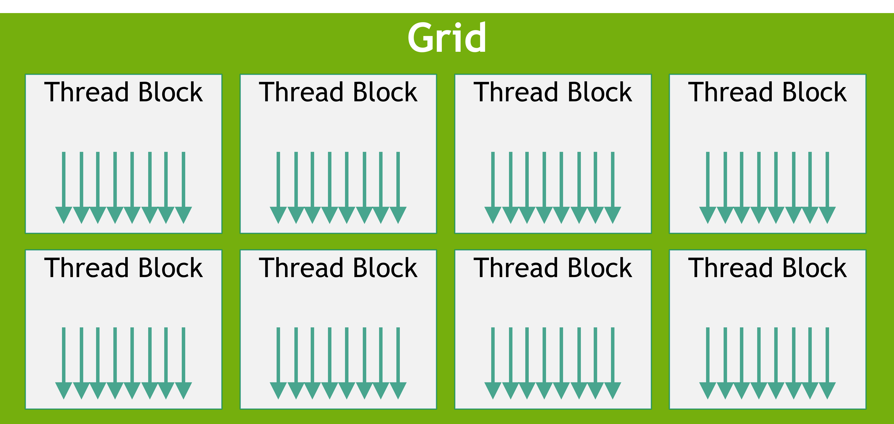

# 2.2. Writing CUDA SIMT Kernels — SIMT, Thread Hierarchy, and Memory Spaces

CUDA C++ kernels can largely be written in the same way that traditional CPU code would be written for a given problem. However, there are some unique features of the GPU that can be used to improve performance. Additionally, some understanding of how threads on the GPU are scheduled, how they access memory, and how their execution proceeds can help developers write kernels that maximize utilization of the available computing resources.

## 2.2.1. Basics of SIMT

From the developer's perspective, the CUDA thread is the fundamental unit of parallelism. [Warps and SIMT](../01-introduction/programming-model.html#programming-model-warps-simt) describes the basic SIMT model of GPU execution and [SIMT Execution Model](../03-advanced/advanced-kernel-programming.html#advanced-kernels-hardware-implementation-simt-architecture) provides additional details of the SIMT model. The SIMT model allows each thread to maintain its own state and control flow. From a functional perspective, each thread can execute a separate code path. However, substantial performance improvements can be realized by taking care that kernel code minimizes the situations where threads in the same warp take divergent code paths.

## 2.2.2. Thread Hierarchy

Threads are organized into thread blocks, which are then organized into a grid. Grids may be 1, 2, or 3 dimensional and the size of the grid can be queried inside a kernel with the `gridDim` built-in variable. Thread blocks may also be 1, 2, or 3 dimensional. The size of the thread block can be queried inside a kernel with the `blockDim` built-in variable. The index of the thread block can be queried with the `blockIdx` built-in variable. Within a thread block, the index of the thread is obtained using the `threadIdx` built-in variable. These built-in variables are used to compute a unique global thread index for each thread, thereby enabling each thread to load/store specific data from global memory and execute a unique code path as needed.

* `gridDim.[x|y|z]`: Size of the grid in the `x`, `y` and `z` dimension respectively. These values are set at kernel launch.
* `blockDim.[x|y|z]`: Size of the block in the `x`, `y` and `z` dimension respectively. These values are set at kernel launch.
* `blockIdx.[x|y|z]`: Index of the block in the `x`, `y` and `z` dimension respectively. These values change depending on which block is executing.
* `threadIdx.[x|y|z]`: Index of the thread in the `x`, `y` and `z` dimension respectively. These values change depending on which thread is executing.

The use of multi-dimensional thread blocks and grids is for convenience only and does not affect performance. The threads of a block are linearized predictably: the first index `x` moves the fastest, followed by `y` and then `z`. This means that in the linearization of a thread indices, consecutive values of `threadIdx.x` indicate consecutive threads, `threadIdx.y` has a stride of `blockDim.x`, and `threadIdx.z` has a stride of `blockDim.x * blockDim.y`. This affects how threads are assigned to warps, as detailed in [Hardware Multithreading](../03-advanced/advanced-kernel-programming.html#advanced-kernels-hardware-implementation-hardware-multithreading).

[Figure 9](#writing-cuda-kernels-thread-hierarchy-review-grid-of-thread-blocks) shows a simple example of a 2D grid, with 1D thread blocks.



*Figure 9 Grid of Thread Blocks*

## 2.2.3. GPU Device Memory Spaces

CUDA devices have several memory spaces that can be accessed by CUDA threads within kernels. [Table 1](#writing-cuda-kernels-memory-types-scopes-lifetimes) shows a summary of the common memory types, their thread scopes, and their lifetimes. The following sections explain each of these memory types in more detail.

Table 1 Memory Types, Scopes and Lifetimes

| Memory Type | Scope | Lifetime | Location |
| --- | --- | --- | --- |
| Global | Grid | Application | Device |
| Constant | Grid | Application | Device |
| Shared | Block | Kernel | SM |
| Local | Thread | Kernel | Device |
| Register | Thread | Kernel | SM |

### 2.2.3.1. Global Memory

Global memory (also called device memory) is the primary memory space for storing data that is accessible by all threads in a kernel. It is similar to RAM in a CPU system. Kernels running on the GPU have direct access to global memory in the same way code running on the CPU has access to system memory.

Global memory is persistent. That is, an allocation made in global memory and the data stored in it persist until the allocation is freed or until the application is terminated. `cudaDeviceReset` also frees all allocations.

Global memory is allocated with CUDA API calls such as `cudaMalloc` and `cudaMallocManaged`. Data can be copied into global memory from CPU memory using CUDA runtime API calls such as `cudaMemcpy`. Global memory allocations made with CUDA APIs are freed using `cudaFree`.

Prior to a kernel launch, global memory is allocated and initialized by CUDA API calls. During kernel execution, data from global memory can be read by the CUDA threads, and the result from operations carried out by CUDA threads can be written back to global memory. Once a kernel has completed execution, the results it wrote to global memory can be copied back to the host or used by other kernels on the GPU.

Because global memory is accessible by all threads in a grid, care must be taken to avoid data races between threads. Since CUDA kernels launched from the host have the return type `void`, the only way for numerical results computed by a kernel to be returned to the host is by writing those results to global memory.

A simple example illustrating the use of global memory is the `vecAdd` kernel below, where the three arrays `A`, `B`, and `C` are in global memory and are being accessed by this vector add kernel.

```
__global__ void vecAdd(float* A, float* B, float* C, int vectorLength)
{
    int workIndex = threadIdx.x + blockIdx.x*blockDim.x;
    if(workIndex < vectorLength)
    {
        C[workIndex] = A[workIndex] + B[workIndex];
```

### 2.2.3.2. Shared Memory

Shared memory is a memory space that is accessible by all threads in a thread block. It is physically located on each SM and uses the same physical resource as the L1 cache, the unified data cache. The data in shared memory persists throughout the kernel execution. Shared memory can be considered a user-managed scratchpad for use during kernel execution. While small in size compared to global memory, because shared memory is located on each SM, the bandwidth is higher and the latency is lower than accessing global memory.

Since shared memory is accessible by all threads in a thread block, care must be taken to avoid data races between threads in the same thread block. Synchronization between threads in the same thread block can be achieved using the `__syncthreads()` function. This function blocks all threads in the thread block until all threads have reached the call to `__syncthreads()`.

```
// assuming blockDim.x is 128
__global__ void example_syncthreads(int* input_data, int* output_data) {
    __shared__ int shared_data[128];
    // Every thread writes to a distinct element of 'shared_data':
    shared_data[threadIdx.x] = input_data[threadIdx.x];

    // All threads synchronize, guaranteeing all writes to 'shared_data' are ordered
    // before any thread is unblocked from '__syncthreads()':
    __syncthreads();

    // A single thread safely reads 'shared_data':
    if (threadIdx.x == 0) {
        int sum = 0;
        for (int i = 0; i < blockDim.x; ++i) {
            sum += shared_data[i];
        }
        output_data[blockIdx.x] = sum;
    }
}
```

The size of shared memory varies depending on the GPU architecture being used. Because shared memory and L1 cache share the same physical space, using shared memory reduces the size of the usable L1 cache for a kernel. Additionally, if no shared memory is used by the kernel, the entire physical space will be utilized by L1 cache. The CUDA runtime API provides functions to query the shared memory size on a per SM basis and a per thread block basis, using the `cudaGetDeviceProperties` function and investigating the `cudaDeviceProp.sharedMemPerMultiprocessor` and `cudaDeviceProp.sharedMemPerBlock` device properties.

The CUDA runtime API provides a function `cudaFuncSetCacheConfig` to tell the runtime whether to allocate more space to shared memory, or more space to L1 cache. This function specifies a preference to the runtime, but is not guaranteed to be honored. The runtime is free to make decisions based on the available resources and the needs of the kernel.

Shared memory can be allocated both statically and dynamically.

#### 2.2.3.2.1. Static Allocation of Shared Memory

To allocate shared memory statically, the programmer must declare a variable inside the kernel using the `__shared__` specifier. The variable will be allocated in shared memory and will persist for the duration of the kernel execution. The size of the shared memory declared in this way must be specified at compile time. For example, the following code snippet, located in the body of the kernel, declares a shared memory array of type `float` with 1024 elements.

```
__shared__ float sharedArray[1024];
```

After this declaration, all the threads in the thread block will have access to this shared memory array. Care must be taken to avoid data races between threads in the same thread block, typically with the use of `__syncthreads()`.

#### 2.2.3.2.2. Dynamic Allocation of Shared Memory

To allocate shared memory dynamically, the programmer can specify the desired amount of shared memory per thread block in bytes as the third (and optional) argument to the kernel launch in the triple chevron notation like this `functionName<<<grid, block, sharedMemoryBytes>>>()`.

Then, inside the kernel, the programmer can use the `extern __shared__` specifier to declare a variable that will be allocated dynamically at kernel launch.

```
extern __shared__ float sharedArray[];
```

One caveat is that if one wants multiple dynamically allocated shared memory arrays, the single `extern __shared__` must be partitioned manually using pointer arithmetic. For example, if one wants the equivalent of the following,

```
short array0[128];
float array1[64];
int   array2[256];
```

in dynamically allocated shared memory, one could declare and initialize the arrays in the following way:

```
extern __shared__ float array[];

short* array0 = (short*)array;
float* array1 = (float*)&array0[128];
int*   array2 =   (int*)&array1[64];
```

Note that pointers need to be aligned to the type they point to, so the following code, for example, does not work since `array1` is not aligned to 4 bytes.

```
extern __shared__ float array[];
short* array0 = (short*)array;
float* array1 = (float*)&array0[127];
```

### 2.2.3.3. Registers

Registers are located on the SM and have thread local scope. Register usage is managed by the compiler and registers are used for thread local storage during the execution of a kernel. The number of registers per SM and the number of registers per thread block can be queried using the `regsPerMultiprocessor` and `regsPerBlock` device properties of the GPU.

NVCC allows the developer to [specify a maximum number of registers](https://docs.nvidia.com/cuda/cuda-compiler-driver-nvcc/index.html#maxrregcount-amount-maxrregcount) to be used by a kernel via the `-maxrregcount` option. Using this option to reduce the number of registers a kernel can use may result in more thread blocks being scheduled on the SM concurrently, but may also result in more register spilling.

### 2.2.3.4. Local Memory

Local memory is thread local storage similar to registers and managed by NVCC, but the physical location of local memory is in the global memory space. The "local" label refers to its logical scope, not its physical location. Local memory is used for thread local storage during the execution of a kernel. Automatic variables that the compiler is likely to place in local memory are:

* Arrays for which it cannot determine that they are indexed with constant quantities,
* Large structures or arrays that would consume too much register space,
* Any variable if the kernel uses more registers than available, that is register spilling.

Because the local memory space resides in device memory, local memory accesses have the same latency and bandwidth as global memory accesses and are subject to the same requirements for memory coalescing as described in [Coalesced Global Memory Access](#writing-cuda-kernels-coalesced-global-memory-access). Local memory is however organized such that consecutive 32-bit words are accessed by consecutive thread IDs. Accesses are therefore fully coalesced as long as all threads in a warp access the same relative address, such as the same index in an array variable or the same member in a structure variable.

### 2.2.3.5. Constant Memory

Constant memory has a grid scope and is accessible for the lifetime of the application. The constant memory resides on the device and is read-only to the kernel. As such, it must be declared and initialized on the host with the `__constant__` specifier, outside any function.

The `__constant__` memory space specifier declares a variable that:

* Resides in constant memory space,
* Has the lifetime of the CUDA context in which it is created,
* Has a distinct object per device,
* Is accessible from all the threads within the grid and from the host through the runtime library (`cudaGetSymbolAddress()` / `cudaGetSymbolSize()` / `cudaMemcpyToSymbol()` / `cudaMemcpyFromSymbol()`).

The total amount of constant memory can be queried with the `totalConstMem` device property element.

Constant memory is useful for small amounts of data that each thread will use in a read-only fashion. Constant memory is small relative to other memories, typically 64KB per device.

An example snippet of declaring and using constant memory follows.

```
// In your .cu file
__constant__ float coeffs[4];

__global__ void compute(float *out) {
    int idx = threadIdx.x;
    out[idx] = coeffs[0] * idx + coeffs[1];
}

// In your host code
float h_coeffs[4] = {1.0f, 2.0f, 3.0f, 4.0f};
cudaMemcpyToSymbol(coeffs, h_coeffs, sizeof(h_coeffs));
compute<<<1, 10>>>(device_out);
```

### 2.2.3.6. Caches

GPU devices have a multi-level cache structure which includes L2 and L1 caches.

The L2 cache is located on the device and is shared among all the SMs. The size of the L2 cache can be queried with the `l2CacheSize` device property element from the function `cudaGetDeviceProperties`.

As described above in [Shared Memory](#writing-cuda-kernels-shared-memory), L1 cache is physically located on each SM and is the same physical space used by shared memory. If no shared memory is utilized by a kernel, the entire physical space will be utilized by the L1 cache.

The L2 and L1 caches can be controlled via functions that allow the developer to specify various caching behaviors. The details of these functions are found in [Configuring L1/Shared Memory Balance](../03-advanced/advanced-kernel-programming.html#advanced-kernel-l1-shared-config), [L2 Cache Control](../04-special-topics/l2-cache-control.html#advanced-kernels-l2-control), and [Low-Level Load and Store Functions](../05-appendices/cpp-language-extensions.html#low-level-load-store-functions).

If these hints are not used, the compiler and runtime will do their best to utilize the caches efficiently.

### 2.2.3.7. Texture and Surface Memory

Note

Some older CUDA code may use texture memory because, in older NVIDIA GPUs, doing so provided performance benefits in some scenarios. On all currently supported GPUs, these scenarios may be handled using direct load and store instructions, and use of texture and surface memory instructions no longer provides any performance benefit.

A GPU may have specialized instructions for loading data from an image to be used as textures in 3D rendering. CUDA exposes these instructions and the machinery to use them in the [texture object API](https://docs.nvidia.com/cuda/cuda-runtime-api/group__CUDART__TEXTURE__OBJECT.html) and the [surface object API](https://docs.nvidia.com/cuda/cuda-runtime-api/group__CUDART__SURFACE__OBJECT.html).

Texture and Surface memory are not discussed further in this guide as there is no advantage to using them in CUDA on any currently supported NVIDIA GPU. CUDA developers should feel free to ignore these APIs. For developers working on existing code bases which still use them, explanations of these APIs can still be found in the legacy [CUDA C++ Programming Guide](https://docs.nvidia.com/cuda/cuda-c-programming-guide/index.html#texture-and-surface-memory).

### 2.2.3.8. Distributed Shared Memory

[Thread Block Clusters](../01-introduction/programming-model.html#programming-model-thread-block-clusters) introduced in compute capability 9.0 and facilitated by [Cooperative Groups](../04-special-topics/cooperative-groups.html#cooperative-groups), provide the ability for threads in a thread block cluster to access shared memory of all the participating thread blocks in that cluster. This partitioned shared memory is called *Distributed Shared Memory*, and the corresponding address space is called Distributed Shared Memory address space. Threads that belong to a thread block cluster can read, write or perform atomics in the distributed address space, regardless whether the address belongs to the local thread block or a remote thread block. Whether a kernel uses distributed shared memory or not, the shared memory size specifications, static or dynamic is still per thread block. The size of distributed shared memory is just the number of thread blocks per cluster multiplied by the size of shared memory per thread block.

Accessing data in distributed shared memory requires all the thread blocks to exist. A user can guarantee that all thread blocks have started executing using `cluster.sync()` from [class cluster\_group](../05-appendices/device-callable-apis.html#cg-api-cluster-group). The user also needs to ensure that all distributed shared memory operations happen before the exit of a thread block, e.g., if a remote thread block is trying to read a given thread block's shared memory, the program needs to ensure that the shared memory read by the remote thread block is completed before it can exit.

Let's look at a simple histogram computation and how to optimize it on the GPU using thread block cluster. A standard way of computing histograms is to perform the computation in the shared memory of each thread block and then perform global memory atomics. A limitation of this approach is the shared memory capacity. Once the histogram bins no longer fit in the shared memory, a user needs to directly compute histograms and hence the atomics in the global memory. With distributed shared memory, CUDA provides an intermediate step, where depending on the histogram bins size, the histogram can be computed in shared memory, distributed shared memory or global memory directly.

The CUDA kernel example below shows how to compute histograms in shared memory or distributed shared memory, depending on the number of histogram bins.

```
#include <cooperative_groups.h>

// Distributed Shared memory histogram kernel
__global__ void clusterHist_kernel(int *bins, const int nbins, const int bins_per_block, const int *__restrict__ input,
                                   size_t array_size)
{
  extern __shared__ int smem[];
  namespace cg = cooperative_groups;
  int tid = cg::this_grid().thread_rank();

  // Cluster initialization, size and calculating local bin offsets.
  cg::cluster_group cluster = cg::this_cluster();
  unsigned int clusterBlockRank = cluster.block_rank();
  int cluster_size = cluster.dim_blocks().x;

  for (int i = threadIdx.x; i < bins_per_block; i += blockDim.x)
  {
    smem[i] = 0; //Initialize shared memory histogram to zeros
  }

  // cluster synchronization ensures that shared memory is initialized to zero in
  // all thread blocks in the cluster. It also ensures that all thread blocks
  // have started executing and they exist concurrently.
  cluster.sync();

  for (int i = tid; i < array_size; i += blockDim.x * gridDim.x)
  {
    int ldata = input[i];

    //Find the right histogram bin.
    int binid = ldata;
    if (ldata < 0)
      binid = 0;
    else if (ldata >= nbins)
      binid = nbins - 1;

    //Find destination block rank and offset for computing
    //distributed shared memory histogram
    int dst_block_rank = (int)(binid / bins_per_block);
    int dst_offset = binid % bins_per_block;

    //Pointer to target block shared memory
    int *dst_smem = cluster.map_shared_rank(smem, dst_block_rank);

    //Perform atomic update of the histogram bin
    atomicAdd(dst_smem + dst_offset, 1);
  }

  // cluster synchronization is required to ensure all distributed shared
  // memory operations are completed and no thread block exits while
  // other thread blocks are still accessing distributed shared memory
  cluster.sync();

  // Perform global memory histogram, using the local distributed memory histogram
  int *lbins = bins + cluster.block_rank() * bins_per_block;
  for (int i = threadIdx.x; i < bins_per_block; i += blockDim.x)
  {
    atomicAdd(&lbins[i], smem[i]);
  }
}
```

The above kernel can be launched at runtime with a cluster size depending on the amount of distributed shared memory required. If the histogram is small enough to fit in shared memory of just one block, the user can launch the kernel with cluster size 1. The code snippet below shows how to launch a cluster kernel dynamically based on shared memory requirements.

```
// Launch via extensible launch
{
  cudaLaunchConfig_t config = {0};
  config.gridDim = array_size / threads_per_block;
  config.blockDim = threads_per_block;

  // cluster_size depends on the histogram size.
  // ( cluster_size == 1 ) implies no distributed shared memory, just thread block local shared memory
  int cluster_size = 2; // size 2 is an example here
  int nbins_per_block = nbins / cluster_size;

  //dynamic shared memory size is per block.
  //Distributed shared memory size =  cluster_size * nbins_per_block * sizeof(int)
  config.dynamicSmemBytes = nbins_per_block * sizeof(int);

  CUDA_CHECK(::cudaFuncSetAttribute((void *)clusterHist_kernel, cudaFuncAttributeMaxDynamicSharedMemorySize, config.dynamicSmemBytes));

  cudaLaunchAttribute attribute[1];
  attribute[0].id = cudaLaunchAttributeClusterDimension;
  attribute[0].val.clusterDim.x = cluster_size;
  attribute[0].val.clusterDim.y = 1;
  attribute[0].val.clusterDim.z = 1;

  config.numAttrs = 1;
  config.attrs = attribute;

  cudaLaunchKernelEx(&config, clusterHist_kernel, bins, nbins, nbins_per_block, input, array_size);
}
```
