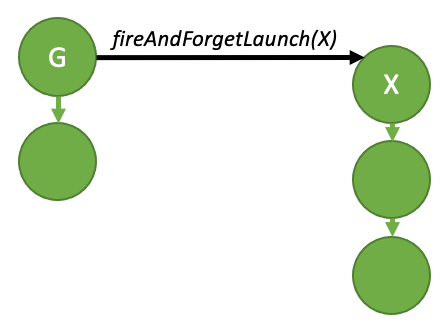
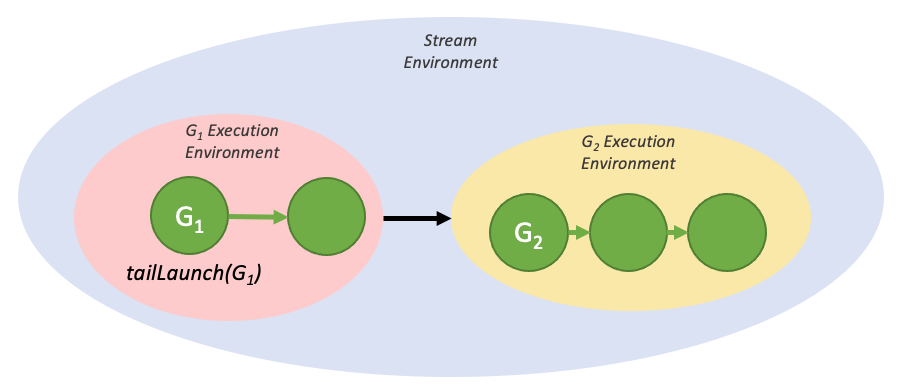
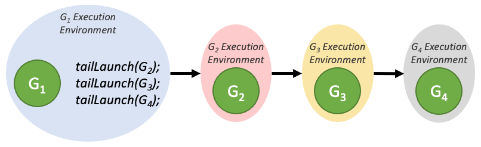

## 4.2.6. Device Graph Launch

There are many workflows which need to make data-dependent decisions during runtime and execute different operations depending on those decisions. Rather than offloading this decision-making process to the host, which may require a round-trip from the device, users may prefer to perform it on the device. To that end, CUDA provides a mechanism to launch graphs from the device.

Device graph launch provides a convenient way to perform dynamic control flow from the device, be it something as simple as a loop or as complex as a device-side work scheduler.

Graphs which can be launched from the device will henceforth be referred to as device graphs, and graphs which cannot be launched from the device will be referred to as host graphs.

Device graphs can be launched from both the host and device, whereas host graphs can only be launched from the host. Unlike host launches, launching a device graph from the device while a previous launch of the graph is running will result in an error, returning `cudaErrorInvalidValue`; therefore, a device graph cannot be launched twice from the device at the same time. Launching a device graph from the host and device simultaneously will result in undefined behavior.

### 4.2.6.1. Device Graph Creation

In order for a graph to be launched from the device, it must be instantiated explicitly for device launch. This is achieved by passing the `cudaGraphInstantiateFlagDeviceLaunch` flag to the `cudaGraphInstantiate()` call. As is the case for host graphs, device graph structure is fixed at time of instantiation and cannot be updated without re-instantiation, and instantiation can only be performed on the host. In order for a graph to be able to be instantiated for device launch, it must adhere to various requirements.

#### 4.2.6.1.1. Device Graph Requirements

General requirements:

* The graph’s nodes must all reside on a single device.
* The graph can only contain kernel nodes, memcpy nodes, memset nodes, and child graph nodes.

Kernel nodes:

* Use of CUDA Dynamic Parallelism by kernels in the graph is not permitted.
* Cooperative launches are permitted so long as MPS is not in use.

Memcpy nodes:

* Only copies involving device memory and/or pinned device-mapped host memory are permitted.
* Copies involving CUDA arrays are not permitted.
* Both operands must be accessible from the current device at time of instantiation. Note that the copy operation will be performed from the device on which the graph resides, even if it is targeting memory on another device.

#### 4.2.6.1.2. Device Graph Upload

In order to launch a graph on the device, it must first be uploaded to the device to populate the necessary device resources. This can be achieved in one of two ways.

Firstly, the graph can be uploaded explicitly, either via `cudaGraphUpload()` or by requesting an upload as part of instantiation via `cudaGraphInstantiateWithParams()`.

Alternatively, the graph can first be launched from the host, which will perform this upload step implicitly as part of the launch.

Examples of all three methods can be seen below:

```
// Explicit upload after instantiation
cudaGraphInstantiate(&deviceGraphExec1, deviceGraph1, cudaGraphInstantiateFlagDeviceLaunch);
cudaGraphUpload(deviceGraphExec1, stream);

// Explicit upload as part of instantiation
cudaGraphInstantiateParams instantiateParams = {0};
instantiateParams.flags = cudaGraphInstantiateFlagDeviceLaunch | cudaGraphInstantiateFlagUpload;
instantiateParams.uploadStream = stream;
cudaGraphInstantiateWithParams(&deviceGraphExec2, deviceGraph2, &instantiateParams);

// Implicit upload via host launch
cudaGraphInstantiate(&deviceGraphExec3, deviceGraph3, cudaGraphInstantiateFlagDeviceLaunch);
cudaGraphLaunch(deviceGraphExec3, stream);
```

#### 4.2.6.1.3. Device Graph Update

Device graphs can only be updated from the host, and must be re-uploaded to the device upon executable graph update in order for the changes to take effect. This can be achieved using the same methods outlined in Section [device-graph-upload](#cuda-graphs-device-graph-upload). Unlike host graphs, launching a device graph from the device while an update is being applied will result in undefined behavior.

### 4.2.6.2. Device Launch

Device graphs can be launched from both the host and the device via `cudaGraphLaunch()`, which has the same signature on the device as on the host. Device graphs are launched via the same handle on the host and the device. Device graphs must be launched from another graph when launched from the device.

Device-side graph launch is per-thread and multiple launches may occur from different threads at the same time, so the user will need to select a single thread from which to launch a given graph.

Unlike host launch, device graphs cannot be launched into regular CUDA streams, and can only be launched into distinct named streams, which each denote a specific launch mode. The following table lists the available launch modes.

Table 9 Device-only Graph Launch Streams

| Stream | Launch Mode |
| --- | --- |
| `cudaStreamGraphFireAndForget` | Fire and forget launch |
| `cudaStreamGraphTailLaunch` | Tail launch |
| `cudaStreamGraphFireAndForgetAsSibling` | Sibling launch |

#### 4.2.6.2.1. Fire and Forget Launch

As the name suggests, a fire and forget launch is submitted to the GPU immediately, and it runs independently of the launching graph. In a fire-and-forget scenario, the launching graph is the parent, and the launched graph is the child.



*Figure 31 Fire and forget launch*

The above diagram can be generated by the sample code below:

```
__global__ void launchFireAndForgetGraph(cudaGraphExec_t graph) {
    cudaGraphLaunch(graph, cudaStreamGraphFireAndForget);
}

void graphSetup() {
    cudaGraphExec_t gExec1, gExec2;
    cudaGraph_t g1, g2;

    // Create, instantiate, and upload the device graph.
    create_graph(&g2);
    cudaGraphInstantiate(&gExec2, g2, cudaGraphInstantiateFlagDeviceLaunch);
    cudaGraphUpload(gExec2, stream);

    // Create and instantiate the launching graph.
    cudaStreamBeginCapture(stream, cudaStreamCaptureModeGlobal);
    launchFireAndForgetGraph<<<1, 1, 0, stream>>>(gExec2);
    cudaStreamEndCapture(stream, &g1);
    cudaGraphInstantiate(&gExec1, g1);

    // Launch the host graph, which will in turn launch the device graph.
    cudaGraphLaunch(gExec1, stream);
}
```

A graph can have up to 120 total fire-and-forget graphs during the course of its execution. This total resets between launches of the same parent graph.

##### 4.2.6.2.1.1. Graph Execution Environments

In order to fully understand the device-side synchronization model, it is first necessary to understand the concept of an execution environment.

When a graph is launched from the device, it is launched into its own execution environment. The execution environment of a given graph encapsulates all work in the graph as well as all generated fire and forget work. The graph can be considered complete when it has completed execution and when all generated child work is complete.

The below diagram shows the environment encapsulation that would be generated by the fire-and-forget sample code in the previous section.


*Figure 32 Fire and forget launch, with execution environments*

These environments are also hierarchical, so a graph environment can include multiple levels of child-environments from fire and forget launches.


*Figure 33 Nested fire and forget environments*

When a graph is launched from the host, there exists a stream environment that parents the execution environment of the launched graph. The stream environment encapsulates all work generated as part of the overall launch. The stream launch is complete (i.e. downstream dependent work may now run) when the overall stream environment is marked as complete.


*Figure 34 The stream environment, visualized*

#### 4.2.6.2.2. Tail Launch

Unlike on the host, it is not possible to synchronize with device graphs from the GPU via traditional methods such as `cudaDeviceSynchronize()` or `cudaStreamSynchronize()`. Rather, in order to enable serial work dependencies, a different launch mode - tail launch - is offered, to provide similar functionality.

A tail launch executes when a graph’s environment is considered complete - ie, when the graph and all its children are complete. When a graph completes, the environment of the next graph in the tail launch list will replace the completed environment as a child of the parent environment. Like fire-and-forget launches, a graph can have multiple graphs enqueued for tail launch.



*Figure 35 A simple tail launch*

The above execution flow can be generated by the code below:

```
__global__ void launchTailGraph(cudaGraphExec_t graph) {
    cudaGraphLaunch(graph, cudaStreamGraphTailLaunch);
}

void graphSetup() {
    cudaGraphExec_t gExec1, gExec2;
    cudaGraph_t g1, g2;

    // Create, instantiate, and upload the device graph.
    create_graph(&g2);
    cudaGraphInstantiate(&gExec2, g2, cudaGraphInstantiateFlagDeviceLaunch);
    cudaGraphUpload(gExec2, stream);

    // Create and instantiate the launching graph.
    cudaStreamBeginCapture(stream, cudaStreamCaptureModeGlobal);
    launchTailGraph<<<1, 1, 0, stream>>>(gExec2);
    cudaStreamEndCapture(stream, &g1);
    cudaGraphInstantiate(&gExec1, g1);

    // Launch the host graph, which will in turn launch the device graph.
    cudaGraphLaunch(gExec1, stream);
}
```

Tail launches enqueued by a given graph will execute one at a time, in order of when they were enqueued. So the first enqueued graph will run first, and then the second, and so on.



*Figure 36 Tail launch ordering*

Tail launches enqueued by a tail graph will execute before tail launches enqueued by previous graphs in the tail launch list. These new tail launches will execute in the order they are enqueued.


*Figure 37 Tail launch ordering when enqueued from multiple graphs*

A graph can have up to 255 pending tail launches.

##### 4.2.6.2.2.1. Tail Self-launch

It is possible for a device graph to enqueue itself for a tail launch, although a given graph can only have one self-launch enqueued at a time. In order to query the currently running device graph so that it can be relaunched, a new device-side function is added:

```
cudaGraphExec_t cudaGetCurrentGraphExec();
```

This function returns the handle of the currently running graph if it is a device graph. If the currently executing kernel is not a node within a device graph, this function will return NULL.

Below is sample code showing usage of this function for a relaunch loop:

```
__device__ int relaunchCount = 0;

__global__ void relaunchSelf() {
    int relaunchMax = 100;

    if (threadIdx.x == 0) {
        if (relaunchCount < relaunchMax) {
            cudaGraphLaunch(cudaGetCurrentGraphExec(), cudaStreamGraphTailLaunch);
        }

        relaunchCount++;
    }
}
```

#### 4.2.6.2.3. Sibling Launch

Sibling launch is a variation of fire-and-forget launch in which the graph is launched not as a child of the launching graph’s execution environment, but rather as a child of the launching graph’s parent environment. Sibling launch is equivalent to a fire-and-forget launch from the launching graph’s parent environment.


*Figure 38 A simple sibling launch*

The above diagram can be generated by the sample code below:

```
__global__ void launchSiblingGraph(cudaGraphExec_t graph) {
    cudaGraphLaunch(graph, cudaStreamGraphFireAndForgetAsSibling);
}

void graphSetup() {
    cudaGraphExec_t gExec1, gExec2;
    cudaGraph_t g1, g2;

    // Create, instantiate, and upload the device graph.
    create_graph(&g2);
    cudaGraphInstantiate(&gExec2, g2, cudaGraphInstantiateFlagDeviceLaunch);
    cudaGraphUpload(gExec2, stream);

    // Create and instantiate the launching graph.
    cudaStreamBeginCapture(stream, cudaStreamCaptureModeGlobal);
    launchSiblingGraph<<<1, 1, 0, stream>>>(gExec2);
    cudaStreamEndCapture(stream, &g1);
    cudaGraphInstantiate(&gExec1, g1);

    // Launch the host graph, which will in turn launch the device graph.
    cudaGraphLaunch(gExec1, stream);
}
```

Since sibling launches are not launched into the launching graph’s execution environment, they will not gate tail launches enqueued by the launching graph.

## 4.2.7. Using Graph APIs

`cudaGraph_t` objects are not thread-safe. It is the responsibility of the user to ensure that multiple threads do not concurrently access the same `cudaGraph_t`.

A `cudaGraphExec_t` cannot run concurrently with itself. A launch of a `cudaGraphExec_t` will be ordered after previous launches of the same executable graph.

Graph execution is done in streams for ordering with other asynchronous work. However, the stream is for ordering only; it does not constrain the internal parallelism of the graph, nor does it affect where graph nodes execute.

See [Graph API.](https://docs.nvidia.com/cuda/cuda-runtime-api/group__CUDART__GRAPH.html#group__CUDART__GRAPH)

## 4.2.8. CUDA User Objects

CUDA User Objects can be used to help manage the lifetime of resources used by asynchronous work in CUDA. In particular, this feature is useful for [cuda-graphs](#cuda-graphs) and [stream capture](#cuda-graphs-creating-a-graph-using-stream-capture).

Various resource management schemes are not compatible with CUDA graphs. Consider for example an event-based pool or a synchronous-create, asynchronous-destroy scheme.

```
// Library API with pool allocation
void libraryWork(cudaStream_t stream) {
    auto &resource = pool.claimTemporaryResource();
    resource.waitOnReadyEventInStream(stream);
    launchWork(stream, resource);
    resource.recordReadyEvent(stream);
}
```

```
// Library API with asynchronous resource deletion
void libraryWork(cudaStream_t stream) {
    Resource *resource = new Resource(...);
    launchWork(stream, resource);
    cudaLaunchHostFunc(
        stream,
        [](void *resource) {
            delete static_cast<Resource *>(resource);
        },
        resource,
        0);
    // Error handling considerations not shown
}
```

These schemes are difficult with CUDA graphs because of the non-fixed pointer or handle for the resource which requires indirection or graph update, and the synchronous CPU code needed each time the work is submitted. They also do not work with stream capture if these considerations are hidden from the caller of the library, and because of use of disallowed APIs during capture. Various solutions exist such as exposing the resource to the caller. CUDA user objects present another approach.

A CUDA user object associates a user-specified destructor callback with an internal refcount, similar to C++ `shared_ptr`. References may be owned by user code on the CPU and by CUDA graphs. Note that for user-owned references, unlike C++ smart pointers, there is no object representing the reference; users must track user-owned references manually. A typical use case would be to immediately move the sole user-owned reference to a CUDA graph after the user object is created.

When a reference is associated to a CUDA graph, CUDA will manage the graph operations automatically. A cloned `cudaGraph_t` retains a copy of every reference owned by the source `cudaGraph_t`, with the same multiplicity. An instantiated `cudaGraphExec_t` retains a copy of every reference in the source `cudaGraph_t`. When a `cudaGraphExec_t` is destroyed without being synchronized, the references are retained until the execution is completed.

Here is an example use.

```
cudaGraph_t graph;  // Preexisting graph

Object *object = new Object;  // C++ object with possibly nontrivial destructor
cudaUserObject_t cuObject;
cudaUserObjectCreate(
    &cuObject,
    object,  // Here we use a CUDA-provided template wrapper for this API,
             // which supplies a callback to delete the C++ object pointer
    1,  // Initial refcount
    cudaUserObjectNoDestructorSync  // Acknowledge that the callback cannot be
                                    // waited on via CUDA
);
cudaGraphRetainUserObject(
    graph,
    cuObject,
    1,  // Number of references
    cudaGraphUserObjectMove  // Transfer a reference owned by the caller (do
                             // not modify the total reference count)
);
// No more references owned by this thread; no need to call release API
cudaGraphExec_t graphExec;
cudaGraphInstantiate(&graphExec, graph, nullptr, nullptr, 0);  // Will retain a
                                                               // new reference
cudaGraphDestroy(graph);  // graphExec still owns a reference
cudaGraphLaunch(graphExec, 0);  // Async launch has access to the user objects
cudaGraphExecDestroy(graphExec);  // Launch is not synchronized; the release
                                  // will be deferred if needed
cudaStreamSynchronize(0);  // After the launch is synchronized, the remaining
                           // reference is released and the destructor will
                           // execute. Note this happens asynchronously.
// If the destructor callback had signaled a synchronization object, it would
// be safe to wait on it at this point.
```

References owned by graphs in child graph nodes are associated to the child graphs, not the parents. If a child graph is updated or deleted, the references change accordingly. If an executable graph or child graph is updated with `cudaGraphExecUpdate` or `cudaGraphExecChildGraphNodeSetParams`, the references in the new source graph are cloned and replace the references in the target graph. In either case, if previous launches are not synchronized, any references which would be released are held until the launches have finished executing.

There is not currently a mechanism to wait on user object destructors via a CUDA API. Users may signal a synchronization object manually from the destructor code. In addition, it is not legal to call CUDA APIs from the destructor, similar to the restriction on `cudaLaunchHostFunc`. This is to avoid blocking a CUDA internal shared thread and preventing forward progress. It is legal to signal another thread to perform an API call, if the dependency is one way and the thread doing the call cannot block forward progress of CUDA work.

User objects are created with `cudaUserObjectCreate`, which is a good starting point to browse related APIs.
