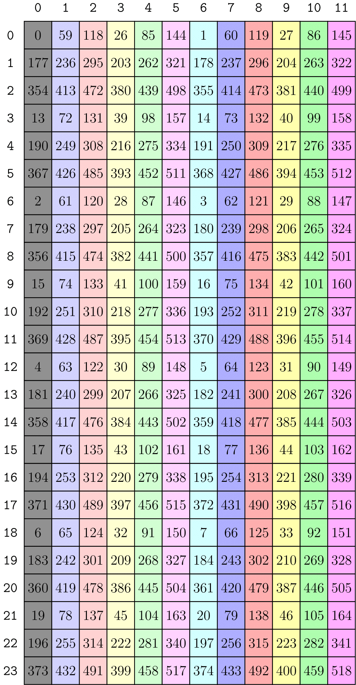
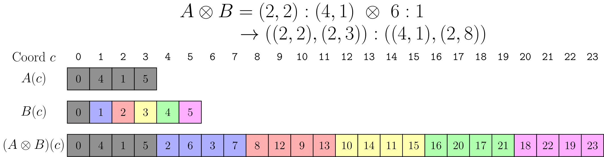
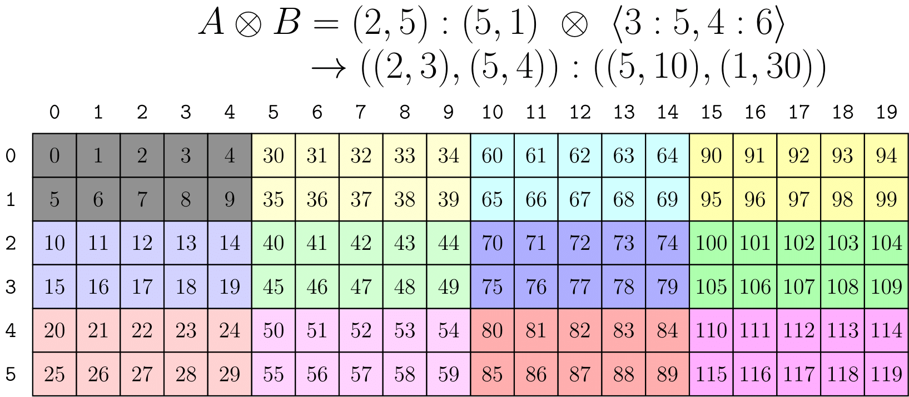
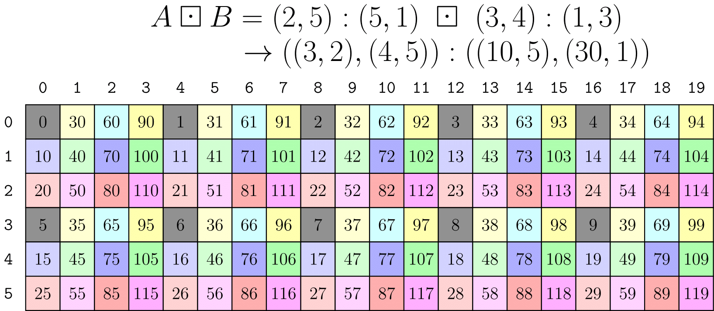

## Division (Tiling)

Finally, we can define the division of a `Layout` by another `Layout`. Functions that divide a layout into components are useful as a basis for tiling and partitioning layouts.

In this section, we'll define `logical_divide(Layout, Layout)`, which again considers all `Layout`s as 1-D functions from integers to integers, and then use that definition to create multidimensional `Layout` divides.

Informally, `logical_divide(A, B)` splits a layout `A` into two modes -- in the first mode are all elements pointed to by `B` and in the second mode are all elements not pointed to by `B`.

Formally, this can be written as

$A \oslash B := A \circ (B,B^\*)$

and implemented as

```cpp
template <class LShape, class LStride,
          class TShape, class TStride>
auto logical_divide(Layout<LShape,LStride> const& layout,
                    Layout<TShape,TStride> const& tiler)
{
  return composition(layout, make_layout(tiler, complement(tiler, size(layout))));
}
```

Note that this is defined only in terms of concatenation, composition, and complement.

So what is that?

> in the first mode are all elements pointed to by `B`

This is clearly composition, `A o B`.

> in the second mode are all elements not pointed to by `B`

The elements NOT pointed to by `B` sounds like a complement, `B*`, up to the size of `A`. As we've seen above in the `complement` section, this can be described as the "layout of the repetition of `B`." If `B` is the "tiler", then `B*` is the layout of the tiles.

### Logical Divide 1-D Example

Consider tiling the 1-D layout `A = (4,2,3):(2,1,8)` with the tiler `B = 4:2`. Informally, this means that we have a 1-D vector of 24 elements in some storage order defined by `A` and we want to extract tiles of 4 elements strided by 2.

This is computed in the three steps described in the implementation above.

* Complement of `B = 4:2` under `size(A) = 24` is `B* = (2,3):(1,8)`.
* Concantenation of `(B,B*) = (4,(2,3)):(2,(1,8))`.
* Composition of `A = (4,2,3):(2,1,8)` with `(B,B*)` is then `((2,2),(2,3)):((4,1),(2,8))`.


The above figure depicts `A` as a 1-D layout with the elements pointed to by `B` highlighted in gray. The layout `B` describes our "tile" of data, and there are six of those tiles in `A` shown by each of the colors. After the divide, the first mode of the result is the tile of data and the second mode of the result iterates over each tile.

### Logical Divide 2-D Example

Using the `Tiler` concept defined above, this immediately generalizes to multidimensional tiling. The below example simply applies `layout_divide` by-mode to the cols and rows of a 2-D layout using a `Tiler`.

Similar to the 2-D composition example above, consider a 2-D layout `A = (9,(4,8)):(59,(13,1))` and want to apply `3:3` down the columns (mode-0) and `(2,4):(1,8)` across the rows (mode-1). This means the tiler can be written as `B = <3:3, (2,4):(1,8)>`.


The above figure depicts `A` as a 2-D layout with the elements pointed to by `B` highlighted in gray. The layout `B` describes our "tile" of data, and there are twelve of those tiles in `A` shown by each of the colors. After the divide, the first mode of each mode of the result is the tile of data and the second mode of each mode iterates over each tile. In that sense, this operation can be viewed as a kind of `gather` operation or as simply a permutation on the rows and cols.

Note that the first mode of each mode of the result is the sublayout `(3,(2,4)):(177,(13,2))` and is precisely the result we would have received if we had applied `composition` instead of `logical_divide`.

### Zipped, Tiled, Flat Divides

It's easy to see the tiles when they are highlighted in the images above, but working with them can still be awkward. How would you slice out the `3`rd tile or the `7`th tile or the `(1,2)`th tile so you could continue working on it?

Enter the convenience flavors of `logical_divide`. Suppose we have a `Layout` and a `Tiler` of some shape, then each operation will apply `logical_divide`, but potentially rearrange the modes into more convenient forms.

```cpp
Layout Shape : (M, N, L, ...)
Tiler Shape  : <TileM, TileN>

logical_divide : ((TileM,RestM), (TileN,RestN), L, ...)
zipped_divide  : ((TileM,TileN), (RestM,RestN,L,...))
tiled_divide   : ((TileM,TileN), RestM, RestN, L, ...)
flat_divide    : (TileM, TileN, RestM, RestN, L, ...)
```

For example, the `zipped_divide` function applies `logical_divide`, and then gathers the "subtiles" into a single mode and the "rest" into a single mode.

```cpp
// A: shape is (9,32)
auto layout_a = make_layout(make_shape (Int< 9>{}, make_shape (Int< 4>{}, Int<8>{})),
                            make_stride(Int<59>{}, make_stride(Int<13>{}, Int<1>{})));
// B: shape is (3,8)
auto tiler = make_tile(Layout<_3,_3>{},           // Apply     3:3     to mode-0
                       Layout<Shape <_2,_4>,      // Apply (2,4):(1,8) to mode-1
                              Stride<_1,_8>>{});

// ((TileM,RestM), (TileN,RestN)) with shape ((3,3), (8,4))
auto ld = logical_divide(layout_a, tiler);
// ((TileM,TileN), (RestM,RestN)) with shape ((3,8), (3,4))
auto zd = zipped_divide(layout_a, tiler);
```

Then, the offset to the `3`rd tile is `zd(0,3)`. The offset to the `7`th tile is `zd(0,7)`. The offset to the `(1,2)`th tile is `zd(0,make_coord(1,2))`. The tile itself always has layout `layout<0>(zd)`. Indeed, it is always the case that

`layout<0>(zipped_divide(a, b)) == composition(a, b)`.

We note that `logical_divide` preserves the *semantics* of the modes while permuting the elements within those modes -- the `M`-mode of layout `A` is still the `M`-mode of the result and the `N`-mode of layout `A` is still the `N`-mode of the result.

This is not the case with `zipped_divide`. The mode-0 in the `zipped_divide` result is the `Tile` itself (of whatever rank the `Tiler` was) and mode-1 is the layout of those tiles. It doesn't always make sense to plot these as 2-D layouts, because the `M`-mode is now more aptly the "tile-mode" and the `N`-mode is more aptly the "rest-mode". Regardless, we still can plot the resulting layout as 2-D as shown below.



We've kept each tile as its color in the previous images for clarity. Clearly, iterating across tiles is now equivalent to iterating across a row of this layout and iterating over elements within a tile is equivalent to iterating down a column of this layout. As we'll see in the `Tensor` section, this can be used to great effect in partitioning within or across tiles of data.

## Product (Tiling)

Finally, we can define the product of a Layout by another Layout. In this section, we'll define `logical_product(Layout, Layout)`, which again considers all `Layout`s as 1-D functions from integers to integers, and then use that definition to create multidimensional `Layout` products.

Informally, `logical_product(A, B)` results in a two mode layout where the first mode is the layout `A` and the second mode is the layout `B` but with each element replaced by a "unique replication" of layout `A`.

Formally, this can be written as

$A \otimes B := (A, A^\* \circ B)$

and implemented in CuTe as

```cpp
template <class LShape, class LStride,
          class TShape, class TStride>
auto logical_product(Layout<LShape,LStride> const& layout,
                     Layout<TShape,TStride> const& tiler)
{
  return make_layout(layout, composition(complement(layout, size(layout)*cosize(tiler)), tiler));
}
```

Note that this is defined only in terms of concatenation, composition, and complement.

So what is that?

> where the first mode is the layout `A`

This is clearly just a copy of `A`.

> the second mode is the layout `B` but with each element replaced by a "unique replication" of layout `A`.

The "unique replication" of layout `A` sounds like complement, `A*`, up to the cosize of `B`. As we've seen in the `complement` section, this can be described as the "layout of the repetition of `A`". If `A` is the "tile", then `A*` is the layout of repetitions that are available for `B`.

### Logical Product 1-D Example

Consider reproducing the 1-D layout `A = (2,2):(4,1)` according to `B = 6:1`. Informally, this means that we have a 1-D layout of 4 elements defined by `A` and we want to reproduce it 6 times.

This is computed in the three steps described in the implementation above.

* Complement of `A = (2,2):(4,1)` under `6*4 = 24` is `A* = (2,3):(2,8)`.
* Composition of `A* = (2,3):(2,8)` with `B = 6:1` is then `(2,3):(2,8)`.
* Concatenation of `(A,A* o B) = ((2,2),(2,3)):((4,1),(2,8))`.



The above figure depicts `A` and `B` as a 1-D layouts. The layout `B` describes the number and order of repetitions of `A` and they are colored for clarity. After the product, the first mode of the result is the tile of data and the second mode of the result iterates over each tile.

Note that the result is identical to the result of the 1-D Logical Divide example.

Of course, we can change the number and order of the tiles in the product by changing `B`.


For example, in the above image with `B = (4,2):(2,1)`, there are 8 repeated tiles instead of 6 and the tiles are in a different order.

### Logical Product 2-D Example

We can use the by-mode `tiler` strategies previously developed to write multidimensional products as well.



The above image demonstates the use of a `tiler` to apply `logical_product` by-mode. Despite this **not being the recommended approach**, the result is a rank-2 layout consisting of 2x5 row-major block that is tiled across a 3x4 column-major arrangement.

The reason **this is not the recommended approach** is that the `tiler B` in the above expression is highly unintuitive. In fact, it requires perfect knowledge of the shape and strides of `A` in order to construct. We would like to express "Tile Layout `A` according to Layout `B`" in a way that makes `A` and `B` independent and is much more intuitive.

#### Blocked and Raked Products

The `blocked_product(LayoutA, LayoutB)` and `raked_product(LayoutA, LayoutB)` are rank-sensitive transformations on top of 1-D `logical_product` that let us express the more intuitive `Layout` products that we most often want to express.

A key observation in the implementation of these functions are the compatibility post-conditions of `logical_product`:

```cpp
// @post rank(result) == 2
// @post compatible(layout_a, layout<0>(result))
// @post compatible(layout_b, layout<1>(result))
```

Because `A` is always compatible with mode-0 of the result and `B` is always compatible with mode-1 of the result, if we made `A` and `B` the same rank then we could "reassociate" like-modes after the product. That is, the "column" mode in `A` could be combined with the "column" mode in `B` and the "row" mode in `A` could be combined with the "row" mode in `B`, etc.

This is exactly what `blocked_product` and `raked_product` do and it is why they are called rank-sensitive. Unlike other CuTe functions that take `Layout` arguments, these care about the top-level rank of the arguments so that each mode can be reassociated after the `logical_product`.


The above image shows the same result as the `tiler` approach, but with much more intuitive arguments. A 2x5 row-major layout is arranged as a tile in a 3x4 column-major arrangement. Also note that `blocked_product` went ahead and `coalesced` mode-0 for us.

Similarly, `raked_product` combines the modes slightly differently. Instead of the resulting "column" mode being constructed from the `A` "column" mode then the `B` "column" mode, the resulting "column" mode is constructed from the `B` "column" mode then the `A` "column" mode.



This results in the "tile" `A` now being interleaved or "raked" with the "layout-of-tiles" `B` instead of appearing as blocks. Other references call this a "cyclic distribution."

### Zipped and Tiled Products

Similar to `zipped_divide` and `tiled_divide`, the `zipped_product` and `tiled_product` simply rearrange the modes that result from a by-mode `logical_product`.

```cpp
Layout Shape : (M, N, L, ...)
Tiler Shape  : <TileM, TileN>

logical_product : ((M,TileM), (N,TileN), L, ...)
zipped_product  : ((M,N), (TileM,TileN,L,...))
tiled_product   : ((M,N), TileM, TileN, L, ...)
flat_product    : (M, N, TileM, TileN, L, ...)
```

## Copyright

Copyright (c) 2017 - 2026 NVIDIA CORPORATION & AFFILIATES. All rights reserved.
SPDX-License-Identifier: BSD-3-Clause

```
  Redistribution and use in source and binary forms, with or without
  modification, are permitted provided that the following conditions are met:

  1. Redistributions of source code must retain the above copyright notice, this
  list of conditions and the following disclaimer.

  2. Redistributions in binary form must reproduce the above copyright notice,
  this list of conditions and the following disclaimer in the documentation
  and/or other materials provided with the distribution.

  3. Neither the name of the copyright holder nor the names of its
  contributors may be used to endorse or promote products derived from
  this software without specific prior written permission.

  THIS SOFTWARE IS PROVIDED BY THE COPYRIGHT HOLDERS AND CONTRIBUTORS "AS IS"
  AND ANY EXPRESS OR IMPLIED WARRANTIES, INCLUDING, BUT NOT LIMITED TO, THE
  IMPLIED WARRANTIES OF MERCHANTABILITY AND FITNESS FOR A PARTICULAR PURPOSE ARE
  DISCLAIMED. IN NO EVENT SHALL THE COPYRIGHT HOLDER OR CONTRIBUTORS BE LIABLE
  FOR ANY DIRECT, INDIRECT, INCIDENTAL, SPECIAL, EXEMPLARY, OR CONSEQUENTIAL
  DAMAGES (INCLUDING, BUT NOT LIMITED TO, PROCUREMENT OF SUBSTITUTE GOODS OR
  SERVICES; LOSS OF USE, DATA, OR PROFITS; OR BUSINESS INTERRUPTION) HOWEVER
  CAUSED AND ON ANY THEORY OF LIABILITY, WHETHER IN CONTRACT, STRICT LIABILITY,
  OR TORT (INCLUDING NEGLIGENCE OR OTHERWISE) ARISING IN ANY WAY OUT OF THE USE
  OF THIS SOFTWARE, EVEN IF ADVISED OF THE POSSIBILITY OF SUCH DAMAGE.
```
