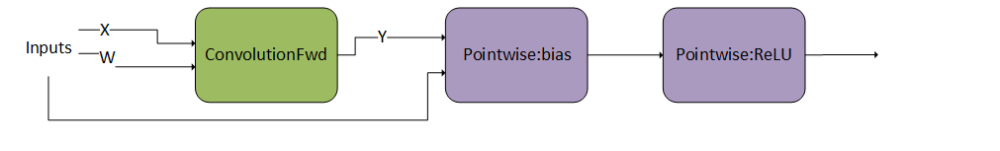
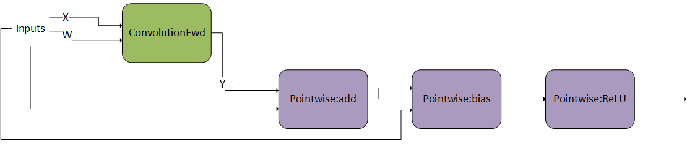
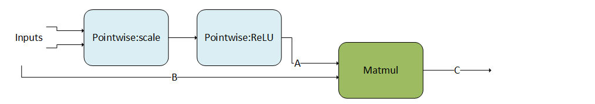

#### Operation Specific Constraints for the Runtime Fusion Engines

Every operation in the supported generic patterns of the runtime fusion engines is subject to a few specific constraints regarding their parameter surface. The following subsections document these.

Note that these constraints are in addition to (1) any constraints mentioned in the [Backend Descriptor Types](../../../backend/v9.20.0/api/cudnn-graph-library.html#graph-backend-desc-types "(in NVIDIA cuDNN Backend)"), and (2) limitations in relation to other operations in the directed acyclic graph (DAG), as mentioned in the [Support Surface](#limitations) section.

##### Matmul

This operation represents matrix-matrix multiplication: A \* B = C. For complete details on the interface, refer to the [CUDNN\_BACKEND\_OPERATION\_MATMUL\_DESCRIPTOR](../../../backend/v9.20.0/api/cudnn-graph-library.html#cudnn-backend-operation-matmul-descriptor "(in NVIDIA cuDNN Backend)") section.

##### Convolutions

There are three operation nodes that represent different types of convolutions namely:

`ConvolutionFwd`

> This operation represents forward convolution, that is, computing the response tensor of image tensor convoluted with filter tensor. For complete details on the interface, as well as general constraints, refer to the [CUDNN\_BACKEND\_OPERATION\_CONVOLUTION\_FORWARD\_DESCRIPTOR](../../../backend/v9.20.0/api/cudnn-graph-library.html#cudnn-backend-operation-convolution-forward-descriptor "(in NVIDIA cuDNN Backend)") section.

`ConvolutionBwdFilter`

> This operation represents convolution backward filters, that is, computing filter gradients from a response and an image tensor. For complete details on the interface, as well as general constraints, refer to the [CUDNN\_BACKEND\_OPERATION\_CONVOLUTION\_BACKWARD\_FILTER\_DESCRIPTOR](../../../backend/v9.20.0/api/cudnn-graph-library.html#cudnn-backend-operation-convolution-backward-filter-descriptor "(in NVIDIA cuDNN Backend)") section.

`ConvolutionBwdData`

> This operation represents convolution backward data, that is, computing input data gradients from a response and a filter tensor. For complete details on the interface, as well as general constraints, refer to the [CUDNN\_BACKEND\_OPERATION\_CONVOLUTION\_BACKWARD\_DATA\_DESCRIPTOR](../../../backend/v9.20.0/api/cudnn-graph-library.html#cudnn-backend-operation-convolution-backward-data-descriptor "(in NVIDIA cuDNN Backend)") section.

Tensor Attributes for all Three Operations

|  | Input Tensor Attribute Name | Output Tensor Attribute Name |
| --- | --- | --- |
| `ConvolutionFwd` | `CUDNN_ATTR_OPERATION_CONVOLUTION_FORWARD_X`, `CUDNN_ATTR_OPERATION_CONVOLUTION_FORWARD_W` | `CUDNN_ATTR_OPERATION_CONVOLUTION_FORWARD_Y` |
| `ConvolutionBwdFilter` | `CUDNN_ATTR_OPERATION_CONVOLUTION_BWD_DATA_DX`, `CUDNN_ATTR_OPERATION_CONVOLUTION_BWD_DATA_DY` | `CUDNN_ATTR_OPERATION_CONVOLUTION_BWD_DATA_W` |
| `ConvolutionBwdData` | `CUDNN_ATTR_OPERATION_CONVOLUTION_BWD_FILTER_DW`, `CUDNN_ATTR_OPERATION_CONVOLUTION_BWD_FILTER_DY` | `CUDNN_ATTR_OPERATION_CONVOLUTION_BWD_FILTER_X` |

The FP8 data type since NVIDIA Ada Lovelace architecture has two variants: `CUDNN_DATA_FP8_E4M3` and `CUDNN_DATA_FP8_E5M2` as I/O data types. Using them as inputs to the operation will result in FP8 Tensor Cores being used. The precision of the accumulation inside the FP8 Tensor Cores is controlled by the compute type, which may have one of two possible values: `CUDNN_DATA_FLOAT` and `CUDNN_DATA_FAST_FLOAT_FOR_FP8`.

`CUDNN_DATA_FAST_FLOAT_FOR_FP8` is faster and sufficiently accurate for inference or the forward pass of training. However, for FP8 training backward pass computations (that is, computing weight and activation gradients), we recommend choosing the more accurate `CUDNN_DATA_FLOAT` compute type to preserve a higher level of accuracy which may be necessary for some models.

Recommended Compute Type for FP8 Tensor Computations for Ada Lovelace and Hopper Architecture

| Operation | Recommended I/O Type | Recommended Compute Type |
| --- | --- | --- |
| `ConvolutionFwd` | `CUDNN_DATA_FP8_E4M3` | `CUDNN_DATA_FAST_FLOAT_FOR_FP8`, `CUDNN_DATA_FLOAT` |
| `ConvolutionBwdData` | `CUDNN_DATA_FP8_E4M3` | `CUDNN_DATA_FLOAT` |
| `BatchNorm` | `CUDNN_DATA_FP8_E4M3` | `CUDNN_DATA_FLOAT` |
| `Pooling` | `CUDNN_DATA_FP8_E4M3`, `CUDNN_DATA_FP8_E5M2` | `CUDNN_DATA_FLOAT` |
| `Pointwise` | `CUDNN_DATA_FP8_E4M3`, `CUDNN_DATA_FP8_E5M2` | `CUDNN_DATA_FLOAT` |

##### Pointwise

Represents a pointwise operation that implements the equation `Y = op (alpha1 * X)` or `Y = op (alpha1 * X, alpha2 * B)`. Refer to the [CUDNN\_BACKEND\_OPERATION\_POINTWISE\_DESCRIPTOR](../../../backend/v9.20.0/api/cudnn-graph-library.html#cudnn-backend-operation-pointwise-descriptor "(in NVIDIA cuDNN Backend)") and [CUDNN\_BACKEND\_POINTWISE\_DESCRIPTOR](../../../backend/v9.20.0/api/cudnn-graph-library.html#cudnn-backend-pointwise-descriptor "(in NVIDIA cuDNN Backend)") sections for more information and general constraints.

The following tables list the constraints for `Pointwise` operations, in addition to the general constraints listed above, and any constraints listed in the [Support Surface](#limitations) section, in relation to other operations. Note that these additional constraints only apply when these operations are used in the runtime fusion engines.

Constraints for `Pointwise` Operations for Support Surface 90 and 80

| Attribute | Requirement |
| --- | --- |
| Tensor data type for `CUDNN_ATTR_OPERATION_POINTWISE_XDESC`, `CUDNN_ATTR_OPERATION_POINTWISE_YDESC` and, if applicable, `CUDNN_ATTR_OPERATION_POINTWISE_BDESC`, `CUDNN_ATTR_OPERATION_POINTWISE_TDESC` | For all operators, all data types are supported. |
| `CUDNN_ATTR_POINTWISE_MATH_PREC` | * For any of the logical operators (`CUDNN_POINTWISE_LOGICAL_AND`, `CUDNN_POINTWISE_LOGICAL_OR`, and `CUDNN_POINTWISE_LOGICAL_NOT`), math precision needs to be `CUDNN_DATA_INT32`. * For any of the following operations (`CUDNN_POINTWISE_ADD`, `CUDNN_POINTWISE_ADD_SQUARE`, `CUDNN_POINTWISE_DIV`, `CUDNN_POINTWISE_MAX`, `CUDNN_POINTWISE_MIN`, `CUDNN_POINTWISE_MOD`, `CUDNN_POINTWISE_ABS`, `CUDNN_POINTWISE_CEIL`, `CUDNN_POINTWISE_FLOOR`, `CUDNN_POINTWISE_MUL`, `CUDNN_POINTWISE_SUB`, `CUDNN_POINTWISE_NEG`, `CUDNN_POINTWISE_CMP_EQ`, `CUDNN_POINTWISE_CMP_NEQ`, `CUDNN_POINTWISE_CMP_GT`, `CUDNN_POINTWISE_CMP_GE`, `CUDNN_POINTWISE_CMP_LT`, `CUDNN_POINTWISE_CMP_LE`, `CUDNN_POINTWISE_GEN_INDEX`, `CUDNN_POINTWISE_BINARY_SELECT`), math precision can be either `CUDNN_DATA_FLOAT` or `CUDNN_DATA_INT32`. * For any of the `CUDNN_POINTWISE_IDENTITY` operations, the math precision can be any data type. However, if the math precision is other than `CUDNN_DATA_INT32` or `CUDNN_DATA_FLOAT`, the input data type, the output data type, and the math precision must be the same. * For all other operators, only `CUDNN_DATA_FLOAT` math precision is supported. |
| `CUDNN_ATTR_OPERATION_POINTWISE_ALPHA1` | `1.0f` |
| `CUDNN_ATTR_OPERATION_POINTWISE_ALPHA2` | `1.0f` |

Constraints for `Pointwise` Operations for Support Surface 70

| Attribute | Requirement |
| --- | --- |
| Tensor data type for `CUDNN_ATTR_OPERATION_POINTWISE_XDESC`, `CUDNN_ATTR_OPERATION_POINTWISE_YDESC` and, if applicable, `CUDNN_ATTR_OPERATION_POINTWISE_BDESC` | * For any of the logical operators (`CUDNN_POINTWISE_LOGICAL_AND`, `CUDNN_POINTWISE_LOGICAL_OR`, and `CUDNN_POINTWISE_LOGICAL_NOT`), data type can be any of `CUDNN_DATA_INT32`, `CUDNN_DATA_INT8`, or `CUDNN_DATA_BOOLEAN`. * For all other operators, all data types are supported. |
| `CUDNN_ATTR_POINTWISE_MATH_PREC` | * For any of the logical operators (`CUDNN_POINTWISE_LOGICAL_AND`, `CUDNN_POINTWISE_LOGICAL_OR`, and `CUDNN_POINTWISE_LOGICAL_NOT`), math precision needs to be `CUDNN_DATA_BOOLEAN`. * For all other operators, only `CUDNN_DATA_FLOAT` is supported. |
| `CUDNN_ATTR_OPERATION_POINTWISE_ALPHA1` | `1.0f` |
| `CUDNN_ATTR_OPERATION_POINTWISE_ALPHA2` | `1.0f` |

##### GenStats

Represents an operation that generates per-channel statistics. Refer to the [CUDNN\_BACKEND\_OPERATION\_GEN\_STATS\_DESCRIPTOR](../../../backend/v9.20.0/api/cudnn-graph-library.html#cudnn-backend-operation-gen-stats-descriptor "(in NVIDIA cuDNN Backend)") section for more information and general constraints.

The following table lists the constraints for GenStats operations, in addition to the general constraints listed above, and any constraints listed in the [Support Surface](#limitations) section, in relation to other operations. Note that these additional constraints only apply when GenStats operations are used in the runtime fusion engines.

Constraints for GenStats Operations

| Attribute | Requirement |
| --- | --- |
| Tensor data type for `CUDNN_ATTR_OPERATION_GENSTATS_XDESC` | * Prior to the NVIDIA Ampere architecture GPU: `CUDNN_DATA_HALF` * On NVIDIA Ampere architecture and later: `CUDNN_DATA_HALF` and `CUDNN_DATA_FLOAT` |
| Tensor shape for `CUDNN_ATTR_OPERATION_GENSTATS_SUMDESC` and `CUDNN_ATTR_OPERATION_GENSTATS_SQSUMDESC` | Both should be of shape [1, C, 1, 1] for 2D conv or [1, C, 1, 1, 1] for 3D conv. |
| Tensor data type for `CUDNN_ATTR_OPERATION_GENSTATS_SUMDESC` and `CUDNN_ATTR_OPERATION_GENSTATS_SQSUMDESC` | `CUDNN_DATA_FLOAT` |
| `CUDNN_ATTR_POINTWISE_MATH_PREC` | `CUDNN_DATA_FLOAT` |
| Tensor layout for `CUDNN_ATTR_OPERATION_GENSTATS_XDESC`, `CUDNN_ATTR_OPERATION_GENSTATS_SUMDESC`, and `CUDNN_ATTR_OPERATION_GENSTATS_SQSUMDESC` | NHWC fully packed |

##### Reduction

This operation represents reducing values of a tensor in one or more dimensions. Refer to the [CUDNN\_BACKEND\_OPERATION\_REDUCTION\_DESCRIPTOR](../../../backend/v9.20.0/api/cudnn-graph-library.html#cudnn-backend-operation-reduction-descriptor "(in NVIDIA cuDNN Backend)") section for more information and general constraints.

The following table lists constraints for Reduction forward operations, in addition to the general constraints listed above, and any constraints listed in the [Support Surface](#limitations) section, in relation to other operations. Note that these additional constraints only apply when Reduction operations are used in the runtime fusion engines.

Constraints for Reduction Operations

| Attribute | Requirement |
| --- | --- |
| Tensor data type for `CUDNN_ATTR_OPERATION_REDUCTION_YDESC` | `CUDNN_DATA_FLOAT` |
| `CUDNN_ATTR_REDUCTION_COMP_TYPE` | `CUDNN_DATA_FLOAT` |
| Tensor layout for `CUDNN_ATTR_OPERATION_REDUCTION_XDESC` and `CUDNN_ATTR_OPERATION_REDUCTION_YDESC` | NHWC/NDHWC/BMN fully packed |
| `CUDNN_ATTR_REDUCTION_OPERATOR` | `CUDNN_REDUCE_TENSOR_ADD`, `CUDNN_REDUCE_TENSOR_MIN`, and `CUDNN_REDUCE_TENSOR_MAX` |

##### ResampleFwd

This operation represents resampling of the spatial dimensions of an image to a desired value. Resampling is supported in both directions, upsampling and downsampling. Downsampling represents the standard operation of pooling, commonly used in convolutional neural networks. Refer to the [CUDNN\_BACKEND\_OPERATION\_RESAMPLE\_FWD\_DESCRIPTOR](../../../backend/v9.20.0/api/cudnn-graph-library.html#cudnn-backend-operation-resample-fwd-descriptor "(in NVIDIA cuDNN Backend)") section for more information and general constraints.

The following are constraints for `ResampleFwd` operations, in addition to the general constraints listed above, and any constraints listed in the [Support Surface](#limitations) section, in relation to other operations. Note that these additional constraints only apply when `ResampleFwd` operations are used in the runtime fusion engines.

We allow a choice amongst four modes for resample. All modes have the following common support specifications:

> * Supported layout: NHWC or NDHWC, NCHW or NCDHW
> * Spatial dimensions supported: 2 or 3
> * Input dimensions supported: 4 or 5
> * Packed boolean data type is not supported.
> * If specified, the index tensor dimension should be equal to the response tensor dimension.

When the tensor format is NCHW/NCDHW, the following additional restrictions apply:

> * Upsampling is not supported.
> * `Int64_t` indices are not supported.
> * Only supports symmetric padding using the prepadding backend API.

There are some mode specific restrictions also. The following tables list the values that are allowed for particular parameters. For the parameters not listed, we allow any value which is mathematically correct.

The following downsampling modes are supported:

> * `CUDNN_RESAMPLE_AVGPOOL_INCLUDE_PADDING`
> * `CUDNN_RESAMPLE_AVGPOOL_EXCLUDE_PADDING`
> * `CUDNN_RESAMPLE_MAXPOOL`

Specific Restrictions for the Downsampling Modes

| Attribute | Average Pooling | Max Pooling |
| --- | --- | --- |
| `CUDNN_ATTR_RESAMPLE_PADDING_MODE` | `CUDNN_ZERO_PAD` | `CUDNN_NEG_INF_PAD` |
| `CUDNN_ATTR_OPERATION_RESAMPLE_FWD_ALPHA` | `1.0` | `1.0` |
| `CUDNN_ATTR_OPERATION_RESAMPLE_FWD_BETA` | `0.0` | `0.0` |
| `CUDNN_ATTR_RESAMPLE_COMP_TYPE` | `CUDNN_DATA_FLOAT` | `CUDNN_DATA_FLOAT` |

For the upsampling modes, `CUDNN_RESAMPLE_NEAREST` is not supported for any combination of parameters. `CUDNN_RESAMPLE_BILINEAR` has the following support specifications.

Specific Restrictions for Upsampling Mode `CUDNN_RESAMPLE_BILINEAR`

| Attribute | Bilinear |
| --- | --- |
| Input dimensions | Equal to `0.5 x` output dimensions |
| `CUDNN_ATTR_RESAMPLE_PRE_PADDINGS` | `0.5` |
| `CUDNN_ATTR_RESAMPLE_POST_PADDINGS` | `1` |
| `CUDNN_ATTR_RESAMPLE_STRIDES` | `0.5` |
| `CUDNN_ATTR_RESAMPLE_WINDOW_DIMS` | `2` |
| Data type for `CUDNN_ATTR_OPERATION_RESAMPLE_FWD_XDESC` and `CUDNN_ATTR_OPERATION_RESAMPLE_FWD_YDESC` | `CUDNN_DATA_FLOAT` |
| `CUDNN_ATTR_RESAMPLE_COMP_TYPE` | `CUDNN_DATA_FLOAT` |
| `CUDNN_ATTR_OPERATION_RESAMPLE_FWD_ALPHA` | `1.0` |
| `CUDNN_ATTR_OPERATION_RESAMPLE_FWD_BETA` | `0.0` |
| `CUDNN_ATTR_RESAMPLE_PADDING_MODE` | `CUDNN_EDGE_VAL_PAD` |

##### Resampling Index Tensor Dump for Training

For max-pooling resampling mode, an index tensor can be provided to be used as a mask for backpropagation.

Values in the index tensors are:

> * Zero-indexed row-major position of maximum value of input tensor in the resampling window.
> * In case of multiple input pixels with maximum value, the first index in a left-to-right top-to-bottom scan is selected.

An example of index element selection:

Select an appropriate element size for the index tensor. As a reference, any element size such that the maximum zero-indexed window position fits should be sufficient.

##### ResampleBwd

This operation represents backward resampling of the spatial dimensions of an output response to a desired value. Resampling is supported in both directions, upsampling and downsampling. Backwards downsampling represents the standard operation of backward pooling, commonly used in convolutional neural networks. Refer to the [CUDNN\_BACKEND\_OPERATION\_RESAMPLE\_BWD\_DESCRIPTOR](../../../backend/v9.20.0/api/cudnn-graph-library.html#cudnn-backend-operation-resample-bwd-descriptor "(in NVIDIA cuDNN Backend)") section for more information and general constraints.

The following are constraints for Resample backward operations, in addition to the general constraints listed above, and any constraints listed in the [Support Surface](#limitations) section, in relation to other operations. Note that these additional constraints only apply when Resample backward operations are used in the runtime fusion engines.

We allow a choice amongst four modes for resample. All modes have the following common support specifications:

> * Supported layout: NHWC or NDHWC, NCHW or NCDHW
> * Spatial dimensions supported: 2 or 3
> * Input dimensions supported: 4 or 5

For layout NHWC or NDHWC:

> * The index tensor should be provided for only max pooling mode, and should adhere to the format described in the [Resampling Index Tensor Dump for Training](#resample-forward-index-dump) section.
> * The index tensor dimensions should be equal to the input gradient tensor dimensions.

For layout NCHW or NCDHW:

> * X, Y, and DY are required when max pooling mode is used.
> * `Int64_t` indices are not supported.

There are some mode specific restrictions also. The following tables list the values that are allowed for particular parameters. For the parameters not listed, we allow any value which is mathematically correct.

The following backward downsampling modes are supported:

> * `CUDNN_RESAMPLE_AVGPOOL_INCLUDE_PADDING`
> * `CUDNN_RESAMPLE_AVGPOOL_EXCLUDE_PADDING`
> * `CUDNN_RESAMPLE_MAXPOOL`

Specific Restrictions for the Backwards Downsampling Modes

| Attribute | Average Pooling | Max Pooling |
| --- | --- | --- |
| `CUDNN_ATTR_RESAMPLE_PADDING_MODE` | `CUDNN_ZERO_PAD` | `CUDNN_NEG_INF_PAD` |
| `CUDNN_ATTR_OPERATION_RESAMPLE_BWD_ALPHA` | `1.0` | `1.0` |
| `CUDNN_ATTR_OPERATION_RESAMPLE_BWD_BETA` | `0.0` | `0.0` |
| `CUDNN_ATTR_RESAMPLE_COMP_TYPE` | `CUDNN_DATA_FLOAT` | `CUDNN_DATA_FLOAT` |

Backward upsampling modes are currently not supported.

#### Examples of Supported Patterns

The following sections provide examples of supported patterns, in order of increasing complexity. We employ the same color scheme as in the overall pattern to aid in identifying the structure of g 1 (blue) and g 2 (purple).

For illustration purposes, we abbreviated the operations used. For a full mapping to the actual backend descriptors, refer to the [Mapping with Backend Descriptors](#mapping-backend-desc).

##### Single Operation

The following example illustrates a convolution operation without any operations before or after it. This means, g 1 and g 2, are empty graphs.

##### Pointwise Operations After Convolution 1

In this example, g 2 consists of a sequential set of two `Pointwise` operations after the convolution.

##### Pointwise Operations After Convolution 2

Similar to the previous example, g 2 consists of a sequential set of multiple `Pointwise` operations.

##### Pointwise Operations Before Matrix Multiplication

`Pointwise` operations can also precede a convolution or matrix multiplication, that is, g 1 is composed of `Pointwise` operations.

##### Convolution Producer Node in Middle of DAG

The following pattern shows g 1 as a DAG of `Pointwise` operations feeding into a convolution. In addition, g 2 is a DAG consisting of two `Pointwise` operations. Note that the convolution is being consumed in the middle of g 2 as opposed to g 2 first node. This is a valid pattern.

##### Mixed Input Precision Matmul and Convolution

Mixed input precision for matmuls and convolutions is implemented as a special case of mainloop fusion. Inputs may have different data types and will be converted to the desired data types serving as the inputs of the `matmul` or `convolution` operation by a `Pointwise:Identity` operation. The following pattern shows g 1 as a DAG of `Pointwise:Identity` operation converting the input data type of tensor A into a `matmul` operation. This is a valid pattern.

#### Normalizations

Layer Norm, RMS Norm, and Adaptive Layer Norm fusion patterns are supported using general runtime compiled engines.

##### NormalizationForward

`NormalizationForward` computes the normalization output `Y` from the input `X`. This operation is used in both the inference and training phase. The phases are distinguished by the attribute `CUDNN_ATTR_OPERATION_NORM_FWD_PHASE`.

This operation supports different normalization modes which are set by the attribute `CUDNN_ATTR_OPERATION_NORM_FWD_MODE`.

For prologue fusion, g 1 is a directed linear graph that can consist of zero or any number of the `CUDNN_BACKEND_OPERATION_POINTWISE_DESCRIPTOR` operations.

For epilogue fusion, g 2 is a directed linear graph that can consist of zero or any number of the `CUDNN_BACKEND_OPERATION_POINTWISE_DESCRIPTOR` operations.

Layer Norm, RMS Norm, and Adaptive Layer Norm for `NormalizationForward`

| Node and Other Attributes | Layer Normalization Forward | RMS Normalization Forward | Adaptive Layer Normalization Forward |
| --- | --- | --- | --- |
| `operation` | `normFwd` | `normFwd` | `normFwd` |
| `X` | * input * data type: input type * 2-5 dims [N', D'] where mean and standard deviation are calculated over the last D' dimensions (for example, [N, C, H, W] where N' = N and D' = C, H, W) | * input * data type: input type * 2-5 dims [N', D'] where mean and standard deviation are calculated over the last D' dimensions (for example, [N, C, H, W] where N' = N and D' = C, H, W) | * input * data type: input type * 3 dims [B, S, D] or [S, B, D] where mean and standard deviation are calculated over the last D dimension |
| `Mean` | * output (only applicable to fmode `CUDNN_NORM_FWD_TRAINING`) * data type: compute type * 2-5 dims [N', 1,...] where 1 is repeated dim(D') times (e.g. [N, 1, 1, 1] where N' = N, D'= C, H, W and 1 is repeated dim(D') = 3 times) | * N/A | * output (only applicable to fmode `CUDNN_NORM_FWD_TRAINING`) * data type: compute type * 3 dims [B, S, 1] |
| `InvVariance` | * output (only applicable to fmode `CUDNN_NORM_FWD_TRAINING`) * data type: compute type * 2-5 dims [N', 1,...] where 1 is repeated dim(D') times (e.g. [N, 1, 1, 1] where N' = N, D'= C, H, W and 1 is repeated dim(D') = 3 times) | * output (only applicable to fmode `CUDNN_NORM_FWD_TRAINING`) * data type: compute type * 2-5 dims [N', 1,...] where 1 is repeated dim(D') times (e.g. [N, 1, 1, 1] where N' = N, D'= C, H, W and 1 is repeated dim(D') = 3 times) | * output (only applicable to fmode `CUDNN_NORM_FWD_TRAINING`) * data type: compute type * 3 dims [B, S, 1] |
| `Scale` | * input weight (optional) * data type: weight type * 2-5 dims [1,..., D'] where 1 is repeated dim(N') times (e.g. [1, C, H, W] where N' = N, D'= C, H, W and 1 is repeated dim(N') = 1 time) | * input weight (optional) * data type: weight type * 2-5 dims [1,..., D'] where 1 is repeated dim(N') times (e.g. [1, C, H, W] where N' = N, D'= C, H, W and 1 is repeated dim(N') = 1 time) | * input weight * data type: weight type * 3 dims [B, 1, D] if X is [B, S, D] or [1, B, D] if X is [S, B, D] |
| `Bias` | * input weight (optional) * data type: weight type * 2-5 dims [1,..., D'] where 1 is repeated dim(N') times (e.g. [1, C, H, W] where N' = N, D'= C, H, W and 1 is repeated dim(N') = 1 time) | * input weight (optional) * data type: weight type * 2-5 dims [1,..., D'] where 1 is repeated dim(N') times (e.g. [1, C, H, W] where N' = N, D'= C, H, W and 1 is repeated dim(N') = 1 time) | * input weight (optional) * data type: weight type * 3 dims [B, 1, D] if X is [B, S, D] or [1, B, D] if X is [S, B, D] |
| `Y` | * output * data type: output type * 2-5 dims [N', D'] where mean and standard deviation are calculated over the last D' dimensions (e.g. [N, C, H, W] where N' = N and D' = C, H, W) | * output * data type: output type * 2-5 dims [N', D'] where mean and standard deviation are calculated over the last D' dimensions (e.g. [N, C, H, W] where N' = N and D' = C, H, W) | * output * data type: output type * 3 dims [B, S, D] or [S, B, D] where mean and standard deviation are calculated over the last D dimension |
| `epsilonDesc` | * input * data type: constant * 2-5 dims [1,...] where 1 is repeated dim([N', D']) times (e.g. [1, 1, 1, 1] where N' = N, D' = C, H, W and 1 is repeated dims([N', D']) = dims([N, C, H, W]) = 4 times) | * input * data type: constant * 2-5 dims [1,...] where 1 is repeated dim([N', D']) times (e.g. [1, 1, 1, 1] where N' = N, D' = C, H, W and 1 is repeated dims([N', D']) = dims([N, C, H, W]) = 4 times) | * input * data type: constant * 3 dims [1, 1, 1] |
| `mode` | `CUDNN_LAYER_NORM` | `CUDNN_RMS_NORM` | `CUDNN_ADA_LAYER_NORM` |
| Supported `fmode` | `CUDNN_NORM_FWD_TRAINING`, `CUDNN_NORM_FWD_INFERENCE` | `CUDNN_NORM_FWD_TRAINING`, `CUDNN_NORM_FWD_INFERENCE` | `CUDNN_NORM_FWD_TRAINING`, `CUDNN_NORM_FWD_INFERENCE` |
| Supported data layout formats | NC(D)HW, N(D)HWC, Row-major, Column-major | NC(D)HW, N(D)HWC, Row-major, Column-major | NC(D)HW, N(D)HWC, Row-major, Column-major |
| Supported input types | FP16, FP32, BF16 | FP16, FP32, BF16 | FP16, FP32, BF16 |
| Supported output types | FP8, FP16, FP32, BF16 | FP8, FP16, FP32, BF16 | FP8, FP16, FP32, BF16 |
| Supported compute type | FP32 | FP32 | FP32 |
| Supported weight types | FP16, FP32, FP32 | FP16, FP32, BF16 | FP16, FP32, BF16 |
| Alignment requirements for input and output types | Minimum 16 bytes aligned, 128 bytes aligned for best performance on compute capability 9.0 or higher | Minimum 16 bytes aligned, 128 bytes aligned for best performance on compute capability 9.0 or higher | Minimum 16 bytes aligned, 128 bytes aligned for best performance on compute capability 9.0 or higher |

Note

For each operation, all applicable tensors must have the same layout.

##### NormalizationBackward

`NormalizationBackward` computes the gradient `dX` and the scale and bias gradients `dScale` and `dBias`. This operation supports multiple modes which are set by the attribute `CUDNN_ATTR_OPERATION_NORM_BWD_MODE`. The mean and variance saved during the forward training pass is passed as input to the `NormBackward` operation.

For prologue fusion, g 1 is a directed linear graph that can consist of zero or any number of the `CUDNN_BACKEND_OPERATION_POINTWISE_DESCRIPTOR` operations.

For epilogue fusion, g 2 is a directed linear graph that can consist of zero or any number of the `CUDNN_BACKEND_OPERATION_POINTWISE_DESCRIPTOR` operations.

Layer Norm, RMS Norm, and Adaptive Layer Norm for `NormalizationBackward`

| Node and Other Attributes | Layer Normalization Backward | RMS Normalization Backward | Adaptive Layer Normalization Backward |
| --- | --- | --- | --- |
| `operation` | `normBwd` | `normBwd` | `normBwd` |
| `X` | * input * data type: input type * 2-5 dims [N', D'] where mean and standard deviation are calculated over the last D' dimensions (e.g. [N, C, H, W] where N' = N and D' = C, H, W) | * input * data type: input type * 2-5 dims [N', D'] where mean and standard deviation are calculated over the last D' dimensions (e.g. [N, C, H, W] where N' = N and D' = C, H, W) | * input * data type: input type * 3 dims [B, S, D] or [S, B, D] where mean and standard deviation are calculated over the last D dimension |
| `Mean` | * input * data type: compute type * 2-5 dims [N', 1,...] where 1 is repeated dim(D') times (e.g. [N, 1, 1, 1] where N' = N, D'= C, H, W and 1 is repeated dim(D') = 3 times) | * N/A | * input * data type: compute type * 3 dims [B, S, 1] |
| `InvVariance` | * input * data type: compute type * 2-5 dims [N', 1,...] where 1 is repeated dim(D') times (e.g. [N, 1, 1, 1] where N' = N, D'= C, H, W and 1 is repeated dim(D') = 3 times) | * input * data type: compute type * 2-5 dims [N', 1,...] where 1 is repeated dim(D') times (e.g. [N, 1, 1, 1] where N' = N, D'= C, H, W and 1 is repeated dim(D') = 3 times) | * input * data type: compute type * 3 dims [B, S, 1] |
| `Scale` | * input weight (optional) * data type: weight type * 2-5 dims [1,..., D'] where 1 is repeated dim(N') times (e.g. [1, C, H, W] where N' = N, D'= C, H, W and 1 is repeated dim(N') = 1 time) | * input weight (optional) * data type: weight type * 2-5 dims [1,..., D'] where 1 is repeated dim(N') times (e.g. [1, C, H, W] where N' = N, D'= C, H, W and 1 is repeated dim(N') = 1 time) | * input weight * data type: weight type * 3 dims [B, 1, D] if X is [B, S, D] or [1, B, D] if X is [S, B, D] |
| `DY` | * input * data type: output type * 2-5 dims [N', D'] where mean and standard deviation are calculated over the last D' dimensions (e.g. [N, C, H, W] where N' = N and D' = C, H, W) | * input * data type: output type * 2-5 dims [N', D'] where mean and standard deviation are calculated over the last D' dimensions (e.g. [N, C, H, W] where N' = N and D' = C, H, W) | * input * data type: output type * 3 dims [B, S, D] or [S, B, D] where mean and standard deviation are calculated over the last D dimension |
| `DX` | * output * data type: input type * 2-5 dims [N', D'] where mean and standard deviation are calculated over the last D' dimensions (e.g. [N, C, H, W] where N' = N and D' = C, H, W) | * output * data type: input type * 2-5 dims [N', D'] where mean and standard deviation are calculated over the last D' dimensions (e.g. [N, C, H, W] where N' = N and D' = C, H, W) | * output * data type: input type * 3 dims [B, S, D] or [S, B, D] where mean and standard deviation are calculated over the last D dimension |
| `Dscale` | * output * data type: weight type * 2-5 dims [1,..., D'] where 1 is repeated dim(N') times (e.g. [1, C, H, W] where N' = N, D'= C, H, W and 1 is repeated dim(N') = 1 time) | * output * data type: weight type * 2-5 dims [1,..., D'] where 1 is repeated dim(N') times (e.g. [1, C, H, W] where N' = N, D'= C, H, W and 1 is repeated dim(N') = 1 time | * output * data type: weight type * 3 dims [B, 1, D] if X is [B, S, D] or [1, B, D] if X is [S, B, D] |
| `Dbias` | * output * data type: weight type * 2-5 dims [1,..., D'] where 1 is repeated dim(N') times (e.g. [1, C, H, W] where N' = N, D'= C, H, W and 1 is repeated dim(N') = 1 time) | * output (optional) * data type: weight type * 2-5 dims [1,..., D'] where 1 is repeated dim(N') times (e.g. [1, C, H, W] where N' = N, D'= C, H, W and 1 is repeated dim(N') = 1 time) | * output * data type: weight type * 3 dims [B, 1, D] if X is [B, S, D] or [1, B, D] if X is [S, B, D] |
| `mode` | `CUDNN_LAYER_NORM` | `CUDNN_RMS_NORM` | `CUDNN_ADA_LAYER_NORM` |
| Supported data layout formats | NC(D)HW, N(D)HWC, Row-major, Column-major | NC(D)HW, N(D)HWC, Row-major, Column-major | NC(D)HW, N(D)HWC, Row-major, Column-major |
| Supported input types | FP16, FP32, BF16 | FP16, FP32, BF16 | FP16, FP32, BF16 |
| Supported output types | FP8, FP16, FP32, BF16 | FP8, FP16, FP32, BF16 | FP8, FP16, FP32, BF16 |
| Supported compute type | FP32 | FP32 | FP32 |
| Supported weight types | FP16, FP32, FP32 | FP16, FP32, BF16 | FP16, FP32, BF16 |
| Alignment requirements for input and output types | 16 bytes aligned, 128 bytes aligned (compute capability 10.0) | 16 bytes aligned, 128 bytes aligned (compute capability 10.0) | 16 bytes aligned, 128 bytes aligned (compute capability 10.0) |

Note

For each operation, all applicable tensors must have the same data layout format (for example, Row-major). Neither mixed input or output types, nor mixed compute types are supported.

