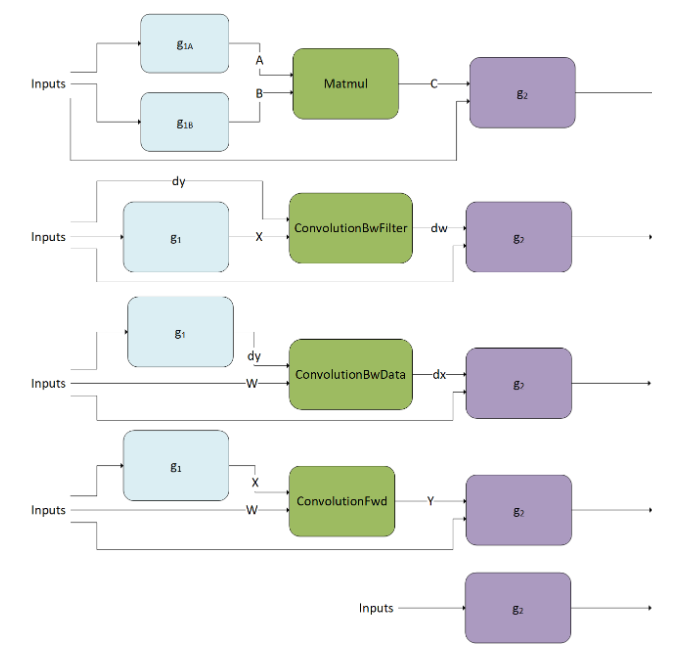

# Graphs

The cuDNN library provides a declarative programming model for describing computation as a graph of operations. This *graph API* was introduced in cuDNN 8.0 to provide a more flexible API, especially with the growing importance of operation fusion.

The user starts by building a graph of operations. At a high level, the user is describing a dataflow graph of operations on tensors, which typically represents a partition of the user's full network graph, which they would like to offload to a GPU kernel (or small set of kernels). Given a *finalized graph*, the user then selects and configures an engine that can execute that graph. There are several methods for selecting and configuring engines, which have tradeoffs with respect to ease-of-use, runtime overhead, and engine performance.

## Key Concepts

As mentioned previously, the key concepts in the graph API are:

> * [Operations and Operation Graphs](#op-op-graphs)
> * [Engines and Engine Configurations](#engine-engine-config)
> * [Heuristics](#heuristics)

These concepts are covered in the subsections below. Later we'll go through an example to tie them all together.

### Operations and Operation Graphs

An operation graph is a dataflow graph of operations on tensors. It is meant to be a mathematical specification and is decoupled from the underlying *engines* that can implement it, as there may be more than one engine available for a given graph.

I/O tensors connect the operations implicitly, for example, an operation A may produce a tensor X, which is then consumed by operation B, implying that operation B depends on operation A.

### Engines and Engine Configurations

For a given operation graph, there are some number of engines that are candidates for implementing that graph. The typical way to query for a list of candidate engines is through a heuristics query, covered below.

An engine has knobs for configuring the engine.

### Other Runtime Concepts

### Heuristics

A *heuristic* is a way to get a list of engine configurations that are intended to be sorted from the most performant to least performant for the given operation graph. There are three modes:

> * Heuristics Mode A - intended to be fast and be able to handle most operation graph patterns. It returns a list of engine configs ranked by the expected performance.
> * Heuristics Mode B - intended to be more generally accurate than mode A, but with the tradeoff of higher CPU latency to return the list of engine configs. The underlying implementation may fall back to the mode A heuristic in cases where we know mode A can do better.
> * Fallback Heuristics Mode - intended to be fast and provide functional fallbacks without expectation of optimal performance.

The recommended workflow is to query either mode A or B and check for support. The first engine config with support is expected to have the best performance.

You can "auto-tune", that is, iterate over the list and time for each engine config and choose the best one for a particular problem on a particular device. Both the C++ and Python APIs have utility functions for doing this.

If all the engine configs are not supported, then use the mode fallback to find the functional fallbacks.

Expert users may also want to filter engine configs based on properties of the engine, such as numerical notes, behavior notes, or adjustable knobs. Numerical notes inform the user about the numerical properties of the engine such as whether it does datatype down conversion at the input or during output reduction. The behavior notes can signal something about the underlying implementation like whether or not it uses runtime compilation. The adjustable knobs allow fine grained control of the engine's behavior and performance.

## Supported Graph Patterns

The cuDNN Graph API supports a set of graph patterns. These patterns are supported by a large number of engines, each with their own support surfaces. These engines are grouped into four different classes, as reflected by the following four subsections: pre-compiled single operation engines, generic runtime fusion engines, specialized runtime fusion engines, and specialized pre-compiled fusion engines. The specialized engines, whether they use runtime compilation or pre-compilation, are targeted to a set of important use cases, and thus have a fairly limited set of patterns they currently support. Over time, we expect to support more of those use cases with the generic runtime fusion engines, whenever practical.

Since these engines have some overlap in the patterns they support, a given pattern may result in zero, one, or more engines.

### Pre-Compiled Single Operation Engines

One basic class of engines includes pre-compiled engines that support an operation graph with just one operation; specifically: `ConvolutionFwd`, `ConvolutionBwdFilter`, `ConvolutionBwdData`, or `ConvolutionBwBias`.

#### ConvolutionBwdData

`ConvolutionBwdData` computes the convolution data gradient of the tensor `dy`. In addition, it uses scaling factors alpha and beta to blend this result with the previous output. This graph operation is similar to [cudnnConvolutionBackwardData()](../../../backend/v9.20.0/api/cudnn-cnn-library.html#cudnnconvolutionbackwarddata "(in NVIDIA cuDNN Backend)").

#### ConvolutionBwdFilter

`ConvolutionBwdFilter` computes the convolution filter gradient of the tensor `dy`. In addition, it uses scaling factors alpha and beta to blend this result with the previous output. This graph operation is similar to [cudnnConvolutionBackwardFilter()](../../../backend/v9.20.0/api/cudnn-cnn-library.html#cudnnconvolutionbackwardfilter "(in NVIDIA cuDNN Backend)").

#### ConvolutionFwd

`ConvolutionFwd` computes the convolution of X with filter data W. In addition, it uses scaling factors alpha and beta to blend this result with the previous output. This graph operation is similar to [cudnnConvolutionForward()](../../../backend/v9.20.0/api/cudnn-cnn-library.html#cudnnconvolutionforward "(in NVIDIA cuDNN Backend)").

### Generic Runtime Fusion Engines

The engines documented in the previous section support single-op patterns. Of course, for fusion to be interesting, the graph needs to support multiple operations. And ideally, we want the supported patterns to be flexible to cover a diverse set of use cases. To accomplish this generality, cuDNN has runtime fusion engines that generate the kernel (or kernels) at runtime based on the graph pattern. This section outlines the patterns supported by these runtime fusion engines (that is, engines with `CUDNN_BEHAVIOR_NOTE_RUNTIME_COMPILATION` behavioral note).

We can think of the support surface as covering the following generic patterns:

1. `Matmul` fusions: \(g\_{2}\left( C=Matmul\left( A=g\_{1A} \left( inputs \right), B=g\_{1B} \right(inputs)), inputs \right)\)
2. `ConvolutionFwd` fusions: \(g\_{2}\left( Y=ConvolutionFwd\left( X=g\_{1} \left( inputs \right), W\right), inputs \right)\)
3. `ConvolutionBwdFilter` fusions: \(g\_{2}\left( dw=ConvolutionBwdFiler\left( dy, X=g\_{1} \right(inputs)), inputs \right)\)
4. `ConvolutionBwdData` fusions: \(g\_{2}\left( dx=ConvolutionBwdData\left( dy=g\_{1} \left( inputs \right), W \right), inputs \right)\)
5. `Pointwise` fusions: \(g\_{2}\left( inputs \right)\)

Note

* g 1 (including g 1A and g 1B) indicates fusion operations applied to the inputs of the `matmul` and `convolution` operation.
* g 2 indicates fusion operations apply to the output of the `matmul` and `convolution` operation.
* g 2 can have more than one output.
* The fusion patterns in g 1 will be referred to as the mainloop fusion, and the fusion patterns in g 2 will be referred to as the epilogue fusion.
* The arrow going into g 2 can go into any of g 2 nodes and does not necessarily need to feed into a root node.
* The abbreviated notations for operations are used in the diagrams and throughout the text for visualization purposes.

#### Support Surface

The generic runtime fusion engine includes three independent support surfaces indexed as 90, 80, and 70. A cuDNN graph that fulfills the requirements of at least one support surface will be able to be executed by the generic runtime fusion engine. The following table lists a summary of the features in each support surface. For best performance, we recommend targeting the highest indexed support surface possible and fall back to lower indexed support surfaces if needed.

Summary of Supported Features of Each Support Surface

| Feature | Support Surface 90 | Support Surface 80 | Support Surface 70 |
| --- | --- | --- | --- |
| Compute Capability | >= 9.0 | >= 8.0 | >= 7.0 |
| `Matmul` Fusions | Supported | Supported | Supported |
| `ConvolutionFwd` Fusions | Supported | Supported | Supported |
| `ConvolutionBwdFilter` Fusions | Supported | Not Supported | Supported |
| `ConvolutionBwdData` Fusions | Partially Supported | Not Supported | Supported |
| `Pointwise` and `Reduction` Fusions | Not Supported | Not Supported | Supported |
| FP8 `Matmul` and `Convolution` Operations | Supported | Supported for Compute Capability >= 8.9 | Not Supported |
| g 1 (Mainloop) Fusions | Supported | Supported | Partially Supported |
| g 2 (Epilogue) Fusions | Supported | Supported | Supported |
| [Mixed Input Precision Matmul/Convolution](#mixed-input-matmul) | Supported | Supported | Not Supported |
| Grouped Convolution | Supported | Supported | Not Supported |

The detailed supported features of each support surface are listed in the following subsections.

##### Support Surface 90

**Compute Capability**

* NVIDIA GPUs with compute capability 9.0 are supported.

**Generic Limitations**

* Strided `ConvolutionBwdData` fusions are not supported.
* `Pointwise` and `Reduction` fusions are not supported.

**Advanced Matmul/Convolution Variations**

* Mixed input precision `Matmul`, `ConvolutionFwd`, and `ConvolutionBwdData` fusions are supported.
* Grouped `ConvolutionFwd`, `ConvolutionBwdFilter`, and `ConvolutionBwdData` fusions are supported.

**I/O and Intermediate Data Type**

* The input tensor data type can be any of `{FLOAT, INT32, HALF, BFLOAT16, INT8, FP8_E4M3, FP8_E5M2}`.
* The input tensor data type of `Matmul`, `ConvolutionFwd`, `ConvolutionBwdFilter`, and `ConvolutionBwdData` operations can be any of `{FLOAT, HALF, BFLOAT16, INT8, FP8_E4M3, FP8_E5M2}`.
* The output tensor data type can be any of `{INT64, FLOAT, INT32, HALF, BFLOAT16, INT8, UINT8, FP8_E4M3, FP8_E5M2}`.
* The output data types of `CUDNN_BACKEND_OPERATION_REDUCTION_DESCRIPTOR` operations can only be `FLOAT`.
* The intermediate virtual tensor data type can be any of `{FLOAT, INT32, HALF, BFLOAT16, INT8, FP8_E4M3, FP8_E5M2}`, and this intermediate storage type is obeyed by the code-generator. Generally, `FP32` is recommended.

**Compute Data Type**

* Compute data type can be either `FP32` or `INT32` for `CUDNN_BACKEND_OPERATION_POINTWISE_DESCRIPTOR` operations.
* Compute data type can only be `FP32` for `CUDNN_BACKEND_OPERATION_REDUCTION_DESCRIPTOR` operations.
* The support surface of the compute data type of `Matmul`, `ConvolutionFwd`, `ConvolutionBwdFilter`, and `ConvolutionBwdData` operations depends on the input data types of the operation. The combinatory support surface is listed in the following table.

Combinatory Support Surface of Input Data Type and Compute Data Type of `Matmul` and `Convolution` Operations

| `matmul` / `convolution` Operation Input Data Type | `matmul` / `convolution` Operation Compute Data Type |
| --- | --- |
| `INT8` | `INT32` |
| `FP8_E4M3`, `FP8_E5M2` | `FLOAT`, `FAST_FLOAT_FOR_FP8` |
| `HALF` | `FLOAT`, `HALF` |
| `BFLOAT16` | `FLOAT` |
| `FLOAT` | `FLOAT` |

**Mainloop Fusions: g** 1

* g 1 is a directed acyclic graph (DAG) that can consist of zero or any number of the `CUDNN_BACKEND_OPERATION_POINTWISE_DESCRIPTOR` operations.
* All the input tensors must have an alignment of 128 bits. For grouped `ConvolutionFwd`, `ConvolutionBwdFilter`, and `ConvolutionBwdData` fusions, the alignment requirement is per group.
* All the intermediate tensors must be virtual.
* The support surface of dimension and layout are listed in the table below. This table does **not** apply to tensors in g 2.

Support Surface of Dimension and Layout for Tensors in g 1

| Pattern | Dimension | Layout |
| --- | --- | --- |
| `Matmul` fusions | * Tensor A must have dimension `dim[B, M, K] or dim[1, M, K]`. * Dimensions of input tensors to g 1A can be `dim[1, 1, 1]`, `dim[B, 1, 1]`, `dim[1, M, 1]`, `dim[B, M, 1]`, `dim[1, 1, K]`, `dim[B, 1, K]`, `dim[1, M, K]`, or `dim[B, M, K]`. * Tensor B must have dimension `dim[B, K, N] or dim[1, K, N]`. * Dimensions of input tensors to g 1B can be `dim[1, 1, 1]`, `dim[B, 1, 1]`, `dim[1, 1, N]`, `dim[B, 1, N]`, `dim[1, K, 1]`, `dim[B, K, 1]`, `dim[1, K, N]`, or `dim[B, K, N]`. | * All tensors can be in either row-major or column-major layout. * The leading dimension must be fully packed. |
| `ConvolutionFwd` fusions | * Tensor X must have dimension `dim[N, C, (D,) H, W]`. * Dimensions of tensors operating with X can be `dim[1, 1, (1,) 1, 1]`, `dim[1, C, (1,) 1, 1]`, or `dim[N, C, (D), H, W]`. Exception: `dim[1, C, (1,) 1, 1]` is not compatible in grouped `ConvolutionFwd` fusions. * Tensor W must have dimension `dim[K, C, (T,) R, S]`. | * All tensors must be in NHWC layout. * The leading dimension must be fully packed. |
| `ConvolutionBwdFilter` fusions | * Tensor dy must have dimension `dim[N, K, (O,) P, Q]`. * Tensor X must have dimension `dim[N, C, (D,) H, W]`. * Fusion operation in g 1 is not supported. | * All tensors can be in either NHWC or CHWN layout. * For `INT8`, `FP8_E4M3`, and `FP8_E5M2` data types, dy or X being in NHWC layout may result in low performance. * The leading dimension must be fully packed. |
| `ConvolutionBwdData` fusions | * Tensor dy must have dimension `dim[N, K, (O,) P, Q]`. * Dimensions of tensors operating with dy can be `dim[1, 1, (1,) 1, 1]`, `dim[1, K, (1,) 1, 1]`, or `dim[N, K, (O,) P, Q]`. * Tensor W must have dimension `dim[K, C, (T,) R, S]`. | * All tensors can be in either NHWC or CHWN layout. * For `INT8`, `FP8_E4M3`, and `FP8_E5M2` data types, dy being in CHWN layout or W being in NHWC layout may result in low performance. * The leading dimension must be fully packed. |

**Epilogue Fusion: g** 2

* g 2 is a directed acyclic graph (DAG) that can consist of zero or any number of the `CUDNN_BACKEND_OPERATION_POINTWISE_DESCRIPTOR` operation and zero or one `CUDNN_BACKEND_OPERATION_REDUCTION_DESCRIPTOR` operation.
* `CUDNN_BACKEND_OPERATION_REDUCTION_DESCRIPTOR` operation can only be the exit node of g 2.
* All the input and output tensors must have an alignment of 8 bits. For grouped `ConvolutionFwd`, `ConvolutionBwdFilter`, and `ConvolutionBwdData` fusions, the alignment requirement is per group.
* In `CUDNN_BACKEND_OPERATION_POINTWISE_DESCRIPTOR` operations, the tensors being broadcasted cannot be placed as the first input.
* The support surface of dimension and layout are listed in the table below. This table does **not** apply to tensors in g 1.

Support Surface of Dimension and Layout for Tensors in g 2

| Pattern | Dimension | Layout |
| --- | --- | --- |
| `Matmul` fusions | * Tensor C must have dimension `dim[B, M, N]` and be the first input operand of each operation. * Dimensions of other input tensors to g 2 can be `dim[1, 1, 1]`, `dim[B, 1, 1]`, `dim[1, M, 1]`, `dim[B, M, 1]`, `dim[1, 1, N]`, `dim[B, 1, N]`, `dim[1, M, N]`, or `dim[B, M, N]`. * Dimensions of output tensors from g 2 can be `dim[B, M, N]`. * If the last operation in g 2 is `CUDNN_BACKEND_OPERATION_REDUCTION_DESCRIPTOR`, the dimension of the last output tensor can be `dim[1, 1, 1]`, `dim[B, 1, 1]`, `dim[1, M, 1]`, `dim[B, M, 1]`, `dim[1, 1, N]`, `dim[B, 1, N]`, or `dim[1, M, N]`. | * All tensors can be in either row-major or column-major layout, but need to be the same. * The leading dimension must be fully packed. * If `CUDNN_BACKEND_OPERATION_REDUCTION_DESCRIPTOR` operation presents, all tensor layouts must be row-major. |
| `ConvolutionFwd` fusions | * Tensor Y must have dimension `dim[N, K, (O,) P, Q]` and be the first input operand of each operation. * Dimensions of other input tensors to g 2 can be `dim[1, 1, (1,) 1, 1]`, `dim[N, 1, (O,) P, Q]`, `dim[1, K, (1,) 1, 1]`, or `dim[N, K, (O,) P, Q]`. * Dimensions of output tensors from g 2 can be `dim[N, K, (O,) P, Q]`. * If the last operation in g 2 is `CUDNN_BACKEND_OPERATION_REDUCTION_DESCRIPTOR`, the dimension of the last output tensor can be `dim[1, 1, (1,) 1, 1]`, `dim[N, 1, (O,) P, Q]`, `dim[1, K, (1,) 1, 1]`, `dim[N, K, (1,) 1, 1]`, or `dim[N, 1, (1,) 1, 1]`. * Grouped `ConvolutionFwd` fusions cannot have `CUDNN_BACKEND_OPERATION_REDUCTION_DESCRIPTOR` operation in g 2. | * All tensors must be in an NHWC layout. * The leading dimension must be fully packed. |
| `ConvolutionBwdFilter` fusions | * Tensor dw must have dimension `dim[K, C, (T,) R, S]` and be the first input operand of each operation. * Dimensions of other input tensors to g 2 can be `dim[1, 1, (1,) 1, 1]`, `dim[1, C, (T,) R, S]`, `dim[K, 1, (1,) 1, 1]`, or `dim[K, C, (T,) R, S]`. * Dimensions of output tensors from g 2 can be `dim[K, C, (T,) R, S]`. * If the last operation in g 2 is `CUDNN_BACKEND_OPERATION_REDUCTION_DESCRIPTOR`, the dimension of the last output tensor can be `dim[1, 1, (1,) 1, 1]`, `dim[1, C, (T,) R, S]`, or `dim[K, 1, (1,) 1, 1]`. * Grouped `ConvolutionBwdFilter` fusions cannot have `CUDNN_BACKEND_OPERATION_REDUCTION_DESCRIPTOR` operation in g 2. | * All tensors must be in an NHWC layout. * The leading dimension must be fully packed. |
| `ConvolutionBwdData` fusions | * Tensor dx must have dimension `dim[N, C, (D,) H, W]`. * Dimensions of other input tensors to g 2 can be `dim[1, 1, (1,) 1, 1]`, `dim[N, 1, (D,) H, W]`, `dim[1, C, (1,) 1, 1]`, or `dim[N, C, (D,) H, W]`. * Dimensions of output tensors from g 2 can be `dim[N, C, (D,) H, W]`. * If the last operation in g 2 is `CUDNN_BACKEND_OPERATION_REDUCTION_DESCRIPTOR`, the dimension of the last output tensor can be `dim[1, 1, (1,) 1, 1]`, `dim[N, 1, (D,) H, W]`, `dim[1, C, (1,) 1, 1]`, `dim[N, C, (1,) 1, 1]`, or `dim[N, 1, (1,) 1, 1]`. * Grouped `ConvolutionBwdData` fusions cannot have g 2. | * All tensors must be in an NHWC layout. * The leading dimension must be fully packed. |
| `Pointwise` and `Reduction` fusions | Not Supported | Not Supported |

##### Support Surface 80

**Compute Capability**

* NVIDIA GPUs with compute capability 8.0, 8.6. 8.7, 8.9, and 9.0 are supported.

**Generic Limitations**

* `ConvolutionBwdFilter` fusions are not supported.
* `ConvolutionBwdData` fusions are not supported.
* `Pointwise` and `Reduction` fusions are not supported.

**Advanced Matmul/Convolution Variations**

* Mixed input precision `Matmul` and `ConvolutionFwd` fusions are supported.
* Grouped `ConvolutionFwd` fusions are supported.

**I/O and Intermediate Data Type**

* The input tensor data type can be any of `{FLOAT, INT32, HALF, BFLOAT16, INT8, FP8_E4M3, FP8_E5M2}`.
* The input tensor data type of `Matmul` and `ConvolutionFwd` operations can be any of `{FLOAT, HALF, BFLOAT16, INT8, FP8_E4M3, FP8_E5M2}`. `FP8_E4M3` and `FP8_E5M2` input tensor data type of `Matmul` and `ConvolutionFwd` operations are only available with compute capability 8.9.
* The output tensor data type can be any of `{INT64, FLOAT, INT32, HALF, BFLOAT16, INT8, UINT8, FP8_E4M3, FP8_E5M2}`.
* The output data types of `CUDNN_BACKEND_OPERATION_REDUCTION_DESCRIPTOR` operations can only be `FLOAT`.
* The intermediate virtual tensor data type can be any of `{FLOAT, INT32, HALF, BFLOAT16, INT8, FP8_E4M3, FP8_E5M2}`, and this intermediate storage type is obeyed by the code-generator. Generally, `FP32` is recommended.
* `FP8_E4M3` and `FP8_E5M2` input, output, and intermediate tensor data type is only available with compute capability 8.9 and 9.0.

**Compute Data Type**

* Compute data type can be either `FP32` or `INT32` for `CUDNN_BACKEND_OPERATION_POINTWISE_DESCRIPTOR` operations.
* Compute data type can only be `FP32` for `CUDNN_BACKEND_OPERATION_REDUCTION_DESCRIPTOR` operations.
* The support surface of the compute data type of `Matmul`, `ConvolutionFwd`, `ConvolutionBwdFilter`, and `ConvolutionBwdData` operations depends on the input data types of the operation. The combinatory support surface is listed in the following table.

Combinatory Support Surface of Input Data Type and Compute Data Type of `Matmul` and `Convolution` Operations

| `matmul` / `convolution` Operation Input Data Type | `matmul` / `convolution` Operation Compute Data Type | Note |
| --- | --- | --- |
| `INT8` | `INT32` |  |
| `FP8_E4M3`, `FP8_E5M2` | `FLOAT`, `FAST_FLOAT_FOR_FP8` | Available with compute capability 8.9 only |
| `HALF` | `FLOAT`, `HALF` |  |
| `BFLOAT16` | `FLOAT` |  |
| `FLOAT` | `FLOAT` |  |

**Mainloop Fusions: g** 1

* g 1 is a directed acyclic graph (DAG) that can consist of zero or any number of the `CUDNN_BACKEND_OPERATION_POINTWISE_DESCRIPTOR` operation.
* All the input tensors must have an alignment of 32 bits. For ConvolutionFwd fusions with no operations in g 1, the input tensors can have an alignment of 8 bits. For grouped `ConvolutionFwd` fusions, the alignment requirement is per group.
* All the intermediate tensors must be virtual.
* The support surface of dimension and layout are listed in the table below. This table does **not** apply to tensors in g 2.

Support Surface of Dimension and Layout for Tensors in g 1

| Pattern | Dimension | Layout |
| --- | --- | --- |
| `Matmul` fusions | * Tensor A must have dimension `dim[B, M, K]` or `dim[1, M, K]`. * Dimensions of input tensors to g 1A can be `dim[1, 1, 1]`, `dim[B, 1, 1]`, `dim[1, M, 1]`, `dim[B, M, 1]`, `dim[1, 1, K]`, `dim[B, 1, K]`, `dim[1, M, K]`, or `dim[B, M, K]`. * Tensor B must have dimension `dim[B, K, N]` or `dim[1, K, N]`. * Dimensions of input tensors to g 1B can be `dim[1, 1, 1]`, `dim[B, 1, 1]`, `dim[1, 1, N]`, `dim[B, 1, N]`, `dim[1, K, 1]`, `dim[B, K, 1]`, `dim[1, K, N]`, or `dim[B, K, N]`. | * All tensors can be in either row-major or column-major layout. * The leading dimension must be fully packed. |
| `ConvolutionFwd` fusions | * Tensor X must have dimension `dim[N, C, (D,) H, W]`. * Dimensions of tensors operating with X can be `dim[1, 1, (1,) 1, 1]`, `dim[1, C, (1,) 1, 1]`, or `dim[N, C, (D), H, W]`. Exception: `dim[1, C, (1,) 1, 1]` is not compatible in grouped `ConvolutionFwd` fusions. * Tensor W must have dimension `dim[K, C, (T,) R, S]`. | * All tensors must be in an NHWC layout. * The leading dimension must be fully packed. |
| `ConvolutionBwdFilter` fusions | Not Supported | Not Supported |
| `ConvolutionBwdData` fusions | Not Supported | Not Supported |

**Epilogue Fusion: g** 2

* g 2 is a directed acyclic graph (DAG) that can consist of zero or any number of the `CUDNN_BACKEND_OPERATION_POINTWISE_DESCRIPTOR` operation and zero or one `CUDNN_BACKEND_OPERATION_REDUCTION_DESCRIPTOR` operation.
* `CUDNN_BACKEND_OPERATION_REDUCTION_DESCRIPTOR` operation can only be the exit node of g 2.
* All the input and output tensors must have an alignment of 8 bits. For grouped `ConvolutionFwd` fusions, the alignment requirement is per group.
* In `CUDNN_BACKEND_OPERATION_POINTWISE_DESCRIPTOR` operations, the tensors being broadcasted cannot be placed as the first input.
* The support surface of dimension and layout are listed in the table below. This table does **not** apply to tensors in g 1.

Support Surface of Dimension and Layout for Tensors in g 2

| Pattern | Dimension | Layout |
| --- | --- | --- |
| `Matmul` fusions | * Tensor C must have dimension `dim[B, M, N]` and be the first input operand of each operation. * Dimensions of other input tensors to g 2 can be `dim[1, 1, 1]`, `dim[B, 1, 1]`, `dim[1, M, 1]`, `dim[B, M, 1]`, `dim[1, 1, N]`, `dim[B, 1, N]`, `dim[1, M, N]`, or `dim[B, M, N]`. * Dimensions of output tensors from g 2 can be `dim[B, M, N]`. * If the last operation in g 2 is `CUDNN_BACKEND_OPERATION_REDUCTION_DESCRIPTOR`, the dimension of the last output tensor can be `dim[1, 1, 1]`, `dim[B, 1, 1]`, `dim[1, M, 1]`, `dim[B, M, 1]`, `dim[1, 1, N]`, `dim[B, 1, N]`, or `dim[1, M, N]`. | * All tensors can be in either row-major or column-major layout, but need to be the same. * The leading dimension must be fully packed. * If `CUDNN_BACKEND_OPERATION_REDUCTION_DESCRIPTOR` operation presents, all tensor layouts must be row-major. |
| `ConvolutionFwd` fusions | * Tensor Y must have dimension `dim[N, K, (O,) P, Q]` and be the first input operand of each operation. * Dimensions of other input tensors to g 2 can be `dim[1, 1, (1,) 1, 1]`, `dim[N, 1, (O,) P, Q]`, `dim[1, K, (1,) 1, 1]`, or `dim[N, K, (O,) P, Q]`. * Dimensions of output tensors from g 2 can be `dim[N, K, (O,) P, Q]`. * If the last operation in g 2 is `CUDNN_BACKEND_OPERATION_REDUCTION_DESCRIPTOR`, the dimension of the last output tensor can be `dim[1, 1, (1,) 1, 1]`, `dim[N, 1, (O,) P, Q]`, `dim[1, K, (1,) 1, 1]`, or `dim[N, 1, (1,) 1, 1]`. * Grouped `ConvolutionFwd` fusions cannot have `CUDNN_BACKEND_OPERATION_REDUCTION_DESCRIPTOR` operation in g 2. | * All tensors must be in an NHWC layout. * The leading dimension must be fully packed. |
| `ConvolutionBwdFilter` fusions | Not Supported | Not Supported |
| `ConvolutionBwdData` fusions | Not Supported | Not Supported |
| `Pointwise` and `Reduction` fusions | Not Supported | Not Supported |

##### Support Surface 70

**Support Surface of Compute Capability**

* NVIDIA GPUs with compute capability 7.0, 7.2, 7.5, 8.0, 8.6, 8.7, 8.9, and 9.0 are supported.

**I/O and Intermediate Data Type**

* The input tensor data type can be any of `{FLOAT, INT32, HALF, BFLOAT16, INT8, FP8_E4M3, FP8_E5M2}`.
* The input tensor data type of `Matmul`, `ConvolutionFwd`, `ConvolutionBwdFilter`, and `ConvolutionBwdData` operations can be any of `{FLOAT, HALF, BFLOAT16, INT8}`.
* The output tensor data type can be any of `{INT64, FLOAT, INT32, HALF, BFLOAT16, INT8, UINT8, FP8_E4M3, FP8_E5M2, BOOLEAN}`.
* The output data types of `CUDNN_BACKEND_OPERATION_REDUCTION_DESCRIPTOR` operations can only be `FLOAT`.
* The intermediate virtual tensor data type can be any of `{FLOAT, INT32, HALF, BFLOAT16, INT8, FP8_E4M3, FP8_E5M2, BOOLEAN}`, and this intermediate storage type is obeyed by the code-generator. Generally, `FP32` is recommended.
* `FP8_E4M3` and `FP8_E5M2` data types are only allowed in pure `Pointwise` and `Reduction` fusions.

**Compute Data Type**

* Compute data type can be `FP32` or `BOOLEAN` for `CUDNN_BACKEND_OPERATION_POINTWISE_DESCRIPTOR` operations.
* Compute data type can only be `FP32` for `CUDNN_BACKEND_OPERATION_REDUCTION_DESCRIPTOR` operations.
* The support surface of the compute data type of `Matmul`, `ConvolutionFwd`, `ConvolutionBwdFilter`, and `ConvolutionBwdData` operations depends on the input data types of the operation. The combinatory support surface is listed in the following table.

Combinatory Support Surface of Input Data Type and Compute Data Type of `Matmul` and `Convolution` Operations

| `Matmul` / `Convolution` Operation Input Data Type | `Matmul` / `Convolution` Operation Compute Data Type | Note |
| --- | --- | --- |
| `INT8` | `INT32` | Not available for `ConvolutionBwdFilter` and `ConvolutionBwdData` fusions |
| `HALF` | `FLOAT`, `HALF` | Available with compute capability 8.9 only |
| `HALF` | `FLOAT`, `HALF` |  |
| `BFLOAT16` | `FLOAT` |  |
| `FLOAT` | `FLOAT` |  |

**Mainloop Fusions: g** 1

* g 1 is a directed acyclic graph (DAG) that can consist of zero or any number of the following operations:

  + `CUDNN_BACKEND_OPERATION_POINTWISE_DESCRIPTOR`
  + `CUDNN_BACKEND_OPERATION_CONCAT_DESCRIPTOR`
  + `CUDNN_BACKEND_OPERATION_SIGNAL_DESCRIPTOR`
* `CUDNN_BACKEND_OPERATION_CONCAT_DESCRIPTOR` or `CUDNN_BACKEND_OPERATION_SIGNAL_DESCRIPTOR` operations, if present, should be before any `Pointwise` operations.
* For compute capability < 8.0, g 1 is not supported.
* All the input tensors must have an alignment of 32 bits.
* All the intermediate tensors must be virtual.
* In `CUDNN_BACKEND_OPERATION_POINTWISE_DESCRIPTOR` operations, the tensors being broadcasted cannot be placed as the first input.
* The support surface of dimension and layout are listed in the table below. This table does **not** apply to tensors in g:sub:2.

Support Surface of Dimension and Layout for Tensors in g 1

| Pattern | Dimension | Layout |
| --- | --- | --- |
| `Matmul` fusions | * Tensor A must have dimension `dim[B, M, K]` and be the first input operand of each operation. * If g 1 presents, Tensor A must be in `HALF` data type, the other input tensors broadcasted and operated with tensor A can have any data type. * Dimensions of other input tensors to g 1A can be `dim[1, 1, 1]`, `dim[B, M, 1]`, `dim[B, 1, K]`, or `dim[B, M, K]`. If the input tensor is in dimension `dim[B, M, K]`, it must have data type `HALF` as well. * Tensor B must have dimension `dim[B, K, N]`. * Fusion operation in g 1B is not supported. | * All tensors can be in either fully packed row-major layout or fully packed column-major layout. * All input tensors to g 1A must have the same layout. * If the data type of the input tensor to the `matmul` operation is INT8, all the input tensors to g 1A must be in row-major layout and the tensor B must be in column-major layout. |
| `ConvolutionFwd` fusions | * Tensor X must have dimension `dim[N, C, (D,) H, W]` and be the first input operand of each operation. * Tensor W must have dimension `dim[K, C, (T,) R, S]`. * Fusion operations on X tensor can be only a chain of three specific `Pointwise` operations, in this exact order: `CUDNN_POINTWISE_MUL`, `CUDNN_POINTWISE_ADD`, and `CUDNN_POINTWISE_RELU_FWD`. This specific support is added to realize convolution batch norm fusion use cases. * All tensors involved can only be `HALF` data type. * `CUDNN_POINTWISE_MUL` and `CUDNN_POINTWISE_ADD` can only be operated with a tensor with dimension `dim[1, C, (1,) 1, 1]`. | All tensors must be in a fully packed NHWC layout. |
| `ConvolutionBwdFilter` fusions | * Tensor dy must have dimension `dim[N, K, (O,) P, Q]` and be the first input operand of each operation. * Tensor X must have dimension `dim[N, C, (D,) H, W]`. * Fusion operations on X tensor can be only a chain of three specific `Pointwise` operations, in this exact order: `CUDNN_POINTWISE_MUL`, `CUDNN_POINTWISE_ADD`, and `CUDNN_POINTWISE_RELU_FWD`. This specific support is added to realize convolution batch norm fusion use cases. * All tensors involved can only be `HALF` data type. * `CUDNN_POINTWISE_MUL` and `CUDNN_POINTWISE_ADD` can only be operated with a tensor with dimension `dim[1, C, (1,) 1, 1]`. | All tensors must be in a fully packed NHWC layout. |
| `ConvolutionBwdData` fusions | * Tensor dy must have dimension `dim[N, K, (O,) P, Q]` and be the first input operand of each operation. * Tensor W must have dimension `dim[K, C, (T,) R, S]`. * Fusion operation in g 1 is not supported. | All tensors must be in a fully packed NHWC layout. |

**Epilogue Fusion: g** 2

* g 2 is a directed acyclic graph (DAG) that can consist of zero or any number of the following operations:

  + `CUDNN_BACKEND_OPERATION_POINTWISE_DESCRIPTOR`
  + `CUDNN_BACKEND_OPERATION_RESAMPLE_FWD_DESCRIPTOR`
  + `CUDNN_BACKEND_OPERATION_RESAMPLE_BWD_DESCRIPTOR`
  + `CUDNN_BACKEND_OPERATION_GEN_STATS_DESCRIPTOR`
  + `CUDNN_BACKEND_OPERATION_SIGNAL_DESCRIPTOR`

and zero or one `CUDNN_BACKEND_OPERATION_REDUCTION_DESCRIPTOR` operation.

* `CUDNN_BACKEND_OPERATION_REDUCTION_DESCRIPTOR` operation can only be the exit node of g 2.
* `CUDNN_BACKEND_OPERATION_SIGNAL_DESCRIPTOR` operations, if present, must be the final nodes in g 2. Hence, `CUDNN_BACKEND_OPERATION_SIGNAL_DESCRIPTOR` operations cannot be used in conjunction with the `CUDNN_BACKEND_OPERATION_REDUCTION_DESCRIPTOR` operation.
* The input tensor to a `CUDNN_BACKEND_OPERATION_RESAMPLE_FWD_DESCRIPTOR` or `CUDNN_BACKEND_OPERATION_RESAMPLE_BWD_DESCRIPTOR` operation should not be produced by another operation within this graph, but should come from global memory. These two operations cannot be used in the `Matmul`, `ConvolutionBwdFilter`, and `ConvolutionBwdData` fusions, and are only supported with compute capability >= 7.5.
* All the input and output tensors must have an alignment of 32 bits, except the output of a `CUDNN_BACKEND_OPERATION_POINTWISE_DESCRIPTOR` operation can have an alignment of 8 bits.
* In `CUDNN_BACKEND_OPERATION_POINTWISE_DESCRIPTOR` operations, the tensors being broadcasted cannot be placed as the first input.
* The support surface of dimension and layout are listed in the table below. This table does **not** apply to tensors in g:sub:1.

Support Surface of Dimension and Layout for Tensors in g 2

| Pattern | Dimension | Layout |
| --- | --- | --- |
| `Matmul` fusions | * Tensor C must have dimension `dim[B, M, N]` and be the first input operand of each operation. * Dimensions of other input tensors to g 2 can be `dim[1, 1, 1]`, `dim[B, M, 1]`, `dim[B, 1, N]`, or `dim[B, M, N]`. * Dimensions of output tensors from g 2 can be `dim[B, M, N]`. * If the last operation in g 2 is `CUDNN_BACKEND_OPERATION_REDUCTION_DESCRIPTOR`, the dimension of the last output tensor can be `dim[1, 1, 1]`, `dim[B, M, 1]`, or `dim[B, 1, N]`. | * All tensors can be in either fully packed row-major layout or fully packed column-major layout, but need to be the same. * If `CUDNN_BACKEND_OPERATION_REDUCTION_DESCRIPTOR` operation presents, all tensor layouts must be row-major. |
| `ConvolutionFwd` fusions | * Tensor Y must have dimension `dim[N, K, (O,) P, Q]` and be the first input operand of each operation. * Dimensions of other input tensors to g 2 can be `dim[1, 1, (1,) 1, 1]`, `dim[N, 1, (O,) P, Q]`, `dim[1, K, (1,) 1, 1]`, or `dim[N, K, (O,) P, Q]`. * Dimensions of output tensors from g 2 can be `dim[N, K, (O,) P, Q]`. * If the last operation in g 2 is `CUDNN_BACKEND_OPERATION_REDUCTION_DESCRIPTOR`, the dimension of the last output tensor can be `dim[1, 1, (1,) 1, 1]`, `dim[N, 1, (O,) P, Q]`, or `dim[1, K, (1,) 1, 1]`. | All tensors must be in a fully packed NHWC layout. |
| `ConvolutionBwdFilter` fusions | * Tensor dw must have dimension `dim[K, C, (T,) R, S]` and be the first input operand of each operation. * Dimensions of other input tensors to g 2 can be `dim[1, 1, (1,) 1, 1]`, `dim[1, C, (T,) R, S]`, `dim[K, 1, (1,) 1, 1]`, or `dim[K, C, (T,) R, S]`. * Dimensions of output tensors from g 2 can be `dim[K, C, (T,) R, S]`. * If the last operation in g 2 is `CUDNN_BACKEND_OPERATION_REDUCTION_DESCRIPTOR`, the dimension of the last output tensor can be `dim[1, 1, (1,) 1, 1]`, `dim[1, C, (T,) R, S]`, or `dim[K, 1, (1,) 1, 1]`. | All tensors must be in a fully packed NHWC layout. |
| `ConvolutionBwdData` fusions | * Tensor dx must have dimension `dim[N, C, (D,) H, W]` and be the first input operand of each operation. * Dimensions of other input tensors to g 2 can be `dim[1, 1, (1,) 1, 1]`, `dim[N, 1, (D,) H, W]`, `dim[1, C, (1,) 1, 1]`, or `dim[N, C, (D,) H, W]`. * Dimensions of output tensors from g 2 can be `dim[N, C, (D,) H, W]`. * If the last operation in g 2 is `CUDNN_BACKEND_OPERATION_REDUCTION_DESCRIPTOR`, the dimension of the last output tensor can be `dim[1, 1, (1,) 1, 1]`, `dim[N, 1, (D,) H, W]`, or `dim[1, C, (1,) 1, 1]`. | All tensors must be in a fully packed NHWC layout. |
| `Pointwise` and `Reduction` fusions | * If all tensors are 3D, the same dimension requirements as `Matmul` g 2. * If all tensors are 4D or 5D, the same dimension requirements as `ConvolutionFwd`, `ConvolutionBwdFilter`, and `ConvolutionBwdData` g 2. * `CUDNN_BACKEND_OPERATION_REDUCTION_DESCRIPTOR` operation does not support 3D tensors. | * If all tensors are 3D, the same layout requirements as `Matmul` g 2. * If all tensors are 4D or 5D, the same layout requirements as `ConvolutionFwd`, `ConvolutionBwdFilter`, and `ConvolutionBwdData` g 2. |

