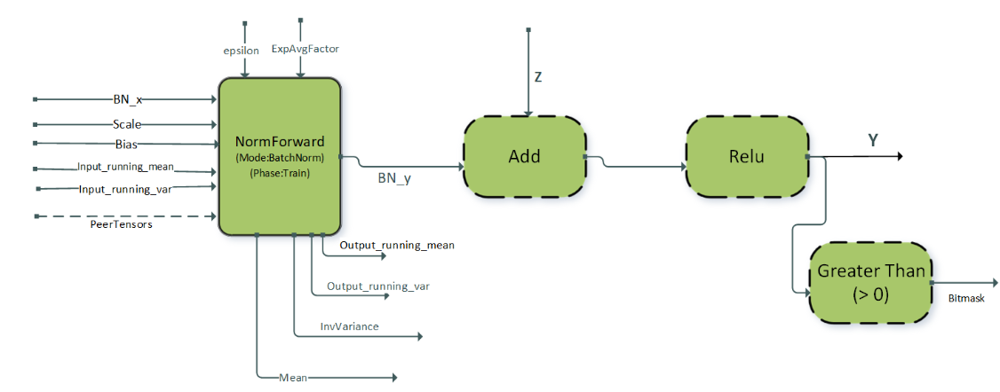
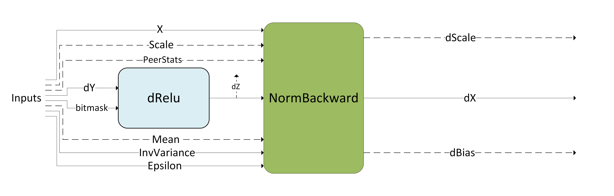
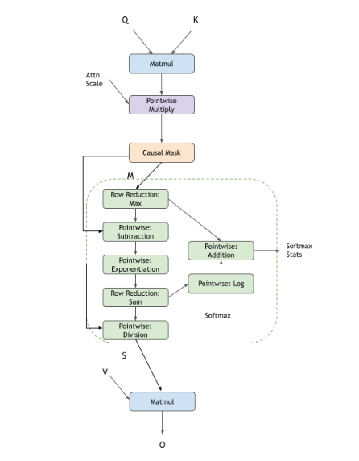
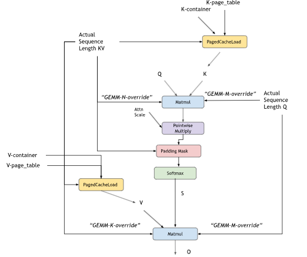
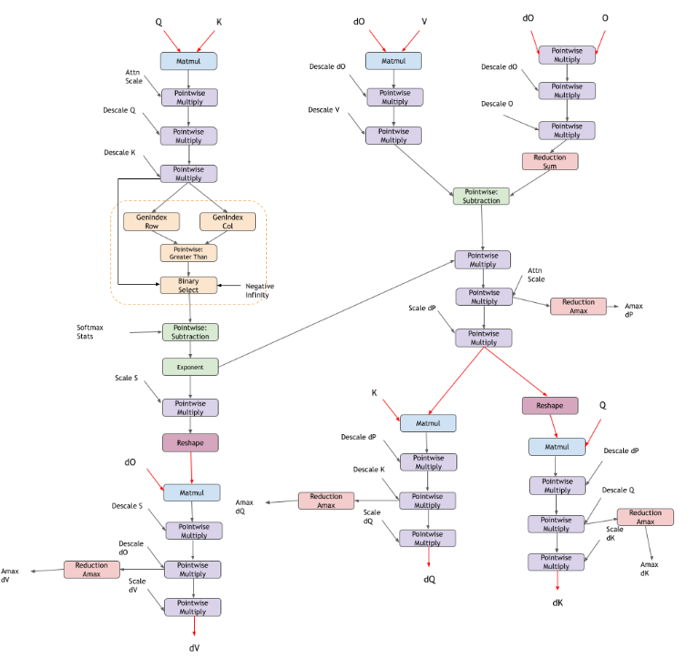
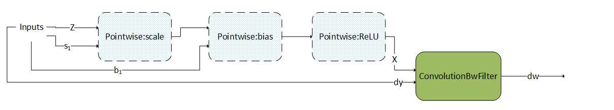
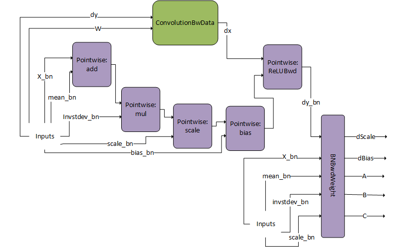

### Specialized Runtime Fusion Engines

The specialized runtime fusion engines target and optimize specialized graph patterns that commonly occur in popular deep learning models. These engines offer limited flexibility regarding supported fusion patterns, supported data types, and supported tensor layouts. Long term, these patterns are expected to be more generic.

The following sections highlight the supported patterns.

#### NormAddRelu

In vision models, normalization followed by ReLU activation is a commonly occurring pattern. The `NormAddRelu` fusion pattern, supported using a runtime compiled engine, aims to optimize this recurring operation graph. This pattern supports two normalization modes, batch normalization and instance normalization. The batch normalization mode also supports single node multi-GPU batch normalization for speeding up batch norm computation in multi-GPU systems. The pattern is intended for use in the forward pass during the training phase. The full pattern `NormAddRelu` with the add node is used in cases where there are skip connections in the model.

The pattern is illustrated in the following diagram and its options and limitations include:

> * The pointwise nodes: `Add`, `ReLU`, and `GT` (greater than) are optional.
> * All tensors should be in NHWC packed layout format.
> * Both 4D and 5D tensors are supported.
> * Only ReLU activation is supported.
> * The attribute `CUDNN_ATTR_OPERATION_NORM_FWD_MODE` for the norm forward operation must be set to ``` CUDNN_BATCH_NORM``or ``CUDNN_INSTANCE_NORM ```.
> * The attribute `CUDNN_ATTR_OPERATION_NORM_FWD_PHASE` for the norm forward operation must be set to `CUDNN_NORM_FWD_TRAINING`.
> * The norm input tensors: `Scale`, `Bias` (batch norm mode: `Input_running_mean` and `Input_running_var`) must be of `float` data type.
> * The norm output tensors: `mean` and `InvVariance` (batch norm mode: `output_running_mean` and `output_running_var`) must be of `float` data type.
> * The norm input tensor `x`, residual input `Z` and output tensor `Y` can be any of `{FP32, FP16, BF16}` data types. For `FP16` and `BF16` data types, the channel count C for the tensors must be a multiple of 8 while for float data type the channel count must be a multiple of 4.
> * These patterns are supported on devices with compute capability >= 8.0.



In case of single node multi-GPU batch norm, each GPU computes the local statistics based on its input data and writes out the local statistics to the `peerTensors`. Each `peerTensor` resides on a separate GPU on the node and is used for reading and writing local statistics from the peer GPUs. This is followed by a global stats computation phase where each GPU aggregates the statistics from the peers and computes the global mean and variance for the batch norm output computation on its local data. Apart from the options and limitations listed above, the following additional restrictions apply for using multi-GPU batch norm:

> * The attribute `CUDNN_ATTR_OPERATION_NORM_FWD_PEER_STAT_DESCS` of the `NormForward` operation must be set.
> * The size of the `peerTensors` vector should be equal to the number of GPUs in the node participating in the batch norm computation.
> * The maximum size of the `peerTensors` vector is 32.
> * Each GPU should operate on the same size of input data [N,C,H,W].
> * The size of each `peerTensor` in the `peerTensors` vector should be equal to `num_gpu * 4 * C` where C is the channel count of the `BN_x` tensor and `num_gpu` is the number of GPUs in the node participating in the batch norm computation.
> * All the elements of each tensor in the `peerTensors` vector should be `memset` to `0` before passing that tensor in the variant pack.


#### DReluForkDNorm

Similar to the `NormAddRelu` pattern, the `DReluForkDNorm` pattern also targets vision networks. It is intended to be used in backpropagation during the training phase. The `DReluForkDNorm` pattern is supported through a runtime compiled engine that usually complements the `NormAddRelu` pattern. This pattern supports four normalization modes:

* Batch normalization
* Instance normalization
* RMS normalization
* Layer normalization

It also supports single node multi-GPU batch normalization for speeding up batch norm backward computation in multi-GPU systems.

The pattern is illustrated in the following diagram and its options and limitations include:

> * The pointwise multiplication node for `dRelu` is optional.
> * The intermediate tensor `dZ` can be virtual or non-virtual for batch and instance normalization, virtual-only for layer and RMS normalization.
> * All tensors should be in NHWC packed layout format for batch and instance normalization. NCHW is also supported for layer and RMS normalization.
> * Both 4D and 5D tensors are supported.
> * Only the backward pass for ReLU activation (`dRelu`) is supported; the backward pass for other activation functions is not supported for norm fusions.
> * Bitmask tensor input is needed for the pointwise multiplication `dRelu` node.
> * The attribute `CUDNN_ATTR_OPERATION_NORM_BWD_MODE` for the norm backward operation must be set to `CUDNN_BATCH_NORM`, `CUDNN_INSTANCE_NORM`, `CUDNN_LAYER_NORM`, or `CUDNN_RMS_NORM`.
> * The norm backward input tensors: `Scale`, `Mean`, `InvVariance` and the output tensors `dScale` and `dBias` must be of `float` data type.
> * The``dRelu`` input tensor `dY`, norm backward input `x`, input gradient `dZ`, and output tensor `dX` can be any of `{FP32, FP16, BF16}` data types. For `FP16` and `BF16` data types, the channel count C for the tensors must be a multiple of 8 while for `float` data type the channel count must be a multiple of 4.
> * These patterns are supported on devices with compute capability >= 8.0.



The single node multi-GPU batch normalization version of this pattern is typically used for `dScale` and `dBias` gradient aggregation across GPUs. For using the multi-GPU version, the attribute `CUDNN_ATTR_OPERATION_NORM_BWD_PEER_STAT_DESCS` of the `NormBackward` operation must be set. Other restrictions for the `peerTensors` vector listed in the previous section apply for this pattern as well.

#### Fused Flash Attention fprop

cuDNN supports flash fused attention to perform scale dot product attention commonly used in models like GPT, BERT, and so on. The general pattern supported by this engine is BMM-Softmax-BMM with many other optional features that you can opt into. You can choose to create the graph by yourself or use the custom `sdpa` node in [cuDNN frontend](https://github.com/NVIDIA/cudnn-frontend/blob/1.0/pre_release_1/README.FE.1.0.md). Using the frontend node will make opting into the different options like causal mask, dropout, alibi masking, and so on, very easy.


The K-cache and V-cache inputs can be non-virtual tensors, or can optionally be composed of paged cache load operations

Pre-softmax optional DAGs cover multiple options for the users to configure:

> * pointwise `Multiply` node for attention scale after the first matmul
> * pointwise `Add` node for the relative positional encoding to add a bias after the first matmul
> * Different masking options like causal masking, padding masking, sliding window attention, and alibi masking. Users can choose multiple masking schemes together or no masking.
> * pointwise `Multiply` node that accepts a full tensor that can be used as a custom mask generated by the user
> * pointwise nodes that represent activation functions like `CUDNN_POINTWISE_TANH_FWD`

Post-softmax optional DAGs cover multiple options for the users to configure:

> * pointwise `Multiply` node with a RNG node to signify dropout
> * pointwise `Multiply` node with a user generated tensor acting as the dropout mask

All these DAGs are optional. A user can enable them depending on the cuDNN API they are targeting. If using the `sdpa` node in cuDNN frontend, they can set the provided API options to `true`, for example `use_causal_mask(True)` and internally, the frontend will add the correct graph automatically. While using the graph API directly, users can add the corresponding graph of the operations they want into the cuDNN graph.

The compound operations for example: Causal Mask, Sliding Window Mask, Softmax, and so on, can be represented using the following operation graphs in cuDNN.

**Causal Mask**


**Padding Mask**


**Sliding Window Mask**


**Alibi Mask**


**Softmax**



**Dropout**


**Paged KV caches**



Limitations For The Input And The Output Non-Virtual Tensors

|  | Limitation |
| --- | --- |
| `Q`, `K^T`, and `V` tensor | * All tensors must be either `FP16` or `BF16` data type. * Contracting dimension for `Q` must be a multiple of 8 with a maximum value of 128 for Ampere GPUs and 256 for Hopper GPUs. * Non-contracting dimension for `V` must be a multiple of 8 with a maximum value of 128 for Ampere GPUs and 256 for Hopper GPUs. * Contracting dimension for `Q` and `K^T` needs to have stride 1 in the layout. * Non-contracting dimension for `V` needs to have stride 1 in the layout. * The second dimension in `K^T` corresponding to the number of heads can be a factor of the number of heads of `Q`. * The second dimension in `V` corresponding to the number of heads can be a factor of the number of heads of `Q`. |
| Tensors for paged attention: `container_K`, `container_V`, `page_table_K`, `page_table_v` | * Both containers have [num\_blocks,h,block\_size,d] dimensions. * `block_size` must be a power of two. * Both `page_tables`:    + Have [b,1,ceil(s\_kv/block\_size),1] dimensions, where `s_kv` is the maximum sequence size in the associated container.   + Have the `INT32` data type.   + Must be minimally 4-byte aligned. * For performance reasons SM100 both `page_tables` are strongly suggested to have:    + 16-byte alignment   + Batch size as the out dimension   + Total number of pages per batch that is a multiple of 4 |
| Softmax stats | * Data type must be `FP32`. * Data must be in row major format. |
| `O` tensor | * Data type must be either `FP16` or `BF16`. * The stride for the last dimension corresponding to the hidden dim per head should be 1. |
| `Seed` and `Offset` | INT32 or INT64 scalar in host or GPU |
| `Scale` to `Pointwise` | Attention scale can be FP16/BF16/FP32. |

Inference mode can be turned on by passing the Softmax stats as a virtual tensor and setting the RNG node probability to `0.0f`. The pattern is supported for GPUs with NVIDIA Ampere architecture and newer.

#### Fused Flash Attention fprop (FP8)

cuDNN also supports Fused Flash Attention in FP8 data type supported on NVIDIA Hopper GPUs. In addition to the standard `fprop` graph, there are additional dequantization scales, quantization scales, and absolute max (amax) calculations. The current FP8 support is a subset of the features supported in BF16 support. We are actively working on expanding the support for the FP8 kernels.

Due to the limited numerical precision of FP8 data type, for practical use cases, you must scale values computed in FP32 format before storing them in FP8 format, and descale the values stored in FP8 format before performing computations on them. For more information, refer to the [Transformer Engine FP8 primer](https://docs.nvidia.com/deeplearning/transformer-engine/user-guide/examples/fp8_primer.html).

**Scaling and Descaling**

In the context of FP8, scaling refers to multiplying each element of a FP32 tensor by a quantization factor.

The quantization factor is computed as: (*Max representable value in the FP8 format*) / (*Max absolute value seen in the tensor*).

For the E4M3 format, the quantization factor is `448.f/ tensor_amax` (rounded to the nearest lower power of two).

For the E5M2 format, the quantization factor is `57344.f / tensor_amax` (rounded to the nearest lower power of two).

The *dequantization factor* is the reciprocal of the quantization factor.

The meaning behind scaling is to spawn the full range of the FP8 format when computing on FP8 values and storing FP8 values, thereby, minimizing the precision loss. True values in FP32 format are multiplied by the quantization factor before storing them as scaled values in FP8 format. Computations on scaled values in FP8 format are descaled by multiplying with the dequantization factor to convert them back to their true values in FP32 format.

Scaling and descaling are critical for convergence with the FP8 data type, hence cuDNN only supports graph patterns for FP8 fused attention with the scaling and descaling nodes present.

In the following diagram, red tensors indicate FP8 datatype tensors and black tensors are in FP32 datatype.


Pre-softmax optional DAGs cover multiple options for you to configure:

> * pointwise `Multiply` node for attention scale after the first matmul
> * Masking options include causal masking and no masking

Post-softmax optional DAGs cover multiple options for you to configure:

> * Currently there is no support for dropout

Limitations For The Input And The Output Non-Virtual Tensors for FP8 Flash Attention

|  | Limitation |
| --- | --- |
| `Q`, `K^T`, and `V` tensor | * All tensors must be either `E4M3` or `E5M2` data type. * Contracting dimension for `Q` must be a multiple of 16 with maximum value of 256. * Non-contracting dimension for `V` must be a multiple of 16 with maximum value of 256. * Contracting dimension for `Q` and `K^T` needs to have stride 1 in the layout. * Non-contracting dimension for `V` needs to have stride 1 in the layout. * The second dimension in `K^T` corresponding to the number of heads can be a factor of the number of heads of `Q`. * The second dimension in `V` corresponding to the number of heads can be a factor of the number of heads of `Q`. |
| Softmax stats | * Data type must be `FP32`. * Data must be in row major format. |
| `O` tensor | * Data type must be either `E4M3` or `E5M2`. * The stride for the last dimension corresponding to the hidden dim per head should be 1. |
| `Scale` to `Pointwise` | Attention scale can be FP32. |
| Dequantization scales (`DeScale Q`, `DeScale K`, `DeScale V`, `DeScale S`) and Quantization scales (`ScaleS`, `ScaleO`) | * Data type must be `FP32`. * Scalar values with dimension [1,1,1,1] and stride [1,1,1,1] * Allowed to be on both host or GPU |
| Amax values (`Amax_O`, `Amax_S`) | * Data type must be `FP32`. * Scalar values with dimension [1,1,1,1] and stride [1,1,1,1] * GPU tensor |

We recommend using the cuDNN frontend scaled dot product attention nodes for cuDNN fused flash attention kernels. The following samples for the cuDNN frontend are available:
- [Attention Python samples](https://github.com/NVIDIA/cudnn-frontend/blob/main/samples/python/50_scaled_dot_product_attention.ipynb)
- [Attention C++ samples](https://github.com/NVIDIA/cudnn-frontend/tree/main/samples/cpp/sdpa)

For more information about cuDNN frontend scaled dot product attention, refer to [Attention](../operations/Attention.html).

#### Fused Flash Attention bprop

cuDNN supports the corresponding backpropagation graph for fused flash attention. This can be used together with the `fprop` graph to perform training on Large Language Models (LLMs).

All the options mentioned in `fprop` are applicable in the `bprop` graph as well. The corresponding `bprop` frontend node contains the same options and can be configured to do the `bprop`. Users opting in for the graph API, again need to add the graphs of the operations they want. The graph shown below is for a standard attention layer in GPT with causal masking.

> Note
>
> The `bprop` support for activation functions has not been added to NVIDIA Ampere GPUs; it only exists on NVIDIA Hopper GPUs.

For Grouped Query Attention (GQA) and Multi Query Attention (MQA), you can configure an additional reduction node for `dK` and `dV`, which reduces the tensor from the full number of heads (`Q` heads) to the actual `K` and `V` heads.

For the input and output tensors, the limitations from the `fprop` graph are carried over. For the `bprop` specific tensors, the limitations are as follows:

Limitations For The `bprop` Specific Tensors

|  | Limitation |
| --- | --- |
| `dQ`, `dK`, and `dV` tensor | * All tensors must be either `FP16` or `BF16` data type. * The last dimension corresponding to the hidden dim per head must be a multiple of 8 with a maximum value of 128 for Ampere GPUs and 256 for Hopper GPUs. * The stride for the last dimension corresponding to the hidden dim per head should be 1. |
| Softmax sum | * Data type must be `FP32`. * Data must be in row major format. |
| `dO` tensor | * Data type must be either `FP16` or `BF16`. * The last dimension corresponding to the hidden dim per head must be a multiple of 8 with a maximum value of 128 for Ampere GPUs and 256 for Hopper GPUs. * The stride for the last dimension corresponding to the hidden dim per head should be 1. * The layout of the tensor is required to be the same as the `O` tensor. |
| `dqAccum` tensor | * Data type must be `FP32`. * The tensor must be `memset` to zero before passing to cuDNN. * Data must be in row major format. |


The pattern is supported for GPUs with NVIDIA Ampere architecture and newer.

#### Fused Flash Attention bprop (FP8)

cuDNN also supports Fused Flash Attention bprop in native FP8 data type supported on NVIDIA Hopper GPUs. In addition to the standard `bprop` graph, there are additional dequantization scales, quantization scales, and absolute max (amax) calculations. The current FP8 Flash Attention `bprop` support is corresponding to the FP8 Flash Attention `fprop` support.

In the following diagram, red tensors indicate FP8 datatype tensors and black tensors are in FP32 datatype.



Limitations For The FP8 Fused Flash Attention `bprop` Specific Tensors

|  | Limitation |
| --- | --- |
| `dQ`, `dK`, and `dV` tensor | * All tensors must be either `E4M3` or `E5M2` data type. * The last dimension corresponding to the hidden dim per head must be 128. * The stride for the last dimension corresponding to the hidden dim per head should be 1. |
| `dO` tensor | * Data type must be either `E4M3` or `E5M2`. * The last dimension corresponding to the hidden dim per head must be 128. * The stride for the last dimension corresponding to the hidden dim per head should be 1. * The layout of the tensor is required to be the same as the `O` tensor. |

### Specialized Pre-Compiled Engines

The pre-compiled specialized engines target and optimize for a specialized graph pattern with a ragged support surface. Because of this targeting, these graphs do not require runtime compilation.

In most cases, the specialized patterns are just special cases of the generic patterns used in the runtime fusion engines, but there are some cases where the specialized pattern does not fit any of the generic patterns. If your graph pattern matches a specialized pattern, you will get at least a pattern matching engine, and you might also get runtime fusion engines as another option.

Currently, the following patterns are supported by the pattern matching engines. Some nodes are optional. Optional nodes are indicated by dashed outlines.

#### ConvBNfprop

The `ConvBNfprop` pattern is illustrated in the following figure. Its restrictions and options include:

> * The three pointwise nodes scale, bias, and ReLU are optional.
> * X, Z, W, s 1, b :sub:`1` must all be of FP16 data type.
> * Z needs to be of shape [N, C, H, W] with NHWC packed layout.
> * W needs to be of shape [K, C, R, S] with KRSC packed layout.
> * s 1, b :sub:`1` need to be of shape [1, C, 1, 1] with NHWC packed layout.
> * Only ReLU activation is supported.
> * All of the intermediate tensors need to be virtual, except Y needs to be non-virtual.
> * I/O pointers should be 16 bytes aligned.
> * This pattern is only supported on devices with compute capability >= 8.0 (with the exception of NVIDIA Ada Lovelace architecture, 8.9).
> * On devices with compute capability >= 9.0, we only support two patterns:
>
>   + the full pattern: scale + bias + ReLU + Conv + GenStats, and
>   + the partial pattern: Conv + GenStats.


Skip connections are commonly observed in ResNet-like models. To support fusions in skip connections, we support a variant of the pattern above, the DBARCS pattern (short for Dual, Scale, Bias, Add, ReLU, Conv genStats). The limitations and options of the DBARCS pattern include:

> * The pointwise dual scale and dual bias nodes are either both present or not. This is indicated by the dashed block encircling the dual scale and dual bias nodes. In case both the nodes are missing, the `dual_X` tensor is directly fed as input to the add node.
> * The pointwise nodes scale, bias, add, and ReLU are required nodes.
> * Currently, only supported on Hopper GPUs.
> * For all the other data types, layout and virtualness restrictions of the `ConvBNfprop` pattern apply to this pattern as well.
> * `dual_X`, `dual_scale`, and `dual_bias` must all be of FP16 data type.
> * `dual_scale` and `dual_bias` must be of shape [1,C,1,1] with NHWC packed layout.
> * Intermediate outputs of the ReLU and Conv nodes: `Relu_Y` and `Y` are non-virtual. All the other intermediate outputs are virtual.
> * The weight tensor W for the convolution needs to be of shape [K,C,1,1]. Only 1x1 filters with padding 0 are supported for the convolution in the DBARCS pattern.


#### ConvBNwgrad

The `ConvBNwgrad` pattern is illustrated in the following figure. Its restrictions and options include:

> * The three pointwise operations are all optional, as indicated by the dashed outlines.
> * Only ReLU activation is supported.
> * X, s 1, b :sub:`1`, and `dy` must all be of FP16 datatype.
> * I/O pointers should be 16 bytes aligned.
> * X, s 1, b :sub:`1`, and `dy` must all have NHWC packed layouts.
> * All the intermediate tensors need to be virtual.
> * This pattern is only supported on devices with compute capability >= 8.0 (with the exception of NVIDIA Ada Lovelace architecture, 8.9).
> * On devices with compute capability >= 9.0, support is restricted to:
>
>   + the full pattern: scale + bias + ReLU + `wgrad`.



#### ConvBiasAct

The `ConvBiasAct` pattern is illustrated in the following figure. Its restrictions and options include:

> * \(\alpha\_{1}\) and \(\alpha\_{2}\) need to be scalars.
> * The activation node is optional.
> * The size of the bias tensor should be [1, K, 1, 1].
> * Internal conversions are not supported. That is, the virtual output between nodes needs to have the same data type as the nodes compute type, which should be the same as the epilog type of the convolution node.
> * There are some restrictions on the supported combination of data types, which can be found in the API Reference (refer to [cudnnConvolutionBiasActivationForward()](../../../backend/v9.20.0/api/cudnn-cnn-library.html#cudnnconvolutionbiasactivationforward "(in NVIDIA cuDNN Backend)")).


#### ConvScaleBiasAct

The `ConvScaleBiasAct` pattern is illustrated in the following figure. Its restrictions and options include:

> * \(\alpha\_{1}\), \(\alpha\_{2}\), and \(b\_{1}\) should have the same data type/layout and can only be FP32.
> * X, W, and Z can only be INT8x4 or INT8x32.
> * The size of the bias tensor should be [1, K, 1, 1].
> * Internal conversions are not supported. That is, the virtual output between nodes needs to be the same as their compute type.
> * Currently, `Pointwise:ReLU` is the only optional pointwise node.


This pattern is very similar as `ConvBiasAct`. The difference is that here, the scales \(\alpha\_{1}\) and \(\alpha\_{2}\) are tensors, not scalars. If they are scalars, this pattern becomes a normal `ConvBiasAct`.

#### DgradDreluBNBwdWeight

The `DgradDreluBNBwdWeight` pattern is illustrated in the following figure. Its restrictions and options include:

> * Dgrad input `dy` and W are of FP16 datatypes.
> * Batch norm fwd inputs, `X_bn` is of FP16 datatype while the other tensors `mean_bn`, `invstd_dev_bn`, `scale_bn`, and `bias_bn` are FP32.
> * Outputs: `dScale`, `dBias`, A, B, C are of FP32 data type.
> * All pointers are 16 byte aligned.
> * This pattern is only supported on devices with compute capability >= 8.0 (with the exception of NVIDIA Ada Lovelace architecture, 8.9).

`DgradDreluBNBwdWeight` is a pre-compiled engine that can be used in conjunction with the `dBNApply` pattern to compute the backwards path of batch norm.



The `BNBwdWeight` operation takes in five inputs: `X_bn`, `mean_bn`, `invstddev_bn`, `scale_bn`, and `dy_bn` (that is, the output from the `ReLUBwd` node).

It produces five outputs: gradients of the batch norm scale and bias params, `dScale`, `dBias`, and coefficients A, B, C. Note that for illustration purposes, the inputs are duplicated. The inputs on the left and right are however exactly the same.

This pattern is typically used in the computation of the Batch Norm Backward Pass.

When computing the backward pass of batch norm, `dScale`, `dBias`, and `dX_bn` are needed. The `DgradDreluBnBwdWeight` pattern computes the former two. Using the generated A, B, and C we can use the following `dBNApply` pattern to compute `dX`, the input gradient, as follows `dx_bn = A*dy_bn + B*X_bn +C`.


The `dBNApply` pattern was initially supported by a pre-compiled static engine but is now supported by the generic runtime fusion engine.

Note that the `DgradDreluBNBwdWeight` pattern is used in combination with the forward pass pattern `ConvBNfprop`. Because of performance reasons, the output of batch norm `Y_bn`, which was calculated in `ConvBNfprop` (output of scale-bias), needs to be recalculated by `DgradDreluBnBwdWeight`. The pointwise add node subtracts `mean_bn` from `X_bn`, hence the `alpha2` parameter for that node should be set to `-1`.

#### FP8 Fused Flash Attention

cuDNN supports fused flash attention with input and output data types being in FP8 format through a pre-compiled engine but with limited shape support and maximum sequence length allowed up to 512. Our general guidance is to use the specialized [Fused Flash Attention fprop (FP8)](#flash-fused-multi-head-att-fprop-fp8) and [Fused Flash Attention bprop (FP8)](#flash-fused-multi-head-att-bprop-fp8) runtime fusion engines for FP8 datatype support.

## Mapping with Backend Descriptors

For readability, the operations used in this section are abbreviated. The mapping with the actual backend descriptors can be found in this table:

Notations and Backend Descriptors

| Notations Used In This Section | Backend Descriptor |
| --- | --- |
| `Pointwise:scale` | `CUDNN_BACKEND_OPERATION_POINTWISE_DESCRIPTOR` with mode `CUDNN_POINTWISE_MUL` and with operand B broadcasting into operand X |
| `Pointwise:bias` | `CUDNN_BACKEND_OPERATION_POINTWISE_DESCRIPTOR` with mode `CUDNN_POINTWISE_ADD` and with operand B broadcasting into operand X |
| `Pointwise:add` | `CUDNN_BACKEND_OPERATION_POINTWISE_DESCRIPTOR` with mode `CUDNN_POINTWISE_ADD` and with operand B with same dimensions as X |
| `Pointwise:mul` | `CUDNN_BACKEND_OPERATION_POINTWISE_DESCRIPTOR` with mode `CUDNN_POINTWISE_MUL` and with operand B with same dimensions as X |
| `Pointwise:ReLU` | `CUDNN_BACKEND_OPERATION_POINTWISE_DESCRIPTOR` with mode `CUDNN_POINTWISE_RELU_FWD` |
| `Pointwise:ReLUBwd` | `CUDNN_BACKEND_OPERATION_POINTWISE_DESCRIPTOR` with mode `CUDNN_POINTWISE_RELU_BWD` |
| `Pointwise:tanh` | `CUDNN_BACKEND_OPERATION_POINTWISE_DESCRIPTOR` with mode `CUDNN_POINTWISE_TANH_FWD` |
| `Pointwise:sigmoid` | `CUDNN_BACKEND_OPERATION_POINTWISE_DESCRIPTOR` with mode `CUDNN_POINTWISE_SIGMOID_FWD` |
| `Pointwise:ELU` | `CUDNN_BACKEND_OPERATION_POINTWISE_DESCRIPTOR` with mode `CUDNN_POINTWISE_ELU_FWD` |
| `Pointwise:{ReLU,tanh,sigmoid,ELU}` | `CUDNN_BACKEND_OPERATION_POINTWISE_DESCRIPTOR` with one of the following modes: `CUDNN_POINTWISE_RELU_FWD`, `CUDNN_POINTWISE_TANH_FWD`, `CUDNN_POINTWISE_SIGMOID_FWD`, `CUDNN_POINTWISE_ELU_FWD` |
| `matmul` | `CUDNN_BACKEND_OPERATION_MATMUL_DESCRIPTOR` |
| `ConvolutionFwd` | `CUDNN_BACKEND_OPERATION_CONVOLUTION_FORWARD_DESCRIPTOR` |
| `ConvolutionBwdFilter` | `CUDNN_BACKEND_OPERATION_CONVOLUTION_BACKWARD_FILTER_DESCRIPTOR` |
| `ConvolutionBwdData` | `CUDNN_BACKEND_OPERATION_CONVOLUTION_BACKWARD_DATA_DESCRIPTOR` |
| `GenStats` | `CUDNN_BACKEND_OPERATION_GEN_STATS_DESCRIPTOR` |
| `ResampleFwd` | `CUDNN_BACKEND_OPERATION_RESAMPLE_FWD_DESCRIPTOR` |
| `Reduction` | `CUDNN_BACKEND_OPERATION_REDUCTION_DESCRIPTOR` |
| `BnBwdWeight` | `CUDNN_BACKEND_OPERATION_BN_BWD_WEIGHTS_DESCRIPTOR` |
| `NormForward` | `CUDNN_BACKEND_OPERATION_NORM_FORWARD_DESCRIPTOR` |
| `NormBackward` | `CUDNN_BACKEND_OPERATION_NORM_BACKWARD_DESCRIPTOR` |
| `BOOLEAN` / `packed-BOOLEAN` | `CUDNN_DATA_BOOLEAN`: As described in the [cuDNN API Reference](../../../backend/v9.20.0/api/overview.html#api-overview "(in NVIDIA cuDNN Backend)"), this type implies that eight boolean values are packed in a single byte, with the lowest index on the right (that is, least significant bit). `packed-BOOLEAN` and `BOOLEAN` are used interchangeably, where the former is used to emphasize and remind the user about the semantics. |
| `INT8` | `CUDNN_DATA_INT8` |
| `FP8` | `CUDNN_DATA_FP8_E4M3` or `CUDNN_DATA_FP8_E5M2` |
| `FP16` | `CUDNN_DATA_HALF` |
| `BF16` | `CUDNN_DATA_BFLOAT16` |
| `FP32` | `CUDNN_DATA_FLOAT` |
| `TF32` | A tensor core operation mode used to accelerate floating point convolutions or matmuls. This can be used for an operation with compute type `CUDNN_DATA_FLOAT`, on NVIDIA Ampere architecture or later and be disabled with `NVIDIA_TF32_OVERRIDE=1`. |

## cuDNN JIT

cuDNN is delivered as a collection of sub-libraries that supports various runtime configurations.

cuDNN JIT is a configuration of cuDNN sub-libraries that provides a significant reduction in the download and installed binary sizes compared to the full configuration (cuDNN FULL). cuDNN JIT achieves this reduction in size by supporting only the runtime fusion engines through the graph API, with some reductions in support surface and performance. For details, refer to [cuDNN JIT Support Surface](#cudnn-jit-support-surface).

### cuDNN JIT Requirements and Limitations

* cuDNN JIT requires GPUs based on the NVIDIA Ampere GPU architecture and later architectures (compute capability 80 and above). Earlier GPU architectures are not supported.
* cuDNN JIT supports only the runtime fusion engines, namely, [generic runtime fusion engines](#runtime-fusion-engine) and [specialized runtime fusion engines](#specialized-runtime-fusion-engines).
* [Pre-complied single-operation engines](#compile-single-op-engine) and [specialized pre-compiled fusion engines](#compile-specialized-engine) are not supported.
* The [cuDNN JIT support surface](#cudnn-jit-support-surface) is narrower than the cuDNN FULL support surface.
* cuDNN JIT is supported only with the cuDNN dynamic libraries. Static libraries are not supported.

### Installing JIT

For instructions for installing cuDNN JIT packaging, refer to [cuDNN Installation Guide](../../../installation/latest/index.html).

### Setting the cuDNN Runtime Configuration

The cuDNN runtime configuration determines which sub-libraries are loaded and how cuDNN features are made available to your application.

To set the cuDNN runtime configuration, set the `CUDNN_LIB_CONFIG` environment variable to one of the values in the following table.

cuDNN Runtime Configurations

| `CUDNN_LIB_CONFIG` Setting | Summary | Required Sub-Libraries |
| --- | --- | --- |
| `AUTO` [[1]](#fa) | Default setting. Assumed if the `CUDNN_LIB_CONFIG` environment variable is not set. cuDNN sets the runtime configuration automatically based on whether cuDNN JIT or cuDNN FULL is installed. | To run cuDNN JIT, only the cuDNN JIT libraries must be installed. To run cuDNN FULL, all cuDNN libraries must be installed. |
| `FULL` | Provides full usage of cuDNN functionality, including all precompiled kernels. | All |
| `JIT` [[2]](#f1) | * Support is limited to runtime fusion engines through the graph API (no precompiled kernels). * Does not work with static libraries. | * `libcudnn.so` * `libcudnn_graph.so` * `libcudnn_engines_runtime_compiled.so` |

### cuDNN JIT Support Surface

The support surface of cuDNN JIT is narrower than the support surface of cuDNN FULL. If your use case is not supported, you might see runtime errors if you use cuDNN JIT.

The following table compares the support and performance of cuDNN JIT and cuDNN FULL across different graph patterns.

cuDNN JIT Support Surface

| Graph Pattern | cuDNN JIT - Support | cuDNN JIT - Performance |
| --- | --- | --- |
| [Fused Flash Attention fprop](#flash-fused-multi-head-att-fprop) | No difference compared to cuDNN FULL | No difference compared to cuDNN FULL |
| [Fused Flash Attention bprop](#flash-fused-multi-head-att-bprop) | No difference compared to cuDNN FULL | No difference compared to cuDNN FULL |
| [Fused Flash Attention fprop (FP8)](#flash-fused-multi-head-att-fprop-fp8) | No difference compared to cuDNN FULL | No difference compared to cuDNN FULL |
| [Fused Flash Attention bprop (FP8)](#flash-fused-multi-head-att-bprop-fp8) | No difference compared to cuDNN FULL | No difference compared to cuDNN FULL |
| [NormalizationForward](#normalizationforward) | No difference compared to cuDNN FULL | No difference compared to cuDNN FULL |
| [NormalizationBackward](#normalizationbackward) | No difference compared to cuDNN FULL | No difference compared to cuDNN FULL |
| [NormAddRelu](#normaddrelu) | No difference compared to cuDNN FULL | No difference compared to cuDNN FULL |
| [DReluForkDNorm](#dreluforkdnorm) | No difference compared to cuDNN FULL | No difference compared to cuDNN FULL |
| [Pointwise and Reduction Fusions](#runtime-fusion-engine) | No difference compared to cuDNN FULL | No difference compared to cuDNN FULL |
| [Matmul and fusions](#runtime-fusion-engine) | [Certain data alignment constraints](#runtime-fusion-engine) | Performance might differ from cuDNN FULL |
| [ConvolutionFwd](#convolutionfwd) and [fusions](#runtime-fusion-engine) | * [Certain data alignment constraints](#runtime-fusion-engine) * No [NC/32HW32 Memory Layout](core-concepts.html#nc32hw32-layout-x32) support for ConvolutionFwd | Performance might differ from cuDNN FULL |
| [Grouped ConvolutionFwd and fusions](#runtime-fusion-engine) | * [Certain data alignment constraints](#runtime-fusion-engine) * No [NC/32HW32 Memory Layout](core-concepts.html#nc32hw32-layout-x32) support for ConvolutionFwd | Performance might differ from cuDNN FULL |
| [ConvolutionBwdData](#convolutionbwddata) and [fusions](#runtime-fusion-engine) | * [Certain data alignment constraints](#runtime-fusion-engine) * No [NC/32HW32 Memory Layout](core-concepts.html#nc32hw32-layout-x32) support for ConvolutionFwd | Performance might differ from cuDNN FULL |
| [Grouped ConvolutionBwdData and fusions](#runtime-fusion-engine) | * [Certain data alignment constraints](#runtime-fusion-engine) * No [NC/32HW32 Memory Layout](core-concepts.html#nc32hw32-layout-x32) support for ConvolutionFwd | Performance might differ from cuDNN FULL |
| [ConvolutionBwdFilter](#convolutionbwdfilter) and [fusions](#runtime-fusion-engine) | * [Certain data alignment constraints](#runtime-fusion-engine) * No [NC/32HW32 Memory Layout](core-concepts.html#nc32hw32-layout-x32) support for ConvolutionFwd | Performance might differ from cuDNN FULL |
| [ConvBNfprop](#convbnfprop) [[3]](#f2) | * [Certain data alignment constraints](#runtime-fusion-engine) * No support for the `DSBARCS` pattern | Performance might differ from cuDNN FULL |
| [ConvBNwgrad](#convbnwgrad) [[3]](#f2) | [Certain data alignment constraints](#runtime-fusion-engine) | Performance might differ from cuDNN FULL |
| [ConvBiasAct](#convbiasact) [[3]](#f2) | * [Certain data alignment constraints](#runtime-fusion-engine) * No [NC/32HW32 Memory Layout](core-concepts.html#nc32hw32-layout-x32) support for ConvolutionFwd * No \({\alpha}\) 1 and \({\alpha}\) 2 support | Performance might differ from cuDNN FULL |
| [ConvScaleBiasAct](#convscalebiasact) [[3]](#f2) | * [Certain data alignment constraints](#runtime-fusion-engine) * No [NC/32HW32 Memory Layout](core-concepts.html#nc32hw32-layout-x32) support for ConvolutionFwd | Performance might differ from cuDNN FULL |
| [DgradDreluBNBwdWeight](#dgraddrelubnbwdweight) | Not supported | Not supported |
| [Legacy API](../../../backend/v9.20.0/developer/legacy-api.html#legacy-api "(in NVIDIA cuDNN Backend)") | Not supported | Not supported |

Footnotes

[[1](#id24)]

To log warning messages about which runtime configuration is selected by `AUTO`, set `CUDNN_LOGLEVEL_DBG` to at least 2. For more information, refer to [Error Reporting And API Logging](../../../backend/v9.20.0/reference/troubleshooting.html#api-logging "(in NVIDIA cuDNN Backend)").

[[2](#id25)]

Replaces the `GRAPH_JIT_ONLY` setting, which is now deprecated and might be removed in a future release.

[3]
([1](#id27),[2](#id28),[3](#id29),[4](#id30))

Refer also to [Generic Runtime Fusion Engines](#runtime-fusion-engine).
