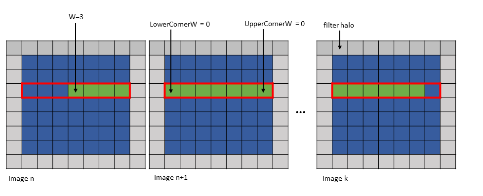
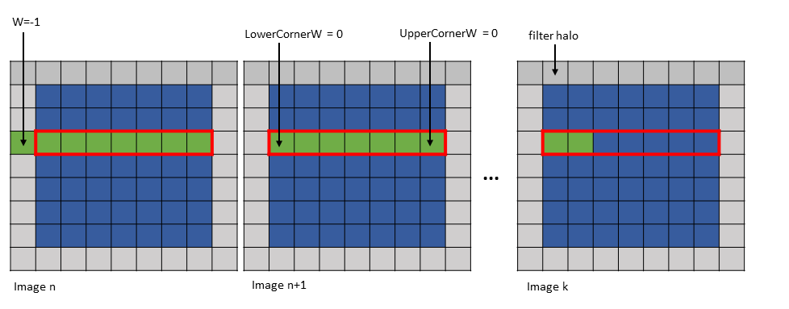
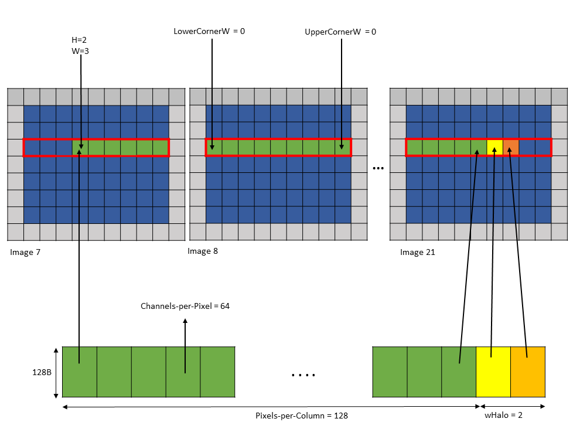
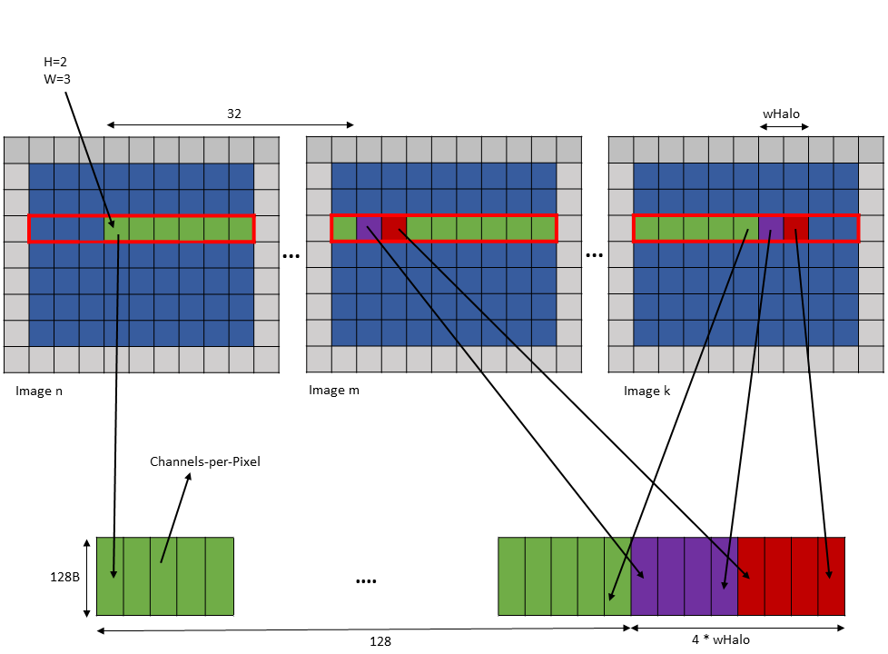

#### 5.5.5.1. [Bounding Box](#tensor-im2col-w-w128-modes-bounding-box)

In these modes, the size of the bounding box in `D` and `H` dimensions are 1.

The `D` and `H` dimensions in the tensor coordinates argument in the PTX instruction specify
the position of the bounding box in the tensor space.

The Bounding-Box `Lower-Corner-W` and Bounding-Box `Upper-Corner-W` specify the two opposite
corners of the Bounding Box in the `W` dimension.

The `W` dimension in the tensor coordinates argument in the PTX instruction specify the location
of the first element that is to be accessed in the bounding box.

Number of pixels loaded in `im2col::w` mode is as specified by Pixels-per-Column in the TensorMap.
Number of pixels loaded in `im2col::w::128` mode is always 128. So, Pixels-per-Column is ignored
in `im2col::w::128` mode.

[Figure 16](#tensor-im2col-w-w128-modes-example) shows an example of the `im2col::w` and
`im2col::w:128` modes.



*Figure 16im2col::w and im2col::w::128 modes example*

The first element can lie outside of the Bounding Box in the W-dimension only and only on the left
side of the Bounding Box. [Figure 17](#tensor-im2col-w-w128-modes-example2) shows of an example of this.



*Figure 17im2col::w and im2col::w::128 modes first element outside Bounding Box example*

---

#### 5.5.5.2. [Traversal Stride](#tensor-im2col-w-w128-modes-traversal-stride)

This is similar to im2col mode with the exception of that the number of elements traversed
along only the `W` dimension is strided by the traversal stride as specified in the TensorMap.

---

#### 5.5.5.3. [`wHalo`](#tensor-im2col-w-w128-modes-whalo)

In `im2col::w` mode, the `wHalo` argument in the PTX instruction specifies how many filter
halo elements must be loaded at the end of the image.

In `im2col::w::128` mode, the halo elements are loaded after every 32 elements in the bounding
box along the `W` dimension. The `wHalo` argument in the PTX instruction specifies how many
halo elements must be loaded after every 32 elements.

Following is an example of `.im2col::w` mode access:

```
Tensor Size [0] = 128
Tensor Size [1] = 9
Tensor Size [2] = 7
Tensor Size [3] = 64
Pixels-per-column = 128
Channels-per-pixel = 64
Bounding Box Lower Corner W = 0
Bounding Box Upper Corner W = 0

Tensor Coordinates in the instruction = (7, 2, 3, 0)
wHalo in the instruction = 2 (as 3x3 convolution filter is used)
```

A tensor copy operation with the above parameters loads 128 pixels and the two halo pixels as shown in
[Figure 18](#tensor-im2col-w-w128-modes-example3).



*Figure 18tensor copy operation with im2col::w mode example*

The halo pixels are always loaded in the shared memory next to the main row pixels as shown in
[Figure 18](#tensor-im2col-w-w128-modes-example3).

Following is an example of `.im2col::w::128` mode access:

```
Tensor Size [0] = 128
Tensor Size [1] = 9
Tensor Size [2] = 7
Tensor Size [3] = 64
Channels-per-pixel = 64
Bounding Box Lower Corner W = 0
Bounding Box Upper Corner W = 0

Tensor Coordinates in the instruction = (7, 2, 3, 0)
wHalo in the instruction = 2 (as 3x3 convolution filter is used)
```

A tensor copy operation with the above parameters loads 128 elements such that after every 32 elements,
wHalo number of elements are loaded as shown in [Figure 19](#tensor-im2col-w-w128-modes-example4).



*Figure 19tensor copy operation with im2col::w::128 mode example*
