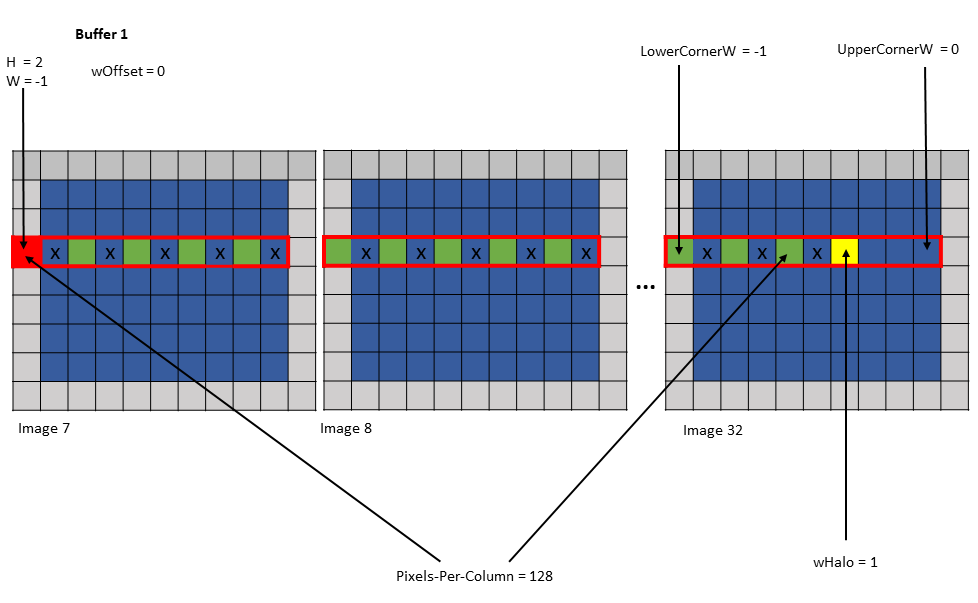
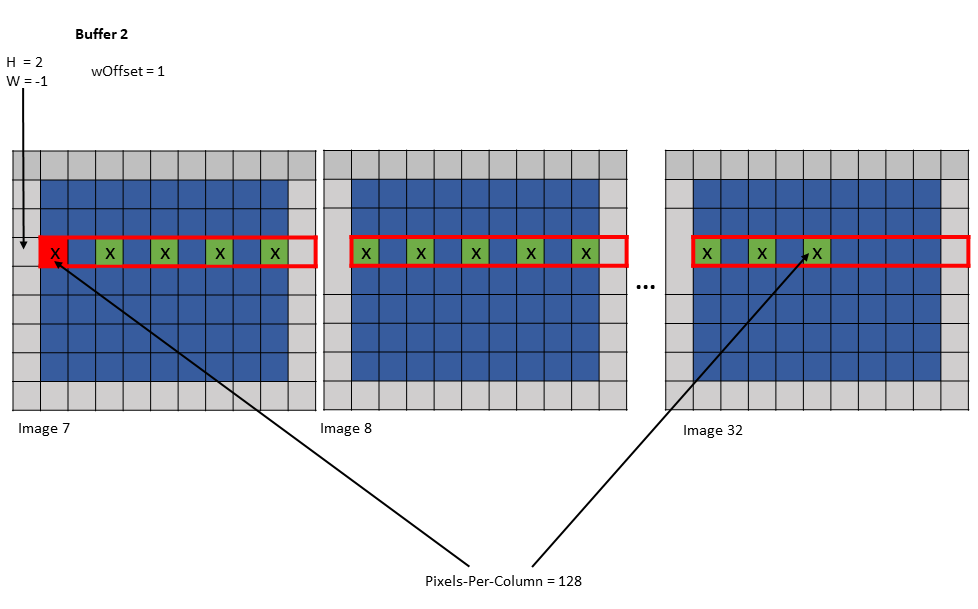
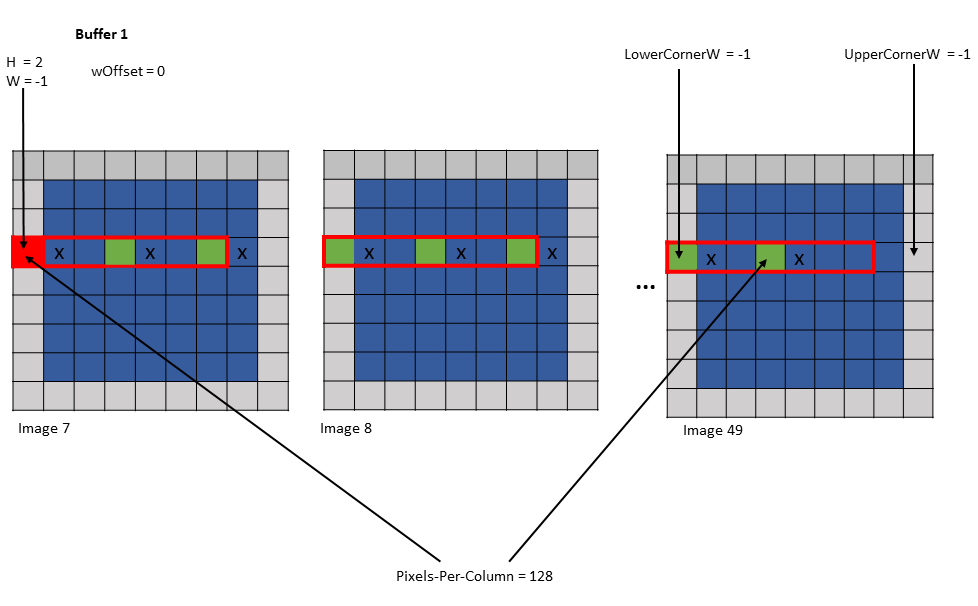
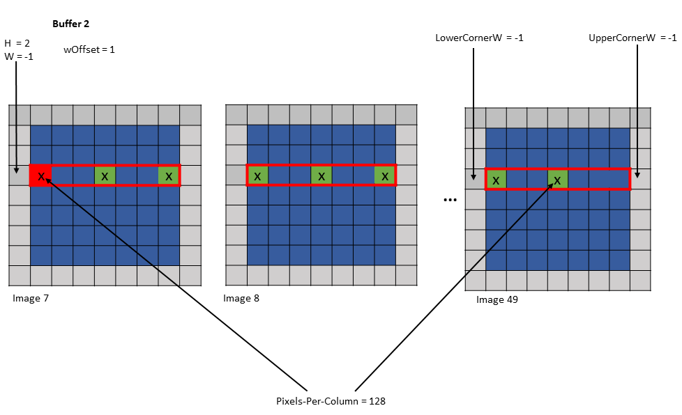
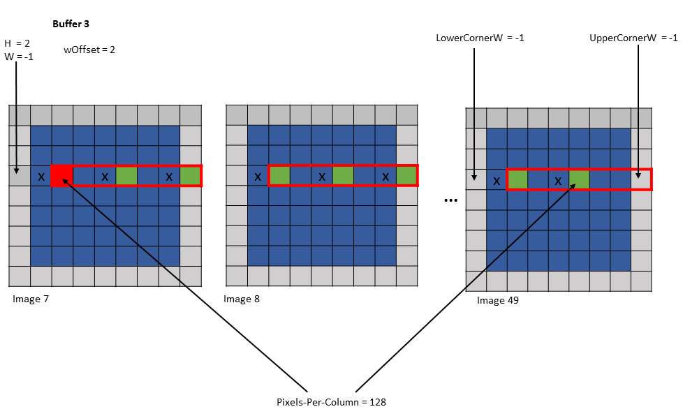

#### 5.5.5.4. [`wOffset`](#tensor-im2col-w-w128-modes-woffset)

In the convolution calculations, the same elements along the `W` dimension are reused for different
locations within the convolution filter footprint. Based on the number of times a pixel is used, the
pixels may be loaded into different shared memory buffers. Each buffer can be loaded by a separate
tensor copy operation.

The `wOffset` argument in the tensor copy and prefetch instruction adjusts the source pixel location
for each buffer. The exact position of the buffer is adjusted along the `W` dimension using the
following formula:

```
Bounding Box Lower Corner W += wOffset
Bounding Box Upper Corner W += wOffset
W += wOffset
```

Following are examples of tensor copy to multiple buffers with various `wHalo` and `wOffset` values:

Example 1:

```
Tensor Size [0] = 128
Tensor Size [1] = 9
Tensor Size [2] = 67
Tensor Size [3] = 64
Pixels-per-Column = 128
Channels-per-pixel = 64
Bounding Box Lower Corner W = -1
Bounding Box Upper Corner W = 0
Traversal Stride = 2

Tensor Coordinates in the instruction = (7, 2, -1, 0)

Shared memory buffer 1:
   wHalo = 1
   wOffset = 0

Shared memory buffer 2:
   wHalo = 0
   wOffset = 1
```



*Figure 20tensor copy operation to buffer 1 of Example 1*



*Figure 21tensor copy operation to buffer 2 of Example 1*

Example 2:

```
Tensor Size [0] = 128
Tensor Size [1] = 7
Tensor Size [2] = 7
Tensor Size [3] = 64
Pixels-per-Column = 128
Channels-per-pixel = 64
Bounding Box Lower Corner W = -1
Bounding Box Upper Corner W = -1
Traversal Stride = 3

Tensor Coordinates in the instruction = (7, 2, -1, 0)

Shared memory buffer 1:
   wHalo = 0
   wOffset = 0

Shared memory buffer 2:
   wHalo = 0
   wOffset = 1

Shared memory buffer 3:
   wHalo = 0
   wOffset = 2
```



*Figure 22tensor copy operation to buffer 1 of Example 2*



*Figure 23tensor copy operation to buffer 2 of Example 2*



*Figure 24tensor copy operation to buffer 3 of Example 2*
