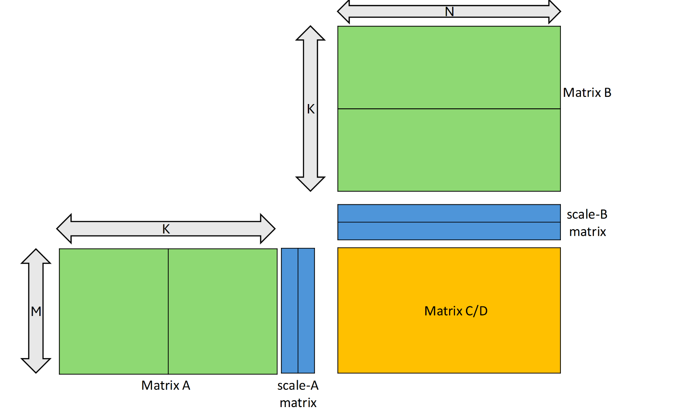
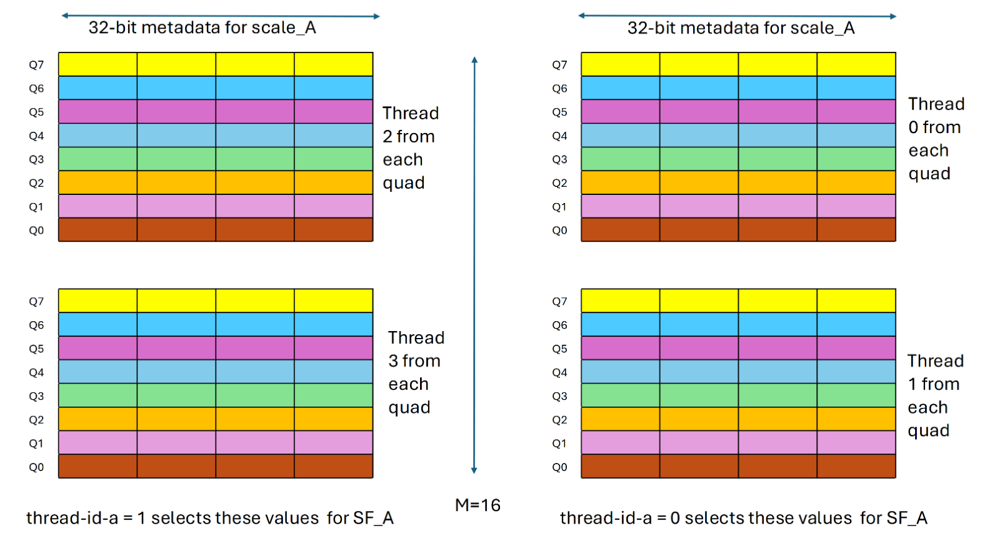
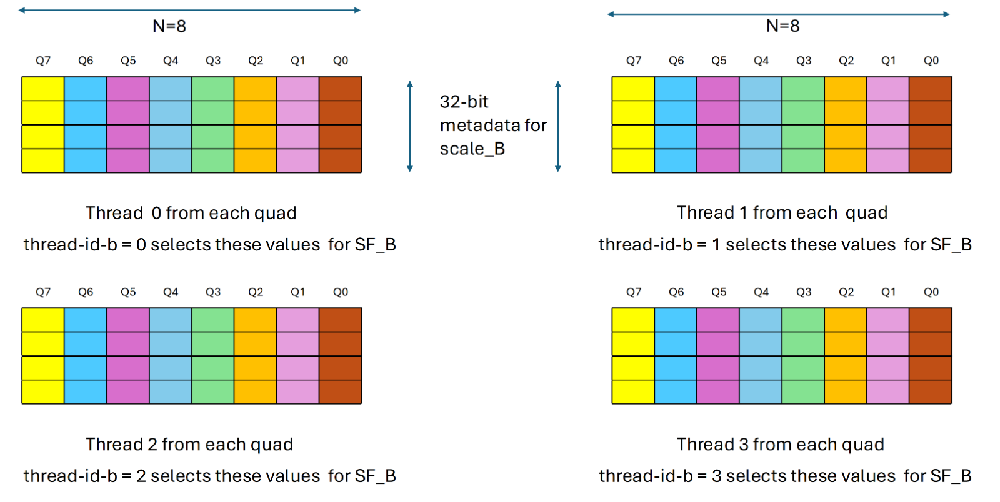
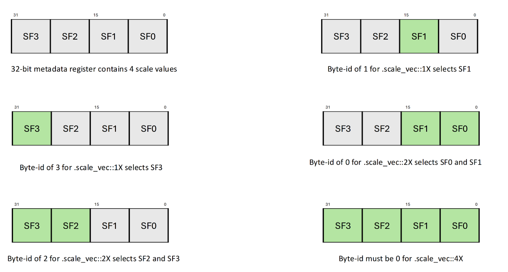

#### 9.7.14.3. [Block Scaling for `mma.sync`](#warp-level-block-scaling)

The `mma` instruction with the following `.kind` qualifier:

* `.kind::mxf8f6f4`
* `.kind::mxf4`
* `.kind::mxf4nvf4`

perform matrix multiplication with block scaling. This operation has the following form:
`D = (A * scale_A) * (B * scale_B) + C`.

For a `scale_A` matrix of shape *M x SFA\_N*, each row of matrix `A` is divided into
*SFA\_N* number of chunks and each chunk of a row is multiplied with the corresponding
element (henceforth referred as *SF\_A*) from the same row of `scale_A`.

Similarly, for a `scale_B` matrix of shape *SFB\_M x N*, each column of matrix `B` is
divided into the *SFB\_M* number of chunks and each chunk of a column is multiplied with
the corresponding element (henceforth referred as *SF\_B*) from the same column of `scale_B`.

[Figure 42](#mma-block-scaling) shows an example of `mma` with block scaling of `scale_vec::2X`.

*Figure 42mmawith block scaling of.scale\_vec::2X*

The shapes for `scale_A` and `scale_B` matrices depend upon the qualifier `.scale_vec_size`
as shown in [Table 35](#mma-scale-vec-matrix-shape).

Table 35 Shapes for scale matrices depending upon `.scale_vec_size` qualifier

| .scale\_vec\_size | Shape of scale\_A | Shape of scale\_B |
| --- | --- | --- |
| `.scale_vec::1X` | M x 1 | 1 x N |
| `.scale_vec::2X` | M x 2 | 2 x N |
| `.scale_vec::4X` | M x 4 | 4 x N |

The valid combination of the exact element types and the `.scale_vec_size` are listed in
[Table 36](#mma-scaling-kind-type-valid-combination).

Table 36 Valid combinations of `.scale_vec_size` and `.kind` qualifier

| .kind::\* | Element Data Type .atype and .btype | Scale Data Type .stype | .scale\_vec\_size |
| --- | --- | --- | --- |
| `.kind::mxf8f6f4` | `.e4m3`, `.e5m2` `.e3m2`, `.e2m3` `.e2m1` | `.ue8m0` | `.scale_vec::1X` |
| `.kind::mxf4` | `.e2m1` | `.ue8m0` | `.scale_vec::2X` |
| `.kind::mxf4nvf4` | `.e2m1` | `.ue8m0` | `.scale_vec::2X`, `.scale_vec::4X` |
| `.e2m1` | `.ue4m3` | `.scale_vec::4X` |

The `scale-a-data` and `scale-b-data` argument provides metadata for `scale_A` and
`scale_B` matrices respectively. The tuple `{byte-id-a, thread-id-a}` and
`{byte-id-b, thread-id-b}` provides the selector information to choose elements
*SF\_A* and *SF\_B* from corresponding metadata arguments `scale-a-data` and
`scale-b-data`.
The tuple `{byte-id-a, thread-id-a}` allows to select the scale matrix element *SF\_A*
from `scale-a-data`. Similarly, the tuple `{byte-id-b, thread-id-b}` allows to select
the scale matrix element *SF\_B* from `scale-b-data`.

The components `thread-id-a`, `thread-id-b` decides which threads among the quad
contribute the *SF\_A* and *SF\_B* values. The following listing describes the impact
of thread selector component `thread-id-a`, `thread-id-b`:

* One thread-pair within the quad determined by `thread-id-a`, contributes the *SF\_A*
  values. The value of 0 selects lower two threads whereas value of 1 selects upper two
  threads from the quad. In other words, when `thread-id-a` set to 0, thread-pair
  satisfying: `%laneid` % 4 == 0 or 1 provides the *SF\_A*. In contrast when
  `thread-id-a` set to 1, thread-pair satisfying: `%laneid` % 4 == 2 or 3 provides
  the *SF\_A*. Refer [Figure 43](#mma-scaling-thread-id-a-selection) for more details.

  

  *Figure 43 Selection of set of values forSF\_Abased onthread-id-a*
* One thread within the quad, determined by `thread-id-b`, contributes the *SF\_B*
  value. In other words, each thread satisfying: `%laneid` % 4 == `thread-id-b`
  provides the *SF\_B*. Refer [Figure 44](#mma-scaling-thread-id-b-selection) for more details.

  

  *Figure 44 Selection of set of values forSF\_Bbased onthread-id-b*

The arguments `byte-id-a`, `byte-id-b` selects which bytes from the `scale-a-data`,
`scale-b-data` contribute the *SF\_A* and *SF\_B* values. The following listing describes
implications of `.scale_vec_size` qualifier on byte selector component `byte-id-a`,
`byte-id-b`:

* When `.scale_vec_size` is `.scale_vec::1X`

  + One byte each within `scale-a-data` and `scale-b-data` determined by `byte-id-a`,
    `byte-id-b` respectively contributes the *SF\_A* and *SF\_B* values.
* When `.scale_vec_size` is `.scale_vec::2X`

  + One byte-pair (two bytes) within `scale-a-data` and `scale-b-data` determined by
    `byte-id-a` and `byte-id-b` contributes the *SF\_A* and *SF\_B* values. The value
    of 0 selects lower two bytes whereas value of 2 selects upper two bytes from the
    corresponding metadata value.
* When `.scale_vec_size` is `.scale_vec::4X`

  + All four bytes within `scale-a-data` and `scale-b-data` contribute the values.
    Hence, `byte-id-a`, `byte-id-b` must be zero.

Refer [Figure 45](#mma-scaling-byte-id-selection) for more details.

*Figure 45 Selection of set of values forSF\_AorSF\_Bbased onbyte-id-aorbyte-id-b*

[Table 37](#mma-scaling-valid-values-of-selector-components) enumerates the valid values for
various selector components. Any other value results in an undefined behavior.

Table 37 Valid values for various selector components

| .scale\_vec\_size | Selector Components | | | |
| --- | --- | --- | --- | --- |
| byte-id-a | thread-id-a | byte-id-b | thread-id-b |
| `scale_vec::1X` | [0, 1, 2, 3] | [0, 1] | [0, 1, 2, 3] | [0, 1, 2, 3] |
| `scale_vec::2X` | [0, 2] | [0, 2] |
| `scale_vec::4X` | 0 | 0 |
