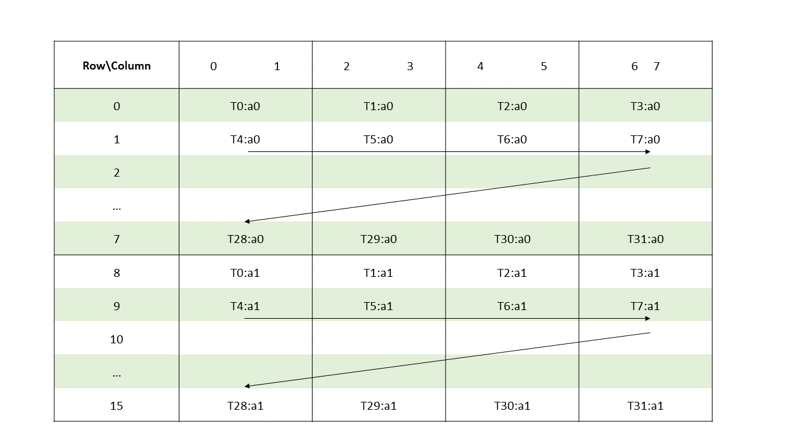
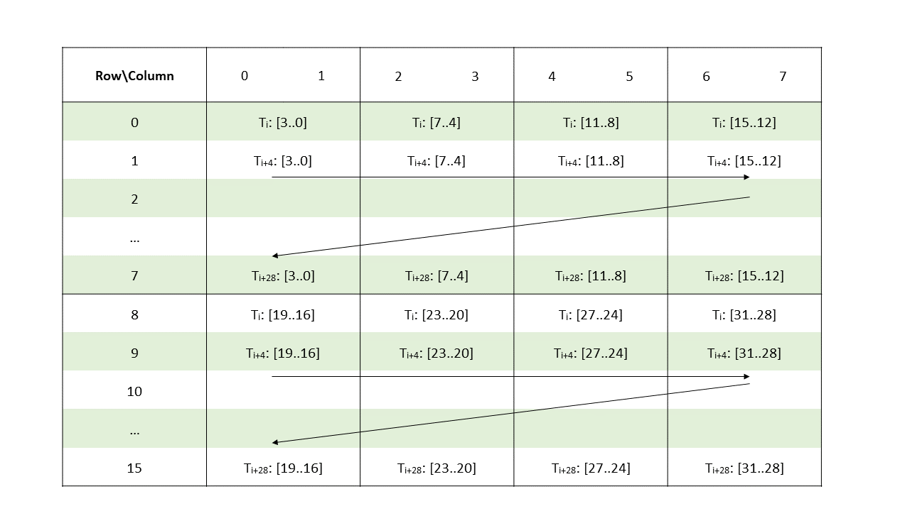
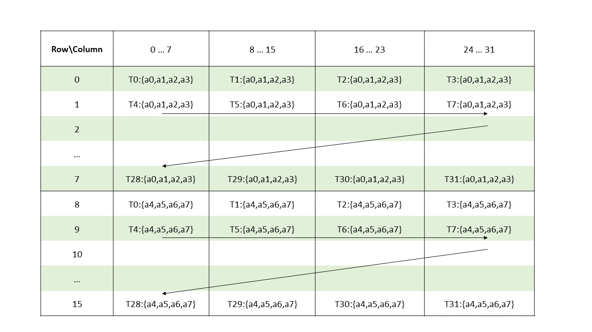
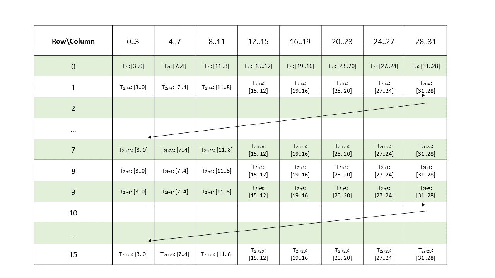

###### 9.7.14.6.2.4. [Matrix Fragments for sparse `mma.m16n8k8` with `.tf32` floating point type](#warp-level-matrix-fragment-sparse-mma-1688-tf32)

A warp executing sparse `mma.m16n8k8` with `.tf32` floating point type will compute an MMA
operation of shape `.m16n8k8`.

Elements of the matrix are distributed across the threads in a warp so each thread of the warp holds
a fragment of the matrix.

* Multiplicand A:

  | .atype | Fragment | Elements |
  | --- | --- | --- |
  | `.tf32` | A vector expression containing two `.b32` registers, each containing one non-zero `.tf32` element out of 2 consecutive elements from matrix A. | Mapping of the non-zero elements is as described in [Sparse matrix storage](#warp-level-sparse-matrix-storage). |

  The layout of the fragments held by different threads is shown in [Figure 126](#sparse-mma-1688-tf32).

  

  *Figure 126 Sparse MMA .m16n8k8 fragment layout for matrix A with.tf32type.*

  The row and column of a matrix fragment can be computed as:

  ```
  groupID = %laneid >> 2
  threadID_in_group = %laneid % 4

  row =      groupID            for a0
             groupID + 8        for a1

  col = [firstcol ... lastcol]  // As per the mapping of non-zero elements
                                // as described in Sparse matrix storage

  Where
  firstcol = threadID_in_group * 2
  lastcol  = firstcol + 1
  ```
* Matrix fragments for multiplicand B and accumulators C and D are the same as in case of
  [Matrix Fragments for mma.m16n8k8](#warp-level-matrix-fragment-mma-1688) for `.tf32`
  format.
* Metadata: A `.b32` register containing 8 4-bit vectors each storing the index of a non-zero
  element of a 2-wide chunk of matrix A as shown in [Figure 127](#sparse-mma-metadata-1688-tf32).

  > 
  >
  > *Figure 127 Sparse MMA .m16n8k8 metadata layout for.tf32type.*

---

###### 9.7.14.6.2.5. [Matrix Fragments for sparse `mma.m16n8k32` with `.u8` / `.s8` integer type](#warp-level-matrix-fragment-sparse-mma-16832-u8s8)

A warp executing sparse `mma.m16n8k32` with `.u8` / `.s8` integer type will compute an MMA
operation of shape `.m16n8k32`.

Elements of the matrix are distributed across the threads in a warp so each thread of the warp holds
a fragment of the matrix.

* Multiplicand A:

  | .atype | Fragment | Elements |
  | --- | --- | --- |
  | `.u8` / `.s8` | A vector expression containing two `.b32` registers, with each register containing four non-zero `.u8` / `.s8` elements out of 8 consecutive elements from matrix A. | Mapping of the non-zero elements is as described in [Sparse matrix storage](#warp-level-sparse-matrix-storage). |

  The layout of the fragments held by different threads is shown in [Figure 128](#sparse-mma-16832-u8s8-a).

  

  *Figure 128 Sparse MMA .m16n8k32 fragment layout for matrix A with.u8/.s8type.*

  ```
  groupID = %laneid >> 2
  threadID_in_group = %laneid % 4

  row =      groupID            for ai where  0 <= i < 4
             groupID + 8        Otherwise

  col = [firstcol ... lastcol]  // As per the mapping of non-zero elements
                                // as described in Sparse matrix storage

  Where
  firstcol = threadID_in_group * 8
  lastcol  = firstcol + 7
  ```
* Matrix fragments for multiplicand B and accumulators C and D are the same as in case of
  [Matrix Fragments for mma.m16n8k32](#warp-level-matrix-fragment-mma-16832).
* Metadata: A `.b32` register containing 16 2-bit vectors with each pair of 2-bit vectors storing
  the indices of two non-zero elements from a 4-wide chunk of matrix A as shown in
  [Figure 129](#sparse-mma-metadata-16832-u8s8).

  > 
  >
  > *Figure 129 Sparse MMA .m16n8k32 metadata layout for.u8/.s8type.*
