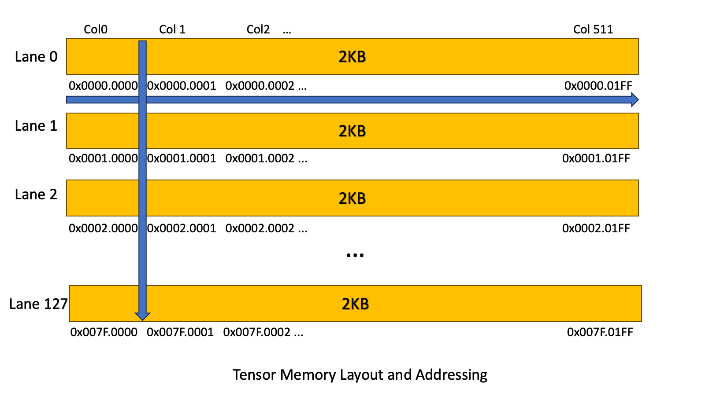

##### 9.7.16.1.1. [Tensor Memory Addressing](#tensor-memory-addressing)

Tensor Memory addresses are 32-bit wide and specify two components.

1. Lane index
2. Column index

The layout is as follows:

> |  |  |
> | --- | --- |
> | 31 16 | 15 0 |
> | Lane index | Column index |

[Figure 182](#tensor-memory-layout) shows the view of the Tensor Memory Layout within CTA.

*Figure 182 Tensor Memory Layout and Addressing*

---

##### 9.7.16.1.2. [Tensor Memory Allocation](#tensor-memory-allocation)

The Tensor Memory is dynamically allocated. The Tensor Memory must be allocated by a single
warp in a CTA using the
[Tensor Memory Allocation and Management Instructions](#tcgen05-memory-alloc-manage-instructions).

The allocation and deallocation of [Tensor Memory](#tensor-memory) is performed in terms of
columns. The unit of allocation is 32 columns and the number of columns being allocated must be
a power of 2. When a column is allocated, all 128 lanes of the column are allocated.

All of the Tensor Memory that was allocated in a kernel, must be explicitly deallocated
before the kernel exits.

---

##### 9.7.16.5.1. [CTA Pair](#tcgen05-cta-pair)

Any 2 CTAs within the cluster whose `%cluster_ctarank` differs by the last bit only
is said to form a CTA pair.

Within a CTA pair, the CTA whose last bit in the `%cluster_ctarank` is:

* 0 is termed the even numbered CTA within the CTA pair.
* 1 is termed as the odd numbered CTA within the CTA pair.

Most of the `tcgen05` operations can either execute at a single CTA level granularity OR
at a CTA pair level granularity. When a `tcgen05` operation is performed at CTA pair
granularity, the Tensor Memory of both the CTAs within the CTA pair are accessed. The set
of threads that need to issue the `tcgen05` operation is listed in the
[Issue Granularity](#tcgen05-issue-granularity).

---

##### 9.7.16.5.2. [Peer CTA](#tcgen05-peer-cta)

The peer CTA of the odd CTA within the CTA pair is the even CTA in the same pair.
Similarly, the peer CTA of the even CTA within the CTA pair is the odd CTA in the same pair.
