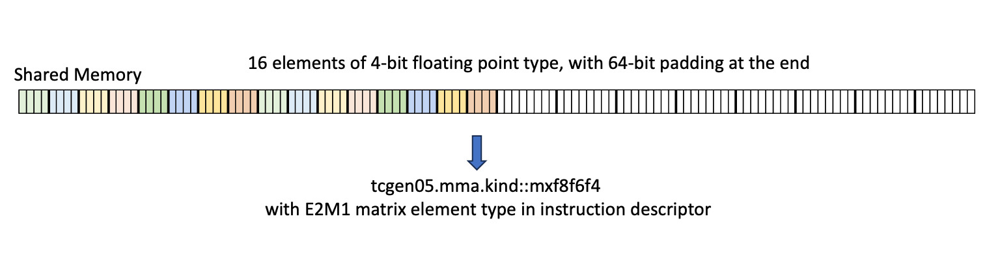
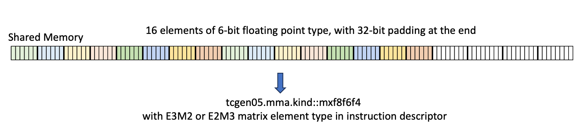

###### 9.7.16.10.4.1. [Packing format for matrix D in Tensor Memory](#tcgen05-packing-formats-mat-d)

The sub-word elements of matrix `D` are expected not to be packed within a 32-bit Tensor Memory word.
For example, if the type of elements of the matrix `D` is 16 bits then a Tensor Memory word
would contain a single 16-bit element in its lower 16 bits.

---

###### 9.7.16.10.4.2. [Packing format for matrix A and B](#tcgen05-packing-formats-mat-a-b)

The 6-bit and 4-bit floating point types have different packing format requirements for
different MMA kinds in both Tensor memory and Shared memory. The requirements are as follows.

---

###### 9.7.16.10.4.3. [Packing format used for matrix A by `.kind::mxf8f6f4` in Tensor Memory](#tcgen05-packing-formats-mxf8f6f4-tmem)

The individual 4-bit and the 6-bit floating point type elements must be packed in an 8-bit container
in Tensor memory as shown below. The 8-bit containers must be contiguously packed in a 32-bit Tensor
Memory word. For example, if the type of elements of the matrix `A` is 6 bits then 4 consecutive
`A` elements should be packed in one 32-bit Tensor Memory word.

* 4-bit packing format as shown in [Figure 199](#tcgen05-packing-formats-mxf8f6f4-tmem-dig1)

  

  *Figure 1994-bit packing format with type E2M1*
* 6-bit packing format

  + Type E3M2 as shown in [Figure 200](#tcgen05-packing-formats-mxf8f6f4-tmem-dig2)

    

    *Figure 2006-bit packing format with type E3M2*
  + Type E2M3 as shown in [Figure 201](#tcgen05-packing-formats-mxf8f6f4-tmem-dig3)

    

    *Figure 2016-bit packing format with type E2M3*

---

###### 9.7.16.10.4.4. [Packing format used for matrix A and B by `.kind::mxf8f6f4` in Shared Memory](#tcgen05-packing-formats-mxf8f6f4-smem)

The 4-bit and 6-bit floating point elements in shared memory must be contiguously packed along
with padding as follows.

* 4-bit packing format as shown in [Figure 202](#tcgen05-packing-formats-mxf8f6f4-smem-dig1)

  

  *Figure 2024-bit packing format*
* 6-bit packing format as shown in [Figure 203](#tcgen05-packing-formats-mxf8f6f4-smem-dig2)

> 
>
> *Figure 2036-bit packing format*

---

###### 9.7.16.10.4.5. [Packing format used for matrix A by `.kind::mxf4` and `.kind::mxf4nvf4` in Tensor Memory](#tcgen05-packing-formats-mxf4-tmem)

Two 4-bit floating point type elements must be packed in an 8-bit container in Tensor memory as
shown in [Figure 204](#tcgen05-packing-formats-mxf4-tmem-dig1) for `mxf4`.

*Figure 2044-bit packing format with type E2M1*

---

###### 9.7.16.10.4.6. [Packing format used for matrix A and B by `.kind::mxf4` and `.kind::mxf4nvf4` in Shared Memory](#tcgen05-packing-formats-mxf4-smem)

The packing format for 4-bit floating point elements in shared memory is to pack two 4-bit
elements in a 8-bit container, with no padding.
