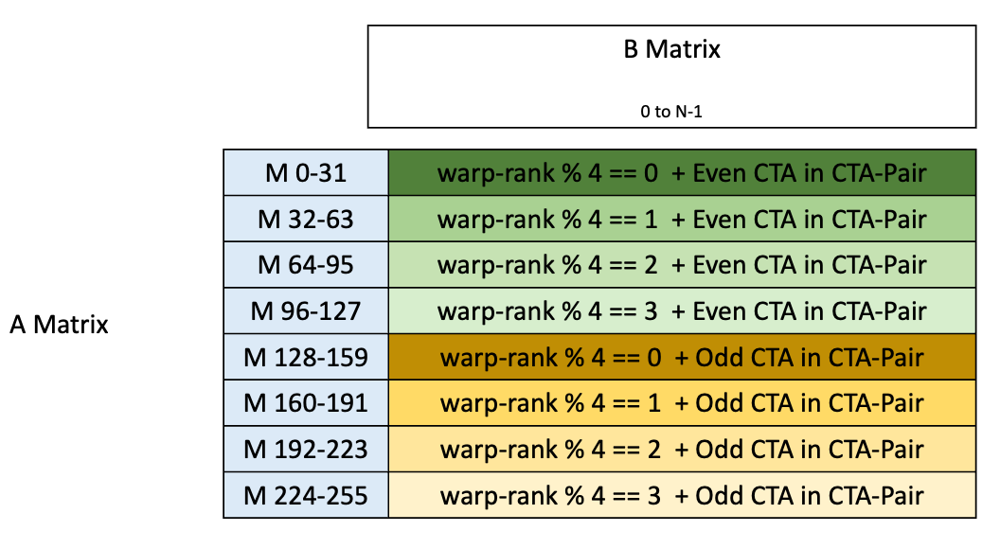
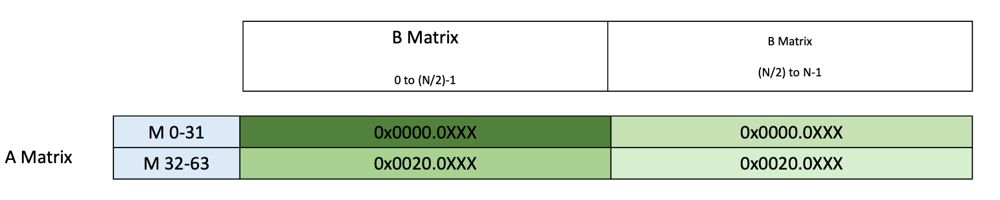
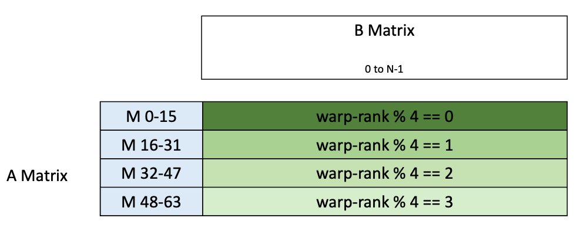
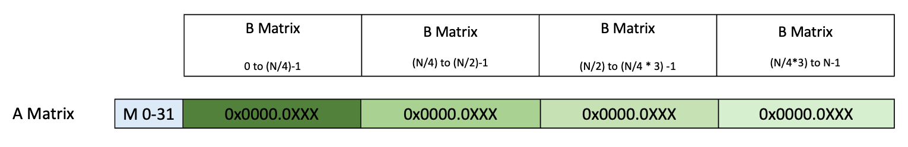

###### 9.7.16.10.5.1. [Layout A (M = 256)](#tcgen05-data-path-layout-a)

Layout organization for M = 256 is shown in [Figure 205](#tcgen05-data-path-layout-a1).

*Figure 205 Layout organization for M = 256*

Addresses for the above region to be used in `tcgen05.ld` / `tcgen05.st`
is shown in [Figure 206](#tcgen05-data-path-layout-a2)

*Figure 206 Addresses to use intcgen05.ld/tcgen05.st*

---

###### 9.7.16.10.5.2. [Layout B (M = 128 + cta-group::2 + Dense A matrix)](#tcgen05-data-path-layout-b)

Layout organization for M = 128 + .cta\_group::2 + Dense A matrix is shown in
[Figure 207](#tcgen05-data-path-layout-b1).

*Figure 207 Layout organization for M = 128 + .cta\_group::2 + Dense A matrix*

Addresses for the above region to be used in `tcgen05.ld` / `tcgen05.st`
is shown in [Figure 208](#tcgen05-data-path-layout-b2)

*Figure 208 Addresses to use intcgen05.ld/tcgen05.st*

---

###### 9.7.16.10.5.3. [Layout C (M = 128 + cta-group::2 + Sparse A matrix)](#tcgen05-data-path-layout-c)

Layout organization for M = 128 + .cta\_group::2 + Sparse A matrix is shown in
[Figure 209](#tcgen05-data-path-layout-c1).

*Figure 209 Layout organization for M = 128 + .cta\_group::2 + Sparse A matrix*

Addresses for the above region to be used in `tcgen05.ld` / `tcgen05.st`
is shown in [Figure 210](#tcgen05-data-path-layout-c2)

*Figure 210 Addresses to use intcgen05.ld/tcgen05.st*

---

###### 9.7.16.10.5.4. [Layout D (M = 128 + cta-group::1)](#tcgen05-data-path-layout-d)

Layout organization for M = 128 + .cta\_group::1 is shown in
[Figure 211](#tcgen05-data-path-layout-d1).

*Figure 211 Layout organization for M = 128 + .cta\_group::1*

Addresses for the above region to be used in `tcgen05.ld` / `tcgen05.st`
is shown in [Figure 212](#tcgen05-data-path-layout-d2)

*Figure 212 Addresses to use intcgen05.ld/tcgen05.st*

---

###### 9.7.16.10.5.5. [Layout E (M = 64 + .ws mode)](#tcgen05-data-path-layout-e)

Layout organization for M = 64 + .ws mode is shown in
[Figure 213](#tcgen05-data-path-layout-e1).

*Figure 213 Layout organization for M = 64 + .ws mode*

Addresses for the above region to be used in `tcgen05.ld` / `tcgen05.st`
is shown in [Figure 214](#tcgen05-data-path-layout-e2)

*Figure 214 Addresses to use intcgen05.ld/tcgen05.st*

---

###### 9.7.16.10.5.6. [Layout F (M = 64 + non .ws mode)](#tcgen05-data-path-layout-f)

Layout organization for M = 64 + non .ws mode is shown in
[Figure 215](#tcgen05-data-path-layout-f1).

*Figure 215 Layout organization for M = 64 + non .ws mode*

Addresses for the above region to be used in `tcgen05.ld` / `tcgen05.st`
is shown in [Figure 216](#tcgen05-data-path-layout-f2)

*Figure 216 Addresses to use intcgen05.ld/tcgen05.st*

---

###### 9.7.16.10.5.7. [Layout G (M = 32)](#tcgen05-data-path-layout-g)

Layout organization for M = 32 is shown in
[Figure 217](#tcgen05-data-path-layout-g1).

*Figure 217 Layout organization for M = 32*

Addresses for the above region to be used in `tcgen05.ld` / `tcgen05.st`
is shown in [Figure 218](#tcgen05-data-path-layout-g2)

*Figure 218 Addresses to use intcgen05.ld/tcgen05.st*
