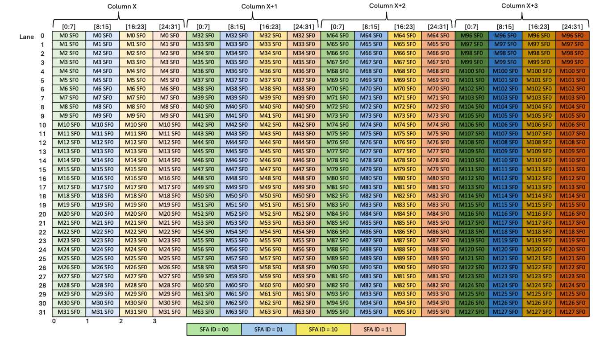
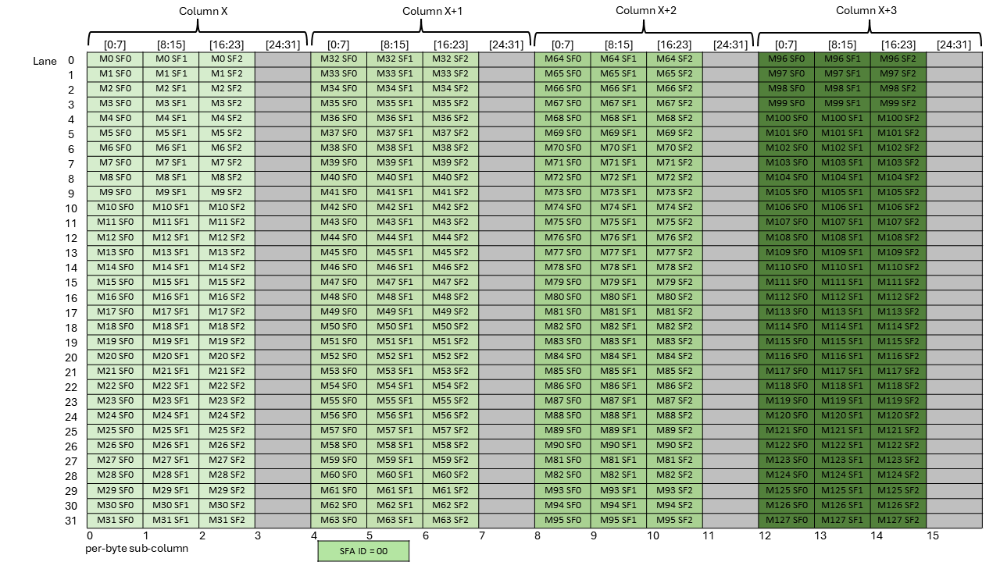
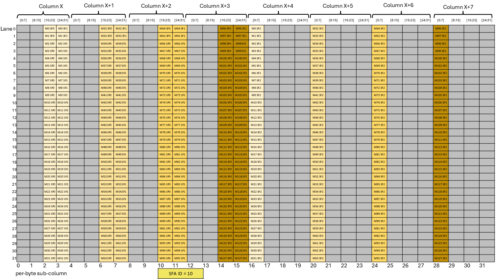

###### 9.7.16.10.7.2.1. [Layout of the Scale Factor A Matrix for scale\_vec::1X/block32 with K=32/K=64](#tcgen05-mma-scale-factor-a-layout-1x)

There is one scale factor per row of the `A` matrix with block size as 32 and the scale factor must be provided in
1-byte aligned sub-column of the Tensor Memory. *SFA\_ID* specifies the byte offset in the
Tensor Memory word that must be used for the scale factor matrix.
[Figure 231](#tcgen05-mma-scale-factor-a-1x-dig) shows which sub-columns get selected for
different values of *SFA\_ID*.

*Figure 231 Layout of scale factor A matrix with scale\_vec::1X/block32 with K=32/K=64*

For example, if *SFA\_ID* is 0, then all the green columns are selected to form the scale factor
matrix. Similarly, *SFA\_ID* values of 1, 2 and 3 would select the blue, yellow, and red columns,
respectively.

---

###### 9.7.16.10.7.2.2. [Layout of the Scale Factor A Matrix for scale\_vec::2X/block32 with K=64/K=128](#tcgen05-mma-scale-factor-a-layout-2x)

There are two scale factors per row of the `A` matrix with block size as 32 and the scale factor must be provided in
2-byte aligned sub-column of the Tensor Memory. *SFA\_ID* specifies the half word offset in the
Tensor Memory word that must be used for the scale factor matrix.
[Figure 232](#tcgen05-mma-scale-factor-a-2x-dig) shows which sub-columns gets selected for different
values of *SFA\_ID*.

*Figure 232 Layout of scale factor A matrix with scale\_vec::2X/block32 with K=64/K=128*

For example, if *SFA\_ID* is 0, then all the green columns are selected to form the scale factor
matrix. Similarly, if *SFA\_ID* is 2, then all of the blue columns are selected to form the scale
factor matrix.

---

###### 9.7.16.10.7.2.3. [Layout of the Scale Factor A Matrix for scale\_vec::4X/block16 with K=64/K=128](#tcgen05-mma-scale-factor-a-layout-4x)

There are four scale factors per row of the `A` matrix with block size as 16 and the scale factor must be provided in
4-byte aligned sub-column of the Tensor Memory. The *SFA\_ID* value must be 0 and this specifies
that all of the columns (in green) will be used for the scale factor matrix.
[Figure 233](#tcgen05-mma-scale-factor-a-4x-dig) shows which sub-columns gets selected for different
values of *SFA\_ID*.

*Figure 233 Layout of scale factor A matrix with scale\_vec::4X/block16 with K=64/K=128*

---

###### 9.7.16.10.7.2.4. [Layout of the Scale Factor A Matrix for block32 with K=96 (Semantically equivalent to scale\_vec::3X)](#tcgen05-mma-scale-factor-a-layout-block32-k96)

There are three scale factors per row of the `A` matrix with block size as 32 and the scale
factor must be provided in 4-byte aligned sub-column of the Tensor Memory. *SFA\_ID* specifies
the byte offset in the Tensor Memory word that must be used for the scale factor matrix.
[Figure 234](#tcgen05-mma-scale-factor-a-block32-k96-dig1), [Figure 235](#tcgen05-mma-scale-factor-a-block32-k96-dig2),
[Figure 236](#tcgen05-mma-scale-factor-a-block32-k96-dig3) and [Figure 237](#tcgen05-mma-scale-factor-a-block32-k96-dig4)
show which sub-columns get selected for different values of *SFA\_ID*.

*Figure 234 Layout of scale factor A matrix with block32 with K=96 with SFA\_ID=00*

*Figure 235 Layout of scale factor A matrix with block32 with K=96 with SFA\_ID=01*

*Figure 236 Layout of scale factor A matrix with block32 with K=96 with SFA\_ID=10*

*Figure 237 Layout of scale factor A matrix with block32 with K=96 with SFA\_ID=11*

For example, if *SFA\_ID* is 0, then all the green columns are selected to form the scale factor
matrix. Similarly, *SFA\_ID* values of 1, 2 and 3 would select the blue, yellow, and red columns,
respectively.

---

###### 9.7.16.10.7.2.5. [Layout of the Scale Factor A Matrix for block16 with K=96 (Semantically equivalent to scale\_vec::6X)](#tcgen05-mma-scale-factor-a-layout-block16-k96)

There are six scale factors per row of the `A` matrix with block size as 16 and the scale
factor must be provided in 4-byte aligned sub-column of the Tensor Memory. *SFA\_ID* specifies
the byte offset in the Tensor Memory word that must be used for the scale factor matrix.
[Figure 238](#tcgen05-mma-scale-factor-a-block16-k96-dig1) and [Figure 239](#tcgen05-mma-scale-factor-a-block16-k96-dig2)
show which sub-columns get selected for different values of *SFA\_ID*.

*Figure 238 Layout of scale factor A matrix with block16 with K=96 with SFA\_ID=00*

*Figure 239 Layout of scale factor A matrix with block16 with K=96 with SFA\_ID=10*

For example, if *SFA\_ID* is 0, then all the green columns are selected to form the scale factor
matrix. Similarly, if *SFA\_ID* is 2, then all of the blue columns are selected to form the scale
factor matrix.
