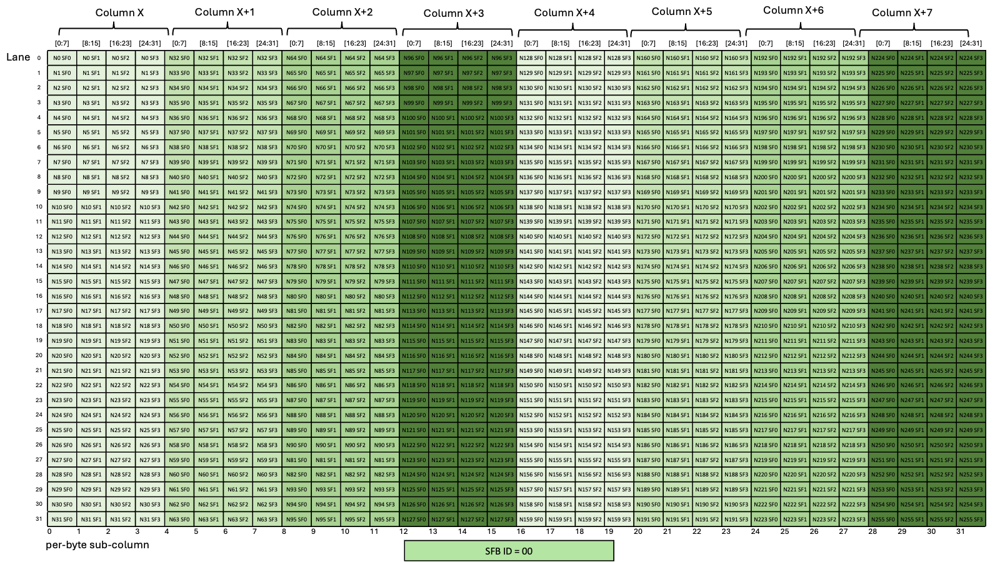

###### 9.7.16.10.7.3.1. [Layout of the Scale Factor B Matrix for scale\_vec::1X/block32 with K=32/K=64](#tcgen05-mma-scale-factor-b-layout-1x)

There is one scale factor per row of the `B` matrix with block size as 32 and the scale factor must be provided in
1-byte aligned sub-column of the Tensor Memory. *SFB\_ID* specifies the byte offset in the
Tensor Memory word that must be used for the scale factor matrix.
[Figure 240](#tcgen05-mma-scale-factor-b-1x-dig) shows which sub-columns get selected for
different values of *SFB\_ID*.

*Figure 240 Layout of scale factor B matrix with scale\_vec::1X/block32 with K=32/K=64*

For example, if *SFB\_ID* is 0, then all the green columns are selected to form the scale factor
matrix. Similarly, *SFB\_ID* values of 1, 2 and 3 would select the blue, yellow, and red columns, respectively.

---

###### 9.7.16.10.7.3.2. [Layout of the Scale Factor B Matrix for scale\_vec::2X/block32 with K=64/K=128](#tcgen05-mma-scale-factor-b-layout-2x)

There are two scale factors per row of the `B` matrix with block size as 32 and the scale factor must be provided in
2-byte aligned sub-column of the Tensor Memory. *SFB\_ID* specifies the half word offset in the
Tensor Memory word that must be used for the scale factor matrix.
[Figure 241](#tcgen05-mma-scale-factor-b-2x-dig) shows which sub-columns get selected for
different values of *SFB\_ID*.

*Figure 241 Layout of scale factor B matrix with scale\_vec::2X/block32 with K=64/K=128*

For example, if *SFB\_ID* is 0, then all the green columns are selected to form the scale factor
matrix. Similarly, if *SFB\_ID* is 2, then all of the blue columns are selected to form the scale
factor matrix.

---

###### 9.7.16.10.7.3.3. [Layout of the Scale Factor B Matrix for scale\_vec::4X/block16 with K=64/K=128](#tcgen05-mma-scale-factor-b-layout-4x)

There are four scale factors per row of the `B` matrix with block size as 16 and the scale factor must be provided in
4-byte aligned sub-column of the Tensor Memory. The *SFB\_ID* value must be 0 and this specifies
that all of the columns (in green) will be used for the scale factor matrix.
[Figure 242](#tcgen05-mma-scale-factor-b-4x-dig) shows which sub-columns get selected for
different values of *SFB\_ID*.

*Figure 242 Layout of scale factor B matrix with scale\_vec::4X/block16 with K=64/K=128*
