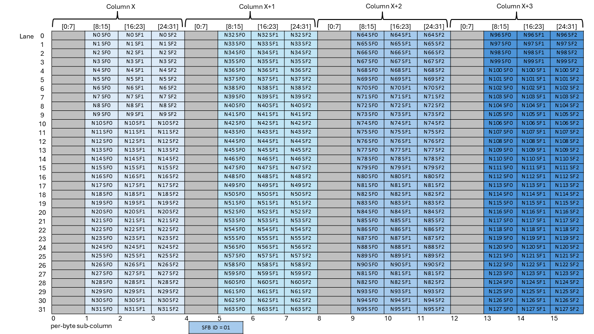
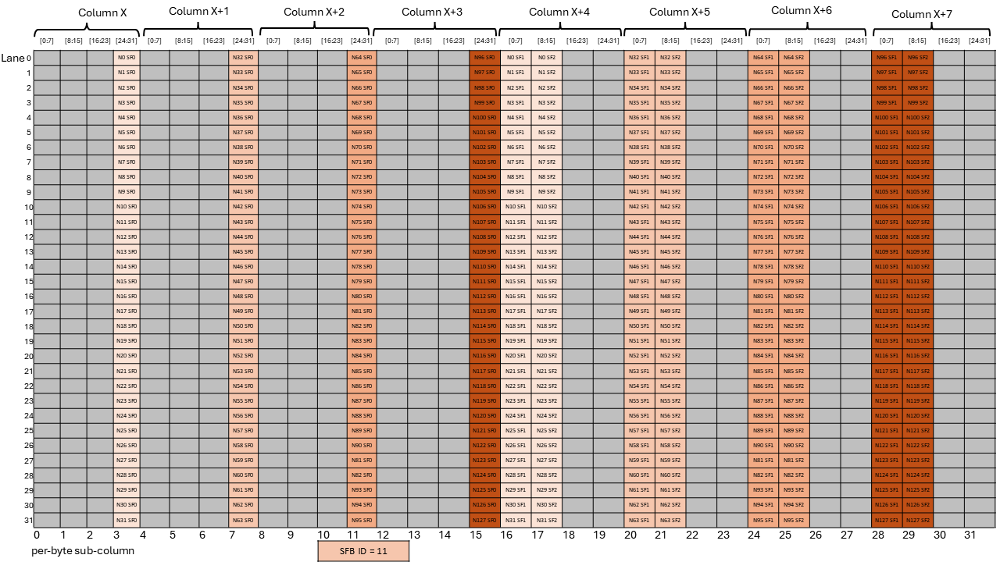
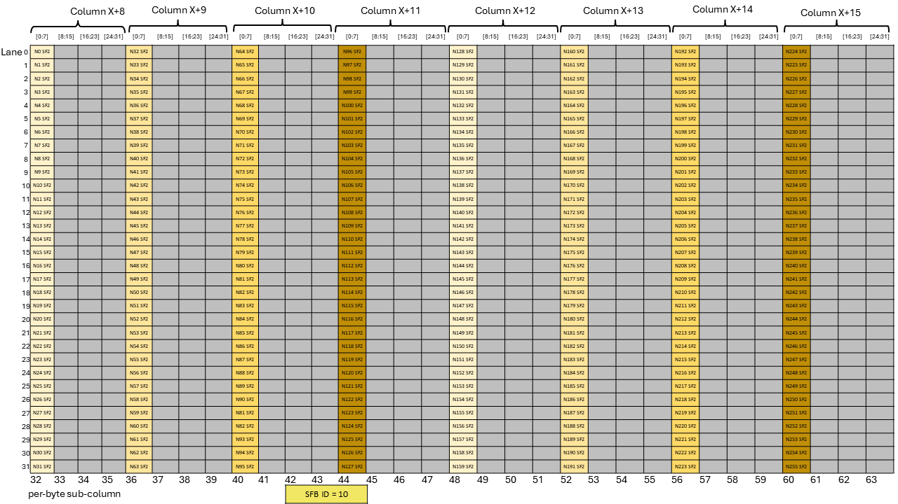

###### 9.7.16.10.7.3.4. [Layout of the Scale Factor B Matrix for block32 with K=96 (Semantically equivalent to scale\_vec::3X)](#tcgen05-mma-scale-factor-b-layout-block32-k96)

There are three scale factors per row of the `B` matrix with block size as 32 and the scale factor
must be provided in 4-byte aligned sub-column of the Tensor Memory. *SFB\_ID* specifies the byte
offset in the Tensor Memory word that must be used for the scale factor matrix.

For N<=128, [Figure 243](#tcgen05-mma-scale-factor-b-block32-k96-nlt128-dig1),
[Figure 244](#tcgen05-mma-scale-factor-b-block32-k96-nlt128-dig2),
[Figure 245](#tcgen05-mma-scale-factor-b-block32-k96-nlt128-dig3) and
[Figure 246](#tcgen05-mma-scale-factor-b-block32-k96-nlt128-dig4) show which
sub-columns get selected for different values of *SFB\_ID*.

*Figure 243 Layout of scale factor B matrix with block32 with K=96 and N<=128 with SFA\_ID=00*

*Figure 244 Layout of scale factor B matrix with block32 with K=96 and N<=128 with SFA\_ID=01*

*Figure 245 Layout of scale factor B matrix with block32 with K=96 and N<=128 with SFA\_ID=10*

*Figure 246 Layout of scale factor B matrix with block32 with K=96 and N<=128 with SFA\_ID=11*

For N>128, [Figure 247](#tcgen05-mma-scale-factor-b-block32-k96-ngt128-dig1),
[Figure 248](#tcgen05-mma-scale-factor-b-block32-k96-ngt128-dig2),
[Figure 249](#tcgen05-mma-scale-factor-b-block32-k96-ngt128-dig3),
[Figure 250](#tcgen05-mma-scale-factor-b-block32-k96-ngt128-dig4),
[Figure 251](#tcgen05-mma-scale-factor-b-block32-k96-ngt128-dig5) and
[Figure 252](#tcgen05-mma-scale-factor-b-block32-k96-ngt128-dig6) show which
sub-columns get selected for different values of *SFB\_ID*.

*Figure 247 Layout of scale factor B matrix with block32 with K=96 and N>128 with SFA\_ID=00*

*Figure 248 Layout of scale factor B matrix with block32 with K=96 and N>128 with SFA\_ID=01*

*Figure 249 Layout of scale factor B matrix with block32 with K=96 and N>128 with SFA\_ID=10*

*Figure 250 Layout of scale factor B matrix with block32 with K=96 and N>128 with SFA\_ID=10*

*Figure 251 Layout of scale factor B matrix with block32 with K=96 and N>128 with SFA\_ID=11*

*Figure 252 Layout of scale factor B matrix with block32 with K=96 and N>128 with SFA\_ID=11*

For example, if *SFB\_ID* is 0, then all the green columns are selected to form the
scale factor matrix. Similarly, *SFB\_ID* values of 1, 2 and 3 would select the blue,
yellow, and red columns, respectively.
