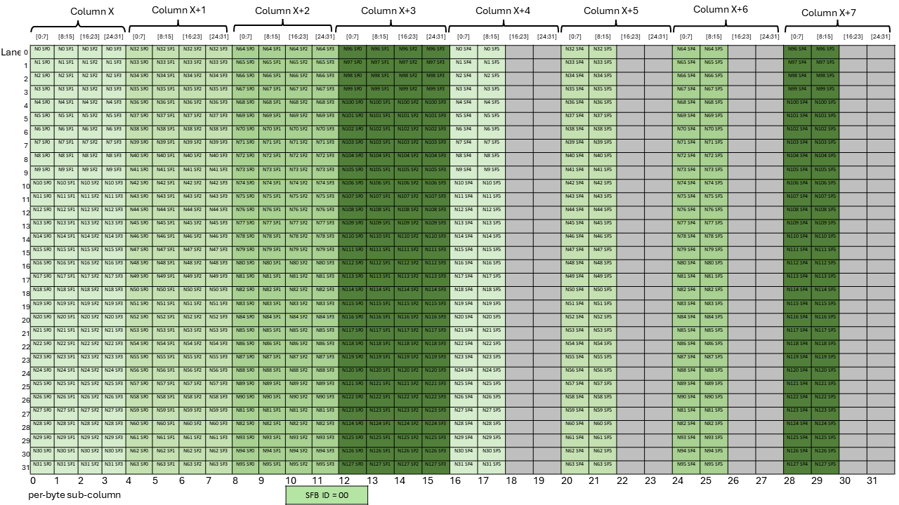
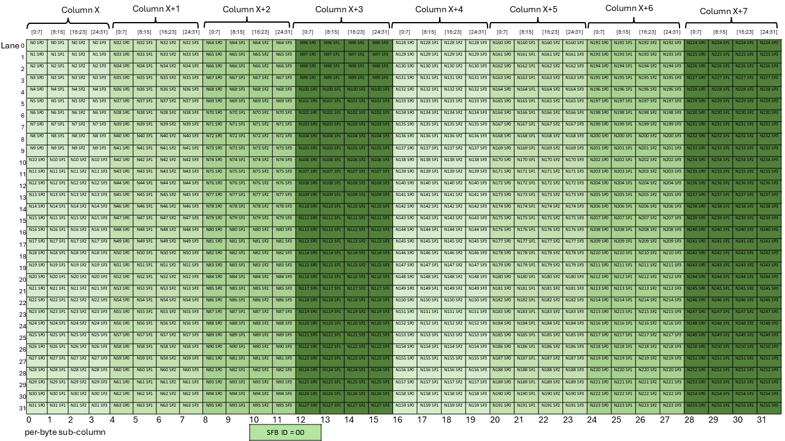
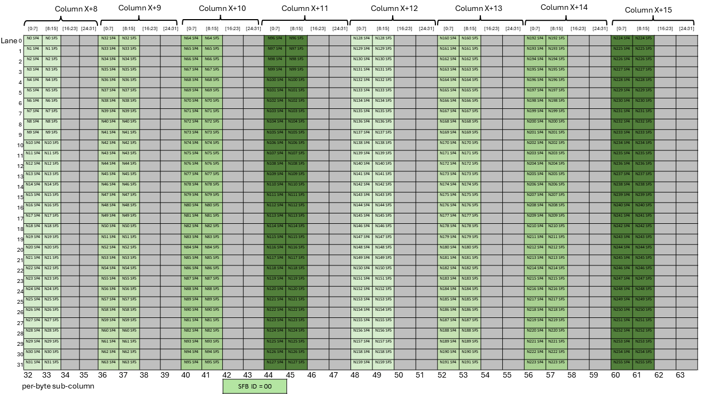
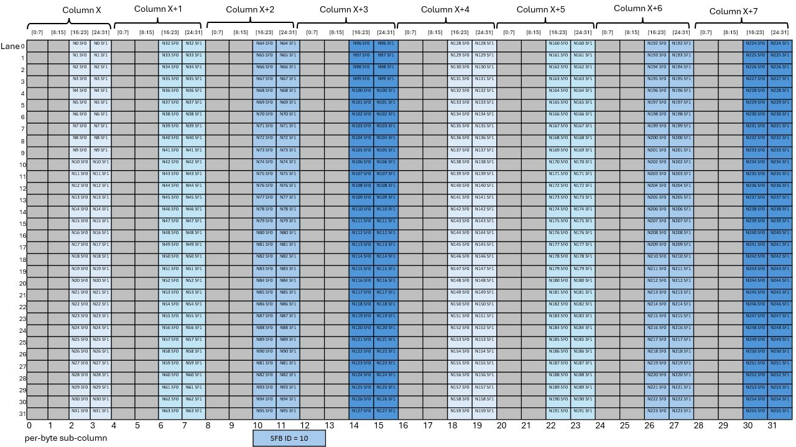
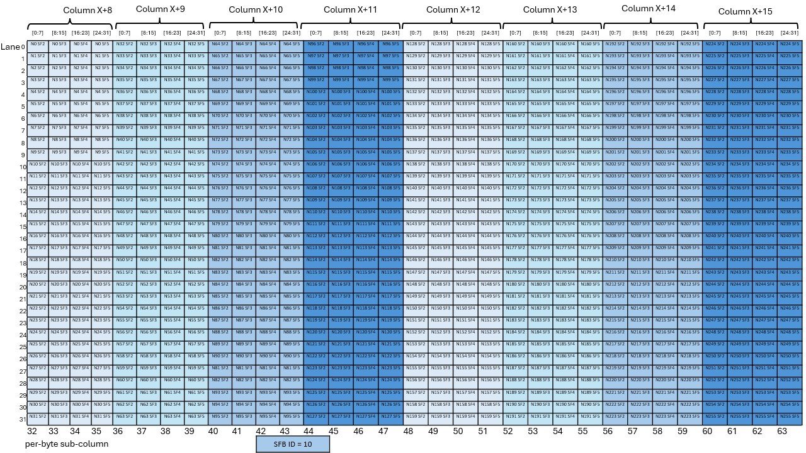

###### 9.7.16.10.7.3.5. [Layout of the Scale Factor B Matrix for block16 with K=96 (Semantically equivalent to scale\_vec::6X)](#tcgen05-mma-scale-factor-b-layout-block16-k96)

There are six scale factors per row of the `B` matrix with block size as 16 and the scale factor
must be provided in 4-byte aligned sub-column of the Tensor Memory. *SFB\_ID* specifies the byte
offset in the Tensor Memory word that must be used for the scale factor matrix.

For N<=128, [Figure 253](#tcgen05-mma-scale-factor-b-block16-k96-nlt128-dig1) and
[Figure 254](#tcgen05-mma-scale-factor-b-block16-k96-nlt128-dig2) show which sub-columns
get selected for different values of *SFB\_ID*.

*Figure 253 Layout of scale factor B matrix with block16 with K=96 and N<=128 with SFA\_ID=00*

*Figure 254 Layout of scale factor B matrix with block16 with K=96 and N<=128 with SFA\_ID=10*

For N>128, [Figure 255](#tcgen05-mma-scale-factor-b-block16-k96-ngt128-dig1),
[Figure 256](#tcgen05-mma-scale-factor-b-block16-k96-ngt128-dig2),
[Figure 257](#tcgen05-mma-scale-factor-b-block16-k96-ngt128-dig3) and
[Figure 258](#tcgen05-mma-scale-factor-b-block16-k96-ngt128-dig4) show which sub-columns
get selected for different values of *SFB\_ID*.

*Figure 255 Layout of scale factor B matrix with block16 with K=96 and N>128 with SFA\_ID=00*

*Figure 256 Layout of scale factor B matrix with block16 with K=96 and N>128 with SFA\_ID=00*

*Figure 257 Layout of scale factor B matrix with block16 with K=96 and N>128 with SFA\_ID=10*

*Figure 258 Layout of scale factor B matrix with block16 with K=96 and N>128 with SFA\_ID=10*

For example, if *SFB\_ID* is 0, then all the green columns are selected to form the
scale factor matrix. Similarly, if *SFB\_ID* is 2, then all of the blue columns are
selected to form the scale factor matrix.
