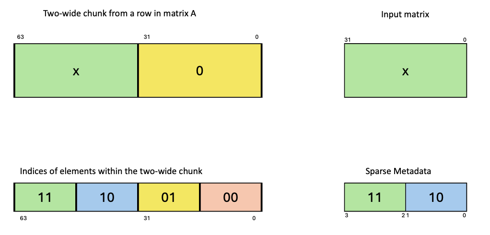

###### 9.7.16.10.8.1. [Sparse `tcgen05.mma.sp` with `.kind::tf32`](#tcgen05-sparse-matrices-kind-tf32)

For `.kind::tf32`, matrix `A` is structured sparse at a granularity of `1:2`.
In other words, each chunk of two adjacent elements in a row of matrix `A` has one
zero and one non-zero element. Only the non-zero element is stored in memory and the
4-bit index in the metadata indicates the position of the non-zero element in the
two-wide chunk. The only meaningful values of the index are:

* `0b1110`
* `0b0100`

Rest of the values result in undefined behavior.

*Figure 259 Sparse tcgen05.mma metadata example for tf32 kind*

---

###### 9.7.16.10.8.2. [Sparse `tcgen05.mma.sp` with `.kind::f16`, `.kind::f8f6f4`, `.kind::mxf8f6f4`, `.kind::i8`](#tcgen05-sparse-matrices-kind-f16-f8f8f4-mxf8f6f4)

For the following `.kind` variants of `tcgen05.mma`:

* `.kind::f16`
* `.kind::f8f8f4`
* `.kind::mxf8f6f4`
* `.kind::i8`

matrix `A` is structured sparse at a granularity of `2:4`. In other words, each chunk
of four adjacent elements in a row of matrix `A` has two zero and two non-zero elements.
Only the non-zero elements are stored in memory and the two 2-bit indices in the metadata
indicates the position of the two non-zero elements in the four-wide chunk. The only
meaningful values of the index are:

* `0b0100`
* `0b1000`
* `0b1100`
* `0b1001`
* `0b1101`
* `0b0110`
* `0b1110`

*Figure 260 Sparse tcgen05.mma metadata example for f16/f8f6f4/mxf8f6f4 kind*

---

###### 9.7.16.10.8.3. [Sparse `tcgen05.mma.sp` with `.kind::mxf4` and `.kind::mxf4nvf4`](#tcgen05-sparse-matrices-kind-mxf4)

For `.kind::mxf4` and `.kind::mxf4nvf4`, matrix `A` is pair-wise structured
sparse at a granularity of `4:8`. In other words, each chunk of eight adjacent
elements in a row of matrix `A` has four zero and four non-zero elements. The
zero and non-zero elements are clustered in sub-chunks of two elements each within
the eight-wide chunk, so each two-wide sub-chunk within the eight-wide chunk must be
all zeros or all non-zeros. Only the four non-zero elements are stored in memory and
the two 2-bit indices in the metadata indicates the position of the two two-wide
sub-chunks with non-zero values in the eight-wide chunk of a row of matrix `A`.
The only meaningful values of the index are:

* `0b0100`
* `0b1000`
* `0b1100`
* `0b1001`
* `0b1101`
* `0b0110`
* `0b1110`

Rest of the values result in undefined behavior.

*Figure 261 Sparse tcgen05.mma metadata example for mxf4 kind*
