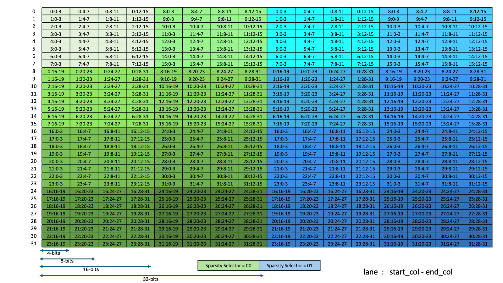
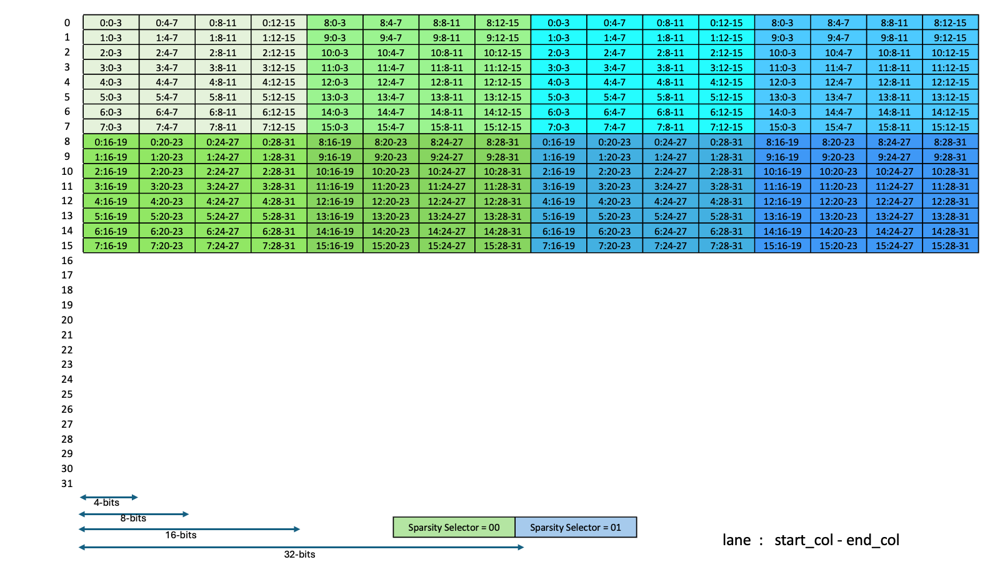
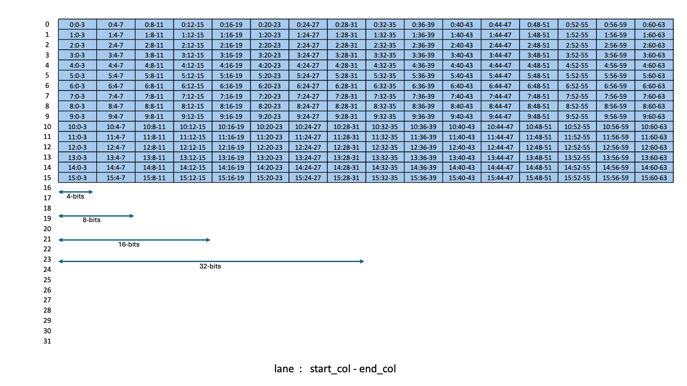

###### 9.7.16.10.8.4.1. [Layout of the Sparsity Metadata Matrix for M = 64 for `.kind::f16`](#tcgen05-sparse-matrices-sparsity-selector-kind-f16-m64)

[Figure 262](#tcgen05-sparse-matrices-sparsity-selector-kind-f16-m64-dig) shows which sub-columns gets
selected for different values of Sparsity Selector.

*Figure 262 Sparsity Metadata Layout for M = 64 for.kind::f16*

---

###### 9.7.16.10.8.4.2. [Layout of the Sparsity Metadata Matrix for M = 128 / M = 256 for `.kind::f16`](#tcgen05-sparse-matrices-sparsity-selector-kind-f16-m128-256)

[Figure 263](#tcgen05-sparse-matrices-sparsity-selector-kind-f16-m128-256-dig) shows which sub-columns gets
selected for different values of Sparsity Selector.

*Figure 263 Sparsity Metadata Layout for M = 128 / M = 256 for.kind::f16*

---

###### 9.7.16.10.8.4.3. [Layout of the Sparsity Metadata Matrix for M = 64 for `.kind::tf32`](#tcgen05-sparse-matrices-sparsity-selector-kind-tf32-m64)

[Figure 264](#tcgen05-sparse-matrices-sparsity-selector-kind-tf32-m64-dig) shows which sub-columns gets
selected for different values of Sparsity Selector.

*Figure 264 Sparsity Metadata Layout for M = 64 for.kind::tf32*

---

###### 9.7.16.10.8.4.4. [Layout of the Sparsity Metadata Matrix for M = 128 / M = 256 for `.kind::tf32`](#tcgen05-sparse-matrices-sparsity-selector-kind-tf32-m128-256)

[Figure 265](#tcgen05-sparse-matrices-sparsity-selector-kind-tf32-m128-256-dig) shows which sub-columns gets
selected for different values of Sparsity Selector.

*Figure 265 Sparsity Metadata Layout for M = 128 / M = 256 for.kind::tf32*

---

###### 9.7.16.10.8.4.5. [Layout of the Sparsity Metadata Matrix for M = 64 for `.kind::f8f6f4`, `.kind::mxf8f6f4`, `.kind::i8`, `.kind::mxf4`, `.kind::mxf4nvf4`](#tcgen05-sparse-matrices-sparsity-selector-kind-f8f6f4-mxf8f6f4-m64)

The value of the sparsity selector:

* must be 0 for `.kind::i8` and `.kind::f8f6f4`
* is assumed to be 0 for `.kind::mxf8f6f4`, `.kind::mxf4` and `.kind::mxf4nvf4`

and all of the columns are selected as
shown in [Figure 266](#tcgen05-sparse-matrices-sparsity-selector-kind-f8f6f4-mxf8f6f4-m64-dig)

*Figure 266 Sparsity Metadata Layout for M = 64 for.kind::f8f6f4,.kind::mxf8f6f4,.kind::i8,.kind::mxf4,.kind::mxf4nvf4*

---

###### 9.7.16.10.8.4.6. [Layout of the Sparsity Metadata Matrix for M = 128 / M = 256 for `.kind::f8f6f4`, `.kind::mxf8f6f4`, `.kind::i8`, `.kind::mxf4`, `.kind::mxf4nvf4`](#tcgen05-sparse-matrices-sparsity-selector-kind-f8f6f4-mxf8f6f4-m128-256)

The value of the sparsity selector:

* must be 0 for `.kind::i8` and `.kind::f8f6f4`
* is assumed to be 0 for `.kind::mxf8f6f4`, `.kind::mxf4` and `.kind::mxf4nvf4`

and all of the columns are selected as
shown in [Figure 267](#tcgen05-sparse-matrices-sparsity-selector-kind-f8f6f4-mxf8f6f4-m128-256-dig)

*Figure 267 Sparsity Metadata Layout for M = 128 / M = 256 for.kind::f8f6f4,.kind::mxf8f6f4,.kind::i8,.kind::mxf4,.kind::mxf4nvf4*
