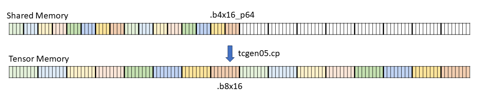
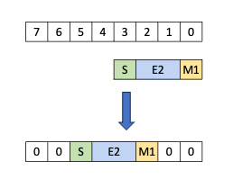
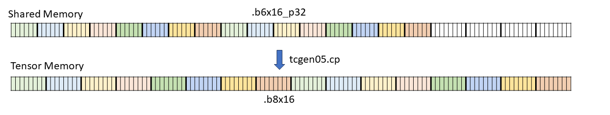
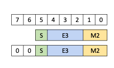
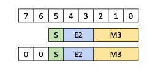

###### 9.7.16.9.1.1. [Decompression of 4-bit floating point to 8-bit type](#tcgen05-optional-decompression-4bit-8bit)

A contiguous set of 16 elements of 4-bits each followed by 8 bytes of padding can be converted
into 16 elements of 8-bits each as shown in [Figure 194](#tcgen05-decompression-4b8b).

*Figure 194 Decompression from 4-bit to 8-bit*

The individual 4-bit to 8-bit decompression would look like as shown in [Figure 195](#tcgen05-decompression-4b8b-individual).

*Figure 195 Individual decompression from 4-bit to 8-bit*

---

###### 9.7.16.9.1.2. [Decompression of 6-bit floating point to 8-bit type](#tcgen05-optional-decompression-6bit-8bit)

A contiguous set of 16 elements of 6-bits each followed by 4 bytes of padding is
decompressed into 16 elements of 8-bits each as shown in [Figure 196](#tcgen05-decompression-6b8b).

*Figure 196 Decompression from 6-bit to 8-bit*

The individual 6-bit to 8-bit decompression for types `E3M2` and `E2M3` is shown in
[Figure 197](#tcgen05-decompression-6b8b-individual1) and [Figure 198](#tcgen05-decompression-6b8b-individual2)
respectively.

*Figure 197 Individual decompression from 6-bit to 8-bit for E3M2 type*

*Figure 198 Individual decompression from 6-bit to 8-bit for E2M3 type*
